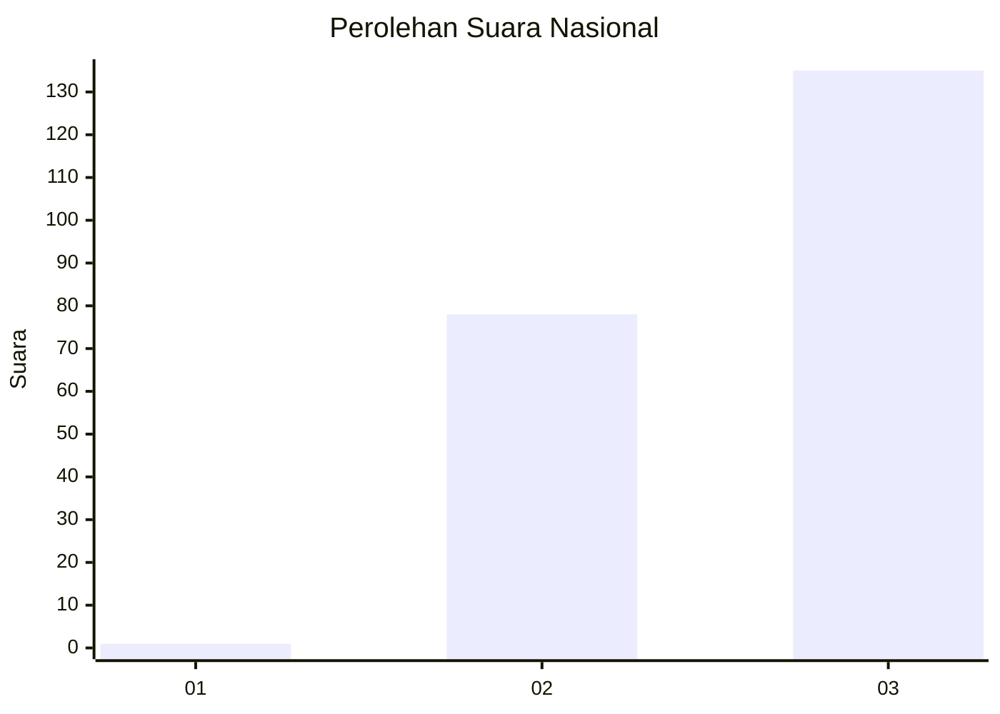
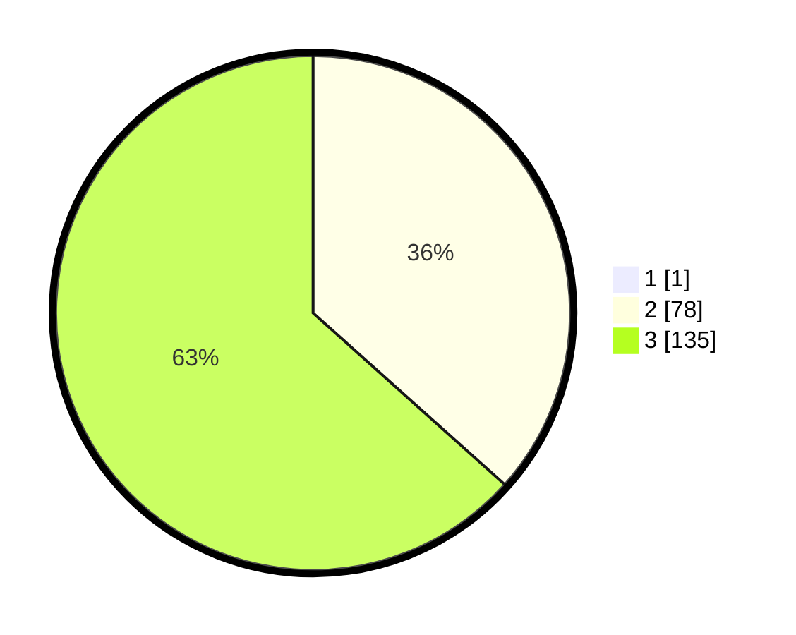

# Hasil

## Grafik

## Tabel

| No. | Nama Paslon    | Suara | Suara (raw) | Persentase |
|:--- |:-------------- | -----:| -----------:| ----------:|
| 1   | ANIES MUHAIMIN | 1     | [1][p-1]    | 0,47       |
| 2   | PRABOWO GIBRAN | 78    | [78][p-2]   | 36,45      |
| 3   | GANJAR MAHFUD  | 135   | [135][p-3]  | 63,08      |

[p-1]: https://github.com/gigit-pemilu/pemilu-2024/blob/main/pilpres/hitung-suara/sub/51-bali/sub/03-badung/sub/02-mengwi/sub/2007-sembung/sub/015-tps/sub/paslon-1.txt
[p-2]: https://github.com/gigit-pemilu/pemilu-2024/blob/main/pilpres/hitung-suara/sub/51-bali/sub/03-badung/sub/02-mengwi/sub/2007-sembung/sub/015-tps/sub/paslon-2.txt
[p-3]: https://github.com/gigit-pemilu/pemilu-2024/blob/main/pilpres/hitung-suara/sub/51-bali/sub/03-badung/sub/02-mengwi/sub/2007-sembung/sub/015-tps/sub/paslon-3.txt

## Foto C Plano

https://sirekap-obj-formc.kpu.go.id/c7db/pemilu/ppwp/51/03/02/20/07/5103022007015-20240215-224633--2ef05b51-3a80-41e6-9688-180c198776ab.jpg

https://sirekap-obj-formc.kpu.go.id/c7db/pemilu/ppwp/51/03/02/20/07/5103022007015-20240215-224530--817bada7-f3d2-4c8d-8e23-0c7fb0b67416.jpg

https://sirekap-obj-formc.kpu.go.id/c7db/pemilu/ppwp/51/03/02/20/07/5103022007015-20240215-224733--19ca4acd-1ece-4924-a957-7e45143f5b34.jpg

## Metadata

| Key        | Value               |
| ---------- | ------------------- |
| Time Stamp | 2024-02-24 22:31:28 |

