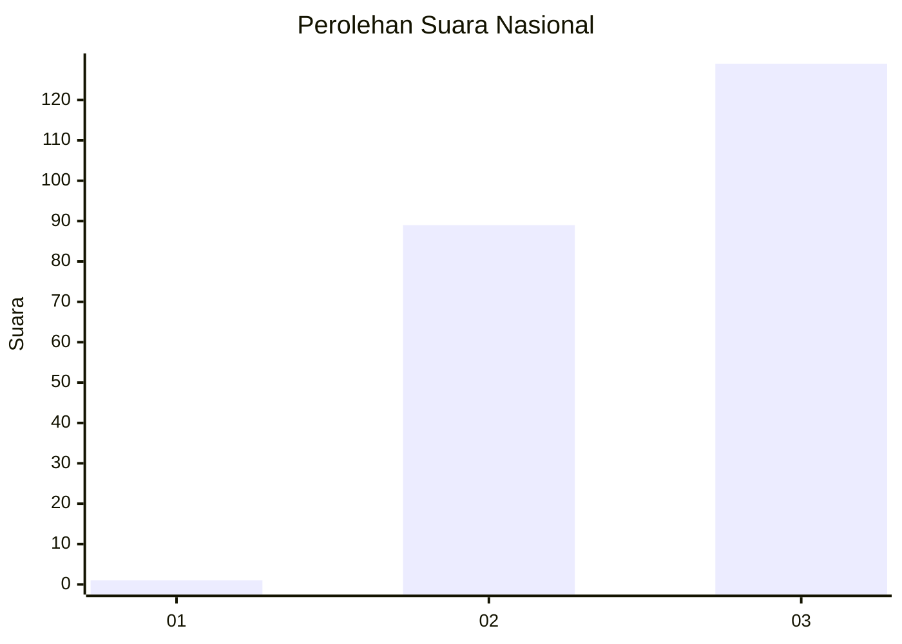
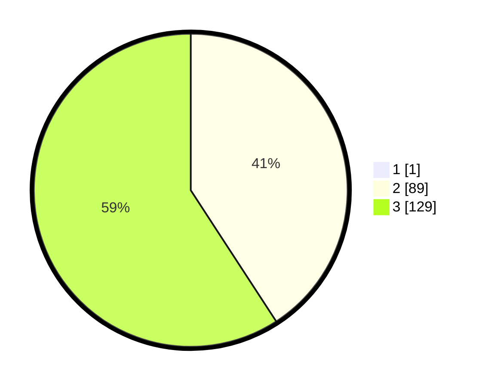

# Hasil

## Grafik

## Tabel

| No. | Nama Paslon    | Suara | Suara (raw) | Persentase |
|:--- |:-------------- | -----:| -----------:| ----------:|
| 1   | ANIES MUHAIMIN | 1     | [1][p-1]    | 0,46       |
| 2   | PRABOWO GIBRAN | 89    | [89][p-2]   | 40,64      |
| 3   | GANJAR MAHFUD  | 129   | [129][p-3]  | 58,90      |

[p-1]: https://github.com/gigit-pemilu/pemilu-2024/blob/main/pilpres/hitung-suara/sub/51-bali/sub/03-badung/sub/02-mengwi/sub/2007-sembung/sub/017-tps/sub/paslon-1.txt
[p-2]: https://github.com/gigit-pemilu/pemilu-2024/blob/main/pilpres/hitung-suara/sub/51-bali/sub/03-badung/sub/02-mengwi/sub/2007-sembung/sub/017-tps/sub/paslon-2.txt
[p-3]: https://github.com/gigit-pemilu/pemilu-2024/blob/main/pilpres/hitung-suara/sub/51-bali/sub/03-badung/sub/02-mengwi/sub/2007-sembung/sub/017-tps/sub/paslon-3.txt

## Foto C Plano

https://sirekap-obj-formc.kpu.go.id/29ef/pemilu/ppwp/51/03/02/20/07/5103022007017-20240215-022209--a7b45f0e-5447-48b2-9fce-fdd954ce3085.jpg

https://sirekap-obj-formc.kpu.go.id/29ef/pemilu/ppwp/51/03/02/20/07/5103022007017-20240215-022419--f8b3abd5-fb96-4c2f-870f-fc79ef061662.jpg

https://sirekap-obj-formc.kpu.go.id/29ef/pemilu/ppwp/51/03/02/20/07/5103022007017-20240215-022501--c1835d04-acc1-408d-a930-3b6e3fc8f88f.jpg

## Metadata

| Key        | Value               |
| ---------- | ------------------- |
| Time Stamp | 2024-02-24 22:31:28 |

