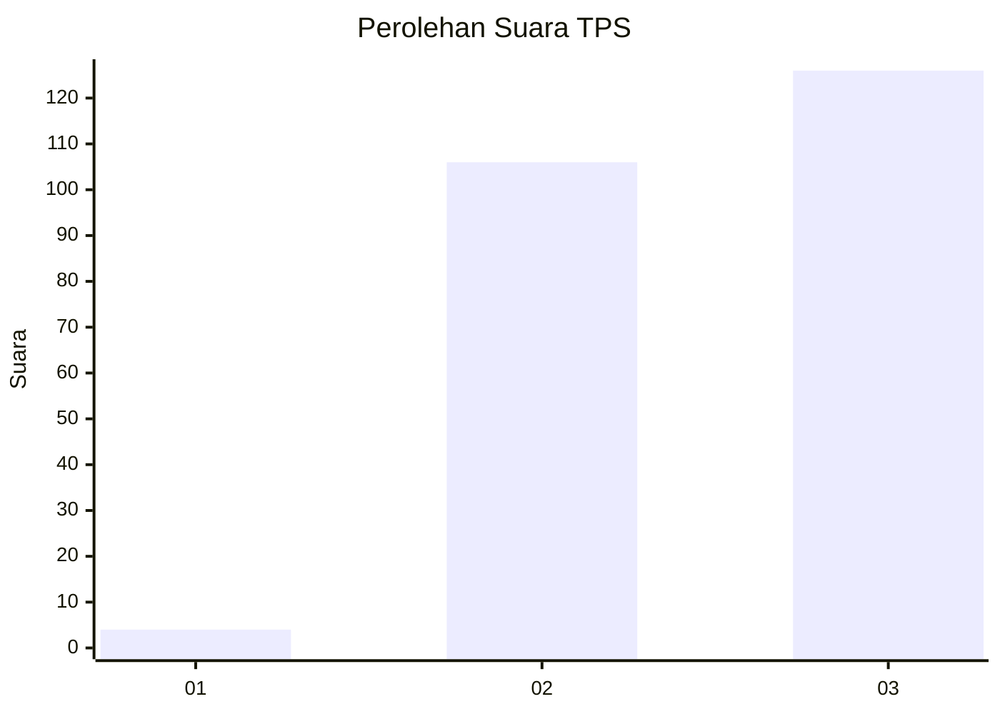
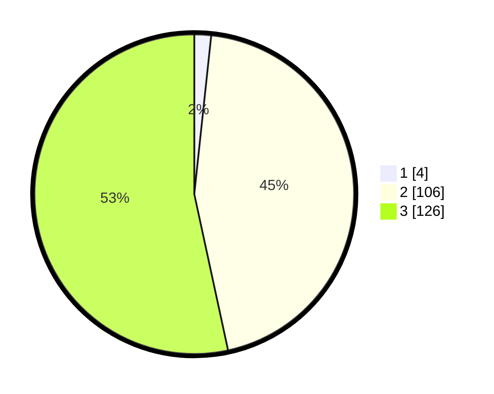

# Hasil

## Grafik

## Tabel

| No. | Nama Paslon    | Suara | Suara (raw) | Persentase |
|:--- |:-------------- | -----:| -----------:| ----------:|
| 1   | ANIES MUHAIMIN | 4     | [4][p-1]    | 1,69       |
| 2   | PRABOWO GIBRAN | 106   | [106][p-2]  | 44,92      |
| 3   | GANJAR MAHFUD  | 126   | [126][p-3]  | 53,39      |

[p-1]: https://github.com/gigit-pemilu/pemilu-2024-51-bali/blob/main/pilpres/hitung-suara/sub/51-bali/sub/03-badung/sub/02-mengwi/sub/2007-sembung/sub/018-tps/sub/paslon-1.txt
[p-2]: https://github.com/gigit-pemilu/pemilu-2024-51-bali/blob/main/pilpres/hitung-suara/sub/51-bali/sub/03-badung/sub/02-mengwi/sub/2007-sembung/sub/018-tps/sub/paslon-2.txt
[p-3]: https://github.com/gigit-pemilu/pemilu-2024-51-bali/blob/main/pilpres/hitung-suara/sub/51-bali/sub/03-badung/sub/02-mengwi/sub/2007-sembung/sub/018-tps/sub/paslon-3.txt

## Foto C Plano

https://sirekap-obj-formc.kpu.go.id/346c/pemilu/ppwp/51/03/02/20/07/5103022007018-20240216-210651--4db67e66-ed71-4eae-b73d-9c7744730225.jpg

https://sirekap-obj-formc.kpu.go.id/346c/pemilu/ppwp/51/03/02/20/07/5103022007018-20240216-211944--29fb40d2-f949-4fcc-a9b9-1ed54a1dd470.jpg

https://sirekap-obj-formc.kpu.go.id/346c/pemilu/ppwp/51/03/02/20/07/5103022007018-20240217-113852--c2c4f395-5d73-450d-bf23-0100295f3530.jpg

## Metadata

| Key        | Value               |
| ---------- | ------------------- |
| Time Stamp | 2024-02-22 12:00:00 |

