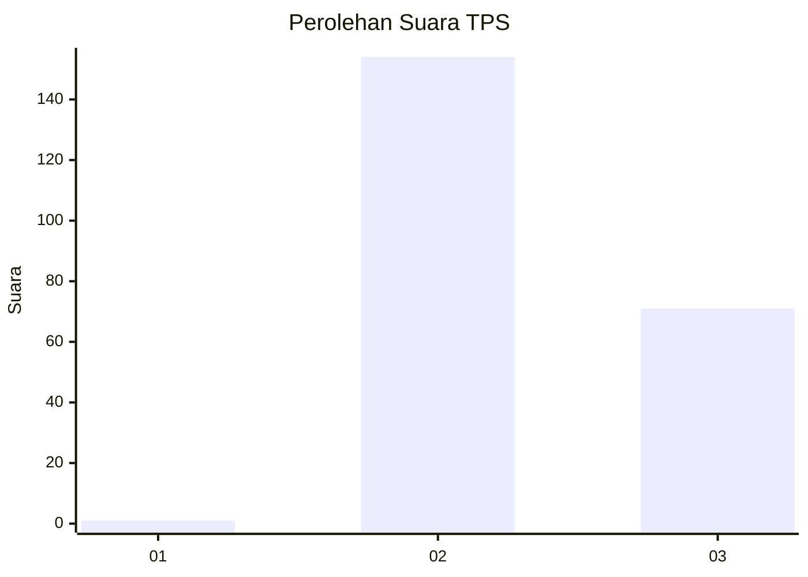
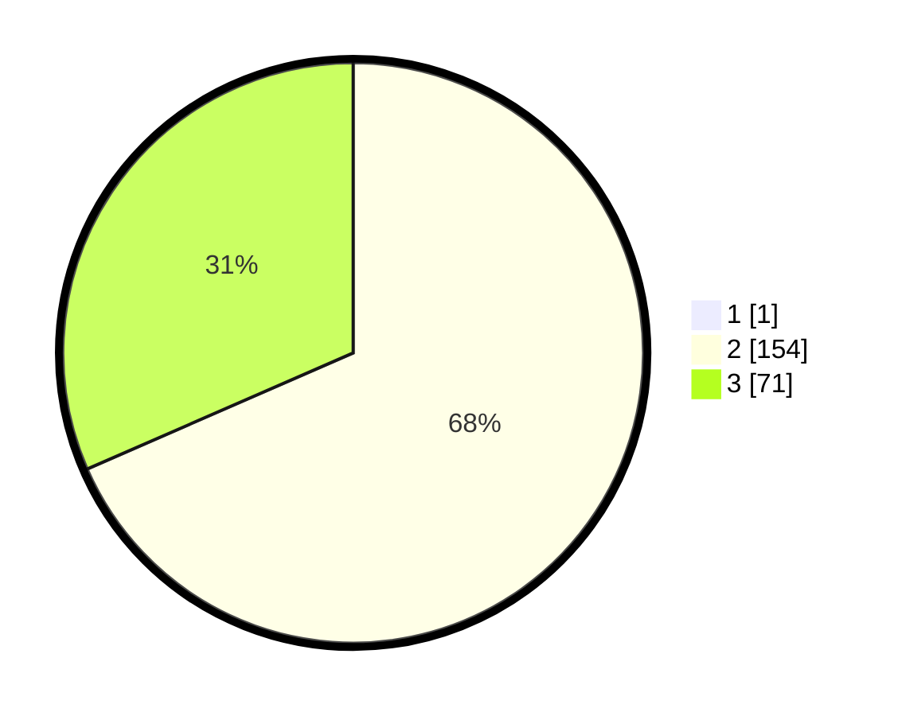

# Hasil

## Grafik

## Tabel

| No. | Nama Paslon    | Suara | Suara (raw) | Persentase |
|:--- |:-------------- | -----:| -----------:| ----------:|
| 1   | ANIES MUHAIMIN | 1     | [1][p-1]    | 0,44       |
| 2   | PRABOWO GIBRAN | 154   | [154][p-2]  | 68,14      |
| 3   | GANJAR MAHFUD  | 71    | [71][p-3]   | 31,42      |

[p-1]: https://github.com/gigit-pemilu/pemilu-2024-51-bali/blob/main/pilpres/hitung-suara/sub/51-bali/sub/03-badung/sub/02-mengwi/sub/2008-baha/sub/003-tps/sub/paslon-1.txt
[p-2]: https://github.com/gigit-pemilu/pemilu-2024-51-bali/blob/main/pilpres/hitung-suara/sub/51-bali/sub/03-badung/sub/02-mengwi/sub/2008-baha/sub/003-tps/sub/paslon-2.txt
[p-3]: https://github.com/gigit-pemilu/pemilu-2024-51-bali/blob/main/pilpres/hitung-suara/sub/51-bali/sub/03-badung/sub/02-mengwi/sub/2008-baha/sub/003-tps/sub/paslon-3.txt

## Foto C Plano

https://sirekap-obj-formc.kpu.go.id/2ca7/pemilu/ppwp/51/03/02/20/08/5103022008003-20240214-222927--6297ce19-0f2d-49c4-bc41-111d673da5ea.jpg

https://sirekap-obj-formc.kpu.go.id/2ca7/pemilu/ppwp/51/03/02/20/08/5103022008003-20240214-223018--c37b8ef3-dc3e-40e8-8f87-f747644c26a7.jpg

https://sirekap-obj-formc.kpu.go.id/2ca7/pemilu/ppwp/51/03/02/20/08/5103022008003-20240214-223131--c793d493-c40d-4c3e-a795-b85bf61bc65a.jpg

## Metadata

| Key        | Value               |
| ---------- | ------------------- |
| Time Stamp | 2024-02-24 22:31:28 |

