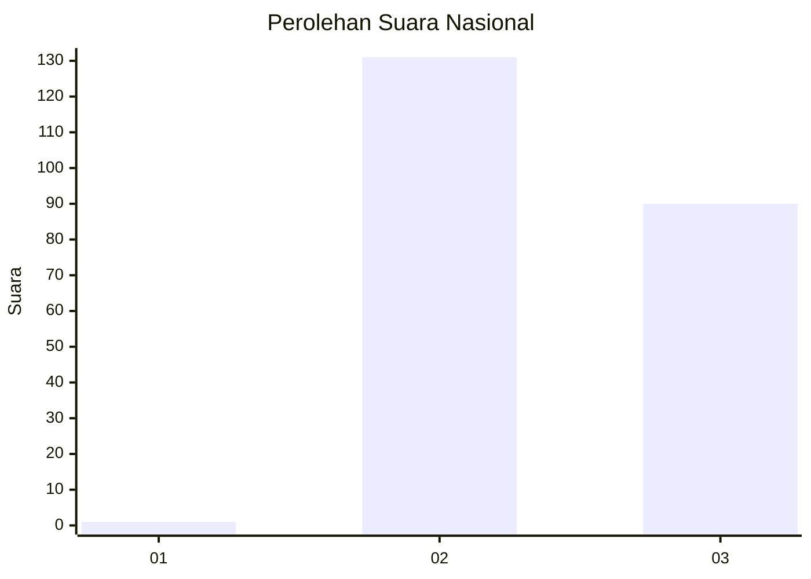
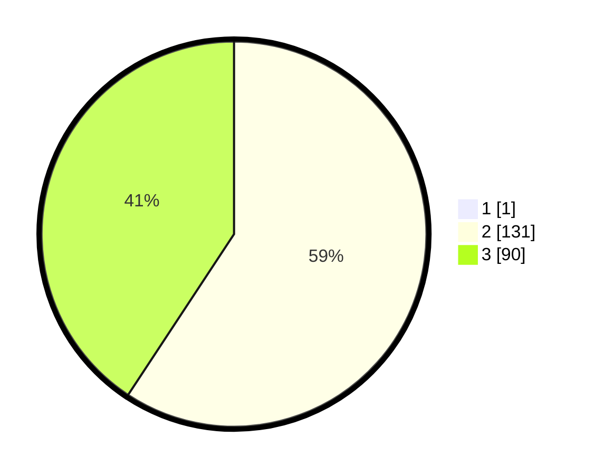

# Hasil

## Grafik

## Tabel

| No. | Nama Paslon    | Suara | Suara (raw) | Persentase |
|:--- |:-------------- | -----:| -----------:| ----------:|
| 1   | ANIES MUHAIMIN | 1     | [1][p-1]    | 0,45       |
| 2   | PRABOWO GIBRAN | 131   | [131][p-2]  | 59,01      |
| 3   | GANJAR MAHFUD  | 90    | [90][p-3]   | 40,54      |

[p-1]: https://github.com/gigit-pemilu/pemilu-2024/blob/main/pilpres/hitung-suara/sub/51-bali/sub/03-badung/sub/02-mengwi/sub/2008-baha/sub/004-tps/sub/paslon-1.txt
[p-2]: https://github.com/gigit-pemilu/pemilu-2024/blob/main/pilpres/hitung-suara/sub/51-bali/sub/03-badung/sub/02-mengwi/sub/2008-baha/sub/004-tps/sub/paslon-2.txt
[p-3]: https://github.com/gigit-pemilu/pemilu-2024/blob/main/pilpres/hitung-suara/sub/51-bali/sub/03-badung/sub/02-mengwi/sub/2008-baha/sub/004-tps/sub/paslon-3.txt

## Foto C Plano

https://sirekap-obj-formc.kpu.go.id/0060/pemilu/ppwp/51/03/02/20/08/5103022008004-20240214-205502--b5e4fbdc-8a13-47cc-ae90-96fca13694af.jpg

https://sirekap-obj-formc.kpu.go.id/0060/pemilu/ppwp/51/03/02/20/08/5103022008004-20240214-213122--c673aa42-1ef2-4f30-a9c9-9d1527ddaf94.jpg

https://sirekap-obj-formc.kpu.go.id/0060/pemilu/ppwp/51/03/02/20/08/5103022008004-20240214-213236--9df6a2d8-6a40-47ba-882d-35bb24c5b20f.jpg

## Metadata

| Key        | Value               |
| ---------- | ------------------- |
| Time Stamp | 2024-02-26 11:00:00 |

## DATA PEMILIH TETAP

Jumlah pemilih dalam DPT: **233**.
 * L: **115**.
 * P: **118**.

## DATA PENGGUNA HAK PILIH

Jumlah pengguna hak pilih dalam DPT: **233**.
 * L: **115**.
 * P: **118**.

Jumlah pengguna hak pilih dalam DPTb: **1**.
 * L: **0**.
 * P: **1**.

Jumlah pengguna hak pilih dalam DPK: **0**.
 * L: **0**.
 * P: **0**.

Jumlah pengguna hak pilih: **234**.
 * L: **115**.
 * P: **119**.

## JUMLAH SUARA SAH DAN TIDAK SAH

JUMLAH SELURUH SUARA SAH: **222**.

JUMLAH SUARA TIDAK SAH: **12**.

JUMLAH SELURUH SUARA SAH DAN SUARA TIDAK SAH: **234**.

