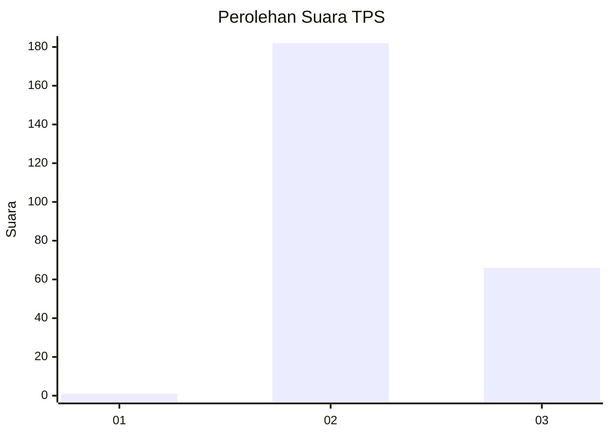
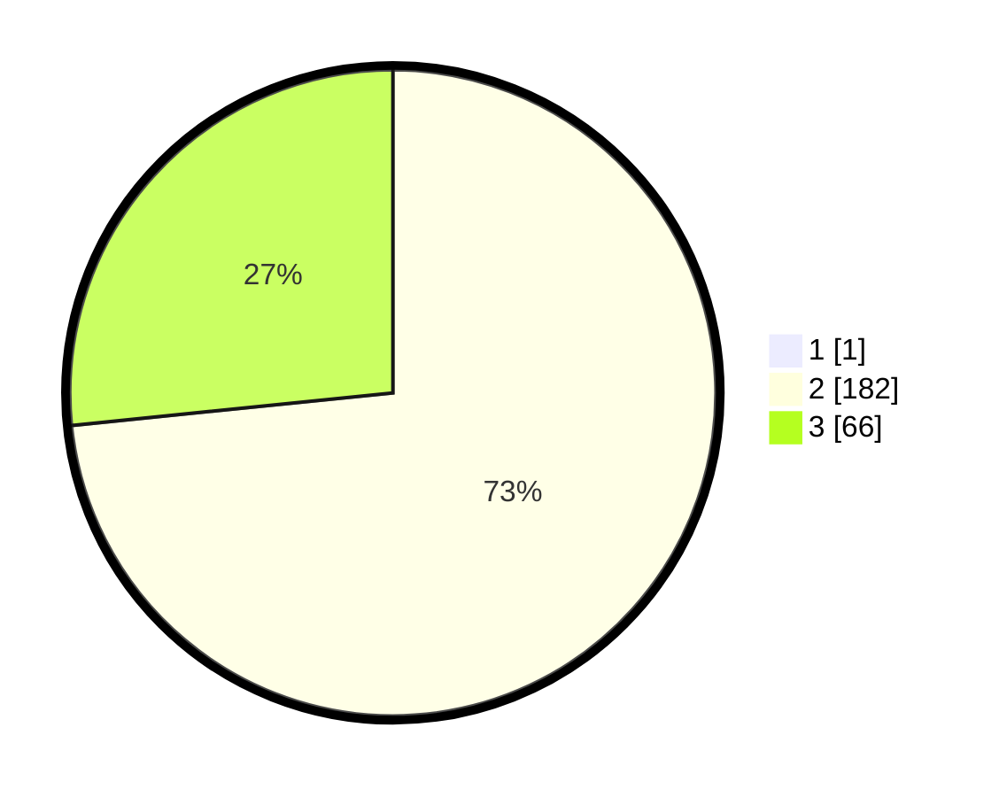

# Hasil

## Grafik

## Tabel

| No. | Nama Paslon    | Suara | Suara (raw) | Persentase |
|:--- |:-------------- | -----:| -----------:| ----------:|
| 1   | ANIES MUHAIMIN | 1     | [1][p-1]    | 0,40       |
| 2   | PRABOWO GIBRAN | 182   | [182][p-2]  | 73,09      |
| 3   | GANJAR MAHFUD  | 66    | [66][p-3]   | 26,51      |

[p-1]: https://github.com/gigit-pemilu/pemilu-2024-51-bali/blob/main/pilpres/hitung-suara/sub/51-bali/sub/03-badung/sub/02-mengwi/sub/2008-baha/sub/005-tps/sub/paslon-1.txt
[p-2]: https://github.com/gigit-pemilu/pemilu-2024-51-bali/blob/main/pilpres/hitung-suara/sub/51-bali/sub/03-badung/sub/02-mengwi/sub/2008-baha/sub/005-tps/sub/paslon-2.txt
[p-3]: https://github.com/gigit-pemilu/pemilu-2024-51-bali/blob/main/pilpres/hitung-suara/sub/51-bali/sub/03-badung/sub/02-mengwi/sub/2008-baha/sub/005-tps/sub/paslon-3.txt

## Foto C Plano

https://sirekap-obj-formc.kpu.go.id/9c06/pemilu/ppwp/51/03/02/20/08/5103022008005-20240216-153333--1d8610a3-f8d9-41e0-aa63-168f555e93f7.jpg

https://sirekap-obj-formc.kpu.go.id/9c06/pemilu/ppwp/51/03/02/20/08/5103022008005-20240216-153355--8057f238-2d94-4e7f-8a0c-722179f18661.jpg

https://sirekap-obj-formc.kpu.go.id/9c06/pemilu/ppwp/51/03/02/20/08/5103022008005-20240214-232215--4733d335-7047-4e3f-a6dd-0f2385d90467.jpg

## Metadata

| Key        | Value               |
| ---------- | ------------------- |
| Time Stamp | 2024-02-21 21:00:04 |

