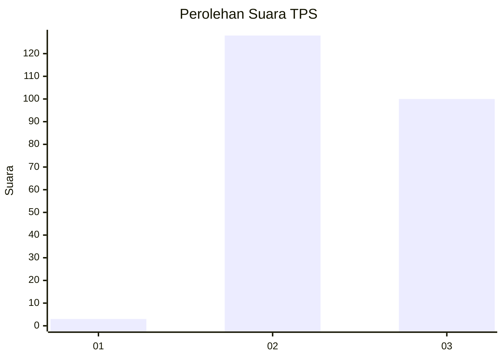
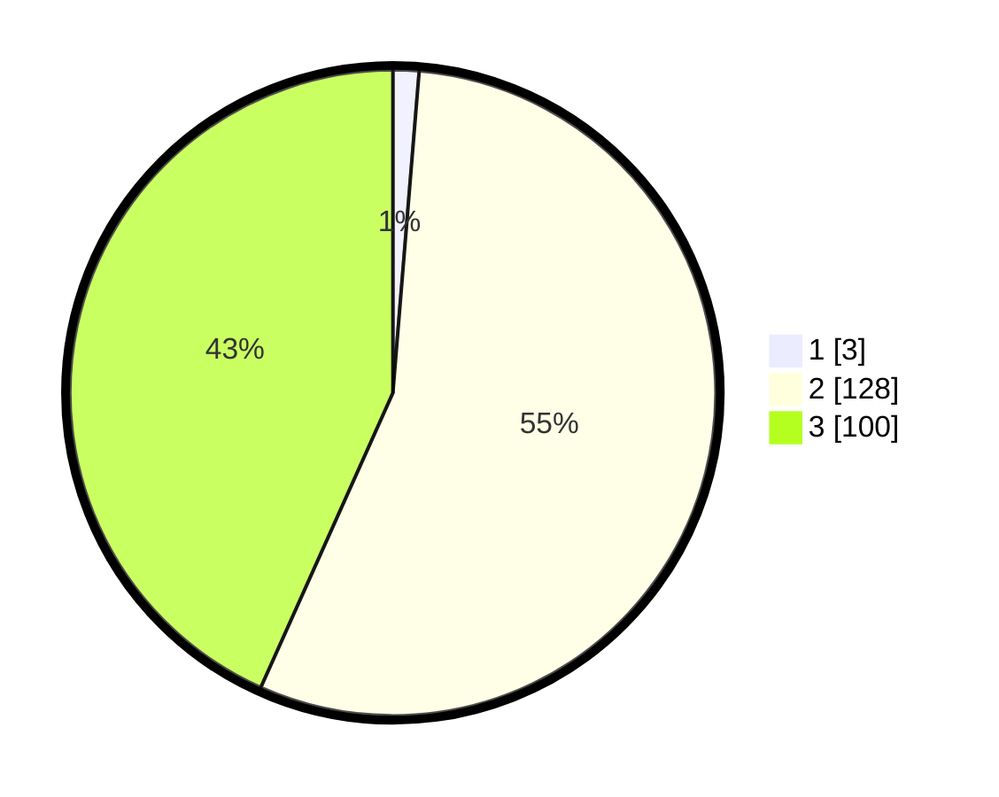

# Hasil

## Grafik

## Tabel

| No. | Nama Paslon    | Suara | Suara (raw) | Persentase |
|:--- |:-------------- | -----:| -----------:| ----------:|
| 1   | ANIES MUHAIMIN | 3     | [3][p-1]    | 1,30       |
| 2   | PRABOWO GIBRAN | 128   | [128][p-2]  | 55,41      |
| 3   | GANJAR MAHFUD  | 100   | [100][p-3]  | 43,29      |

[p-1]: https://github.com/gigit-pemilu/pemilu-2024-51-bali/blob/main/pilpres/hitung-suara/sub/51-bali/sub/03-badung/sub/02-mengwi/sub/2008-baha/sub/007-tps/sub/paslon-1.txt
[p-2]: https://github.com/gigit-pemilu/pemilu-2024-51-bali/blob/main/pilpres/hitung-suara/sub/51-bali/sub/03-badung/sub/02-mengwi/sub/2008-baha/sub/007-tps/sub/paslon-2.txt
[p-3]: https://github.com/gigit-pemilu/pemilu-2024-51-bali/blob/main/pilpres/hitung-suara/sub/51-bali/sub/03-badung/sub/02-mengwi/sub/2008-baha/sub/007-tps/sub/paslon-3.txt

## Foto C Plano

https://sirekap-obj-formc.kpu.go.id/f073/pemilu/ppwp/51/03/02/20/08/5103022008007-20240216-180937--05787bb5-1fe5-4936-9be7-11c854693019.jpg

https://sirekap-obj-formc.kpu.go.id/f073/pemilu/ppwp/51/03/02/20/08/5103022008007-20240216-180953--0a285430-26dd-49c6-a014-6c4216479708.jpg

https://sirekap-obj-formc.kpu.go.id/f073/pemilu/ppwp/51/03/02/20/08/5103022008007-20240216-181001--764317db-0c8b-4f5c-9cc9-06e7b1908962.jpg

## Metadata

| Key        | Value               |
| ---------- | ------------------- |
| Time Stamp | 2024-02-16 23:00:00 |

## DATA PEMILIH TETAP

Jumlah pemilih dalam DPT: **260**.
 * L: **126**.
 * P: **134**.

## DATA PENGGUNA HAK PILIH

Jumlah pengguna hak pilih dalam DPT: **246**.
 * L: **102**.
 * P: **124**.

Jumlah pengguna hak pilih dalam DPTb: **1**.
 * L: **1**.
 * P: **0**.

Jumlah pengguna hak pilih dalam DPK: **0**.
 * L: **0**.
 * P: **0**.

Jumlah pengguna hak pilih: **247**.
 * L: **123**.
 * P: **124**.

## JUMLAH SUARA SAH DAN TIDAK SAH

JUMLAH SELURUH SUARA SAH: **231**.

JUMLAH SUARA TIDAK SAH: **16**.

JUMLAH SELURUH SUARA SAH DAN SUARA TIDAK SAH: **247**.

