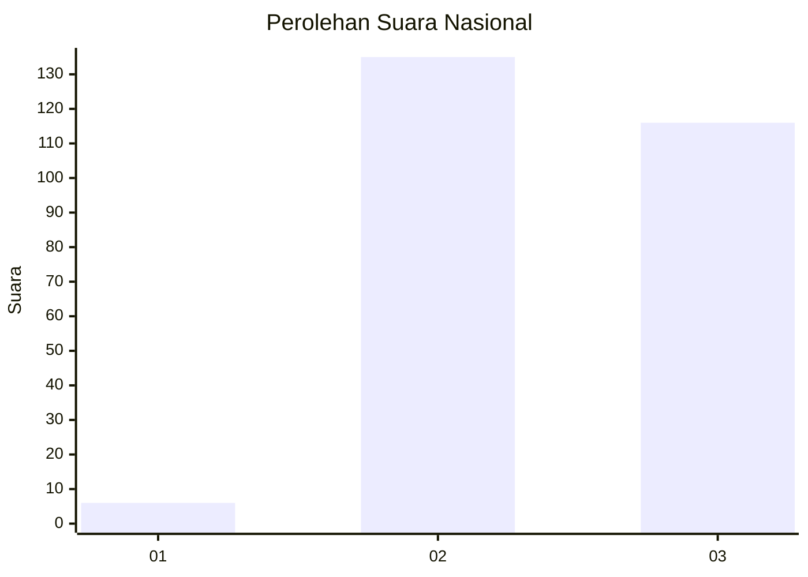
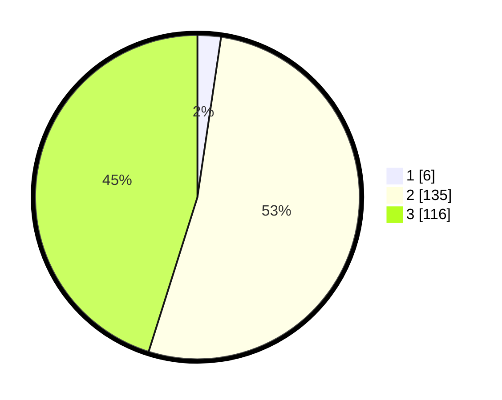

# Hasil

## Grafik

## Tabel

| No. | Nama Paslon    | Suara | Suara (raw) | Persentase |
|:--- |:-------------- | -----:| -----------:| ----------:|
| 1   | ANIES MUHAIMIN | 6     | [6][p-1]    | 2,33       |
| 2   | PRABOWO GIBRAN | 135   | [135][p-2]  | 52,53      |
| 3   | GANJAR MAHFUD  | 116   | [116][p-3]  | 45,14      |

[p-1]: https://github.com/gigit-pemilu/pemilu-2024/blob/main/pilpres/hitung-suara/sub/51-bali/sub/03-badung/sub/02-mengwi/sub/2008-baha/sub/009-tps/sub/paslon-1.txt
[p-2]: https://github.com/gigit-pemilu/pemilu-2024/blob/main/pilpres/hitung-suara/sub/51-bali/sub/03-badung/sub/02-mengwi/sub/2008-baha/sub/009-tps/sub/paslon-2.txt
[p-3]: https://github.com/gigit-pemilu/pemilu-2024/blob/main/pilpres/hitung-suara/sub/51-bali/sub/03-badung/sub/02-mengwi/sub/2008-baha/sub/009-tps/sub/paslon-3.txt

## Foto C Plano

https://sirekap-obj-formc.kpu.go.id/90f2/pemilu/ppwp/51/03/02/20/08/5103022008009-20240214-194826--8cac90b0-ae74-4362-a0ac-a64867e24af1.jpg

https://sirekap-obj-formc.kpu.go.id/90f2/pemilu/ppwp/51/03/02/20/08/5103022008009-20240214-194834--5e28614e-8dfc-4b42-b449-5d8855b6f507.jpg

https://sirekap-obj-formc.kpu.go.id/90f2/pemilu/ppwp/51/03/02/20/08/5103022008009-20240214-194839--4f23e778-3941-4721-8287-c33937103401.jpg

## Metadata

| Key        | Value               |
| ---------- | ------------------- |
| Time Stamp | 2024-02-15 00:41:44 |

## DATA PEMILIH TETAP

Jumlah pemilih dalam DPT: **277**.
 * L: **138**.
 * P: **139**.

## DATA PENGGUNA HAK PILIH

Jumlah pengguna hak pilih dalam DPT: **267**.
 * L: **133**.
 * P: **134**.

Jumlah pengguna hak pilih dalam DPTb: **1**.
 * L: **1**.
 * P: **0**.

Jumlah pengguna hak pilih dalam DPK: **2**.
 * L: **1**.
 * P: **1**.

Jumlah pengguna hak pilih: **270**.
 * L: **135**.
 * P: **135**.

## JUMLAH SUARA SAH DAN TIDAK SAH

JUMLAH SELURUH SUARA SAH: **257**.

JUMLAH SUARA TIDAK SAH: **13**.

JUMLAH SELURUH SUARA SAH DAN SUARA TIDAK SAH: **270**.

