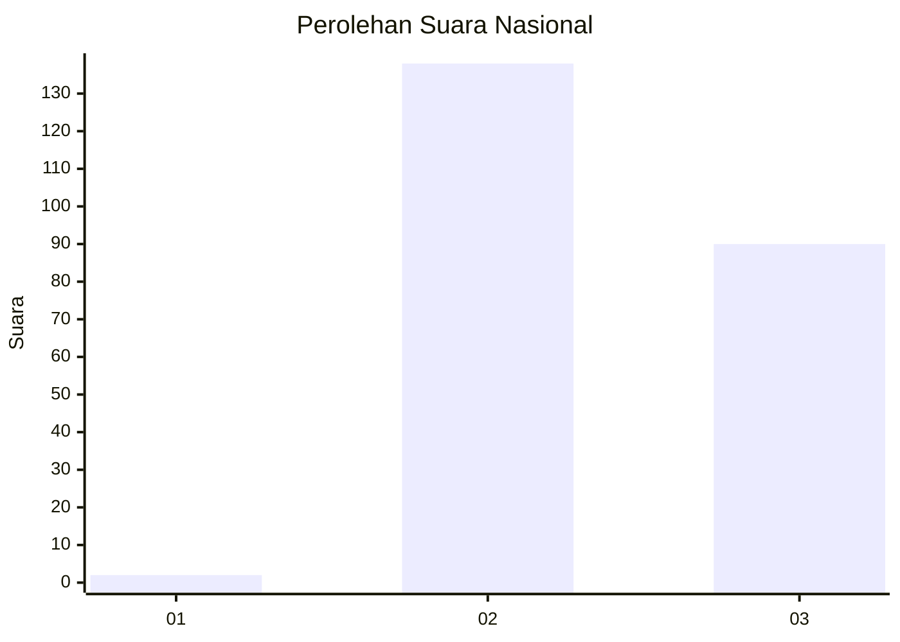
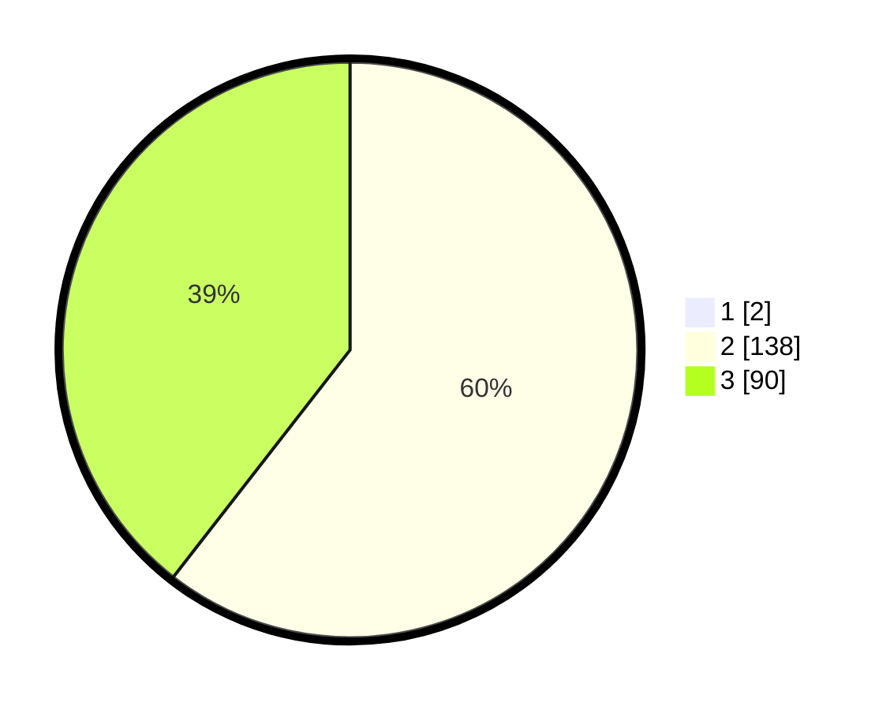

# Hasil

## Grafik

## Tabel

| No. | Nama Paslon    | Suara | Suara (raw) | Persentase |
|:--- |:-------------- | -----:| -----------:| ----------:|
| 1   | ANIES MUHAIMIN | 2     | [2][p-1]    | 0,87       |
| 2   | PRABOWO GIBRAN | 138   | [138][p-2]  | 60,00      |
| 3   | GANJAR MAHFUD  | 90    | [90][p-3]   | 39,13      |

[p-1]: https://github.com/gigit-pemilu/pemilu-2024/blob/main/pilpres/hitung-suara/sub/51-bali/sub/03-badung/sub/02-mengwi/sub/2008-baha/sub/010-tps/sub/paslon-1.txt
[p-2]: https://github.com/gigit-pemilu/pemilu-2024/blob/main/pilpres/hitung-suara/sub/51-bali/sub/03-badung/sub/02-mengwi/sub/2008-baha/sub/010-tps/sub/paslon-2.txt
[p-3]: https://github.com/gigit-pemilu/pemilu-2024/blob/main/pilpres/hitung-suara/sub/51-bali/sub/03-badung/sub/02-mengwi/sub/2008-baha/sub/010-tps/sub/paslon-3.txt

## Foto C Plano

https://sirekap-obj-formc.kpu.go.id/323e/pemilu/ppwp/51/03/02/20/08/5103022008010-20240214-195447--c66cc7df-eb07-4803-be4a-65bd10f311f2.jpg

https://sirekap-obj-formc.kpu.go.id/323e/pemilu/ppwp/51/03/02/20/08/5103022008010-20240214-195452--368599ff-d706-4ae1-bcaf-591ca587fa3b.jpg

https://sirekap-obj-formc.kpu.go.id/323e/pemilu/ppwp/51/03/02/20/08/5103022008010-20240216-095512--b03961d8-1889-46e2-af4c-f74aca282a4e.jpg

## Metadata

| Key        | Value               |
| ---------- | ------------------- |
| Time Stamp | 2024-02-21 19:00:00 |

## DATA PEMILIH TETAP

Jumlah pemilih dalam DPT: **268**.
 * L: **135**.
 * P: **133**.

## DATA PENGGUNA HAK PILIH

Jumlah pengguna hak pilih dalam DPT: **255**.
 * L: **129**.
 * P: **126**.

Jumlah pengguna hak pilih dalam DPTb: **1**.
 * L: **1**.
 * P: **0**.

Jumlah pengguna hak pilih dalam DPK: **0**.
 * L: **0**.
 * P: **0**.

Jumlah pengguna hak pilih: **256**.
 * L: **130**.
 * P: **126**.

## JUMLAH SUARA SAH DAN TIDAK SAH

JUMLAH SELURUH SUARA SAH: **230**.

JUMLAH SUARA TIDAK SAH: **26**.

JUMLAH SELURUH SUARA SAH DAN SUARA TIDAK SAH: **256**.

