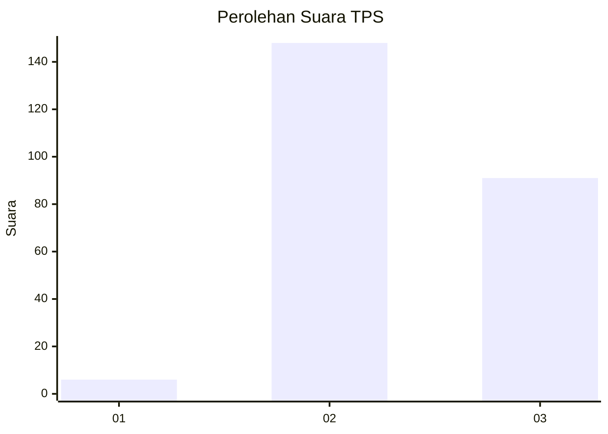
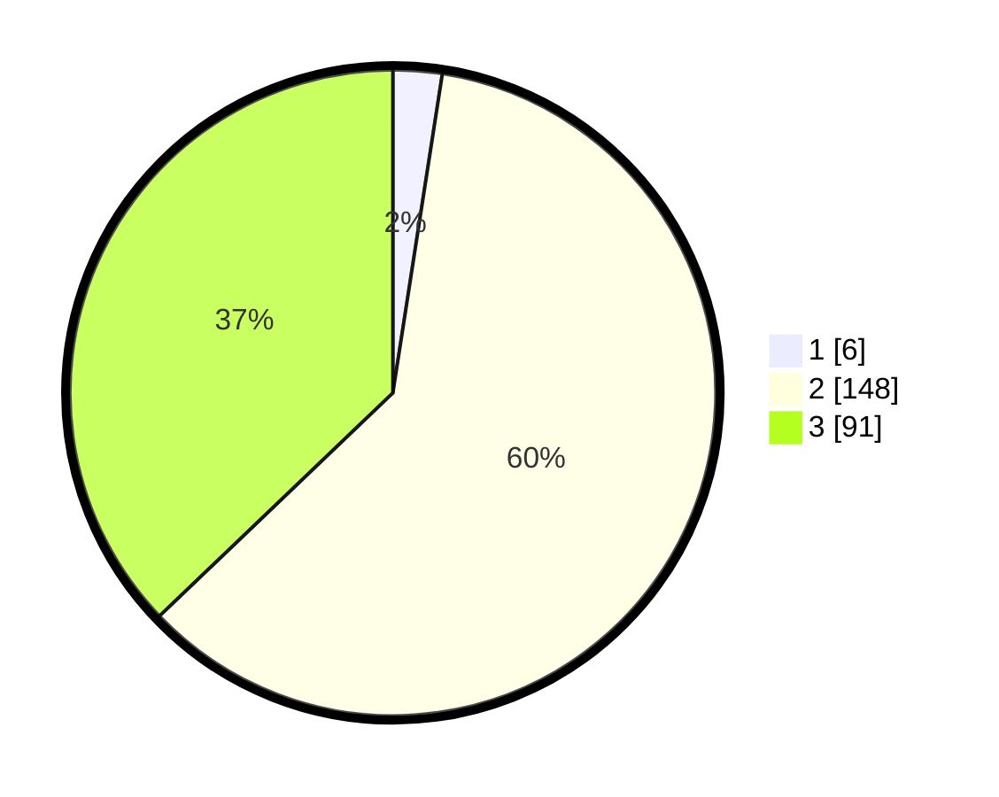

# Hasil

## Grafik

## Tabel

| No. | Nama Paslon    | Suara | Suara (raw) | Persentase |
|:--- |:-------------- | -----:| -----------:| ----------:|
| 1   | ANIES MUHAIMIN | 6     | [6][p-1]    | 2,45       |
| 2   | PRABOWO GIBRAN | 148   | [148][p-2]  | 60,41      |
| 3   | GANJAR MAHFUD  | 91    | [91][p-3]   | 37,14      |

[p-1]: https://github.com/gigit-pemilu/pemilu-2024-51-bali/blob/main/pilpres/hitung-suara/sub/51-bali/sub/03-badung/sub/02-mengwi/sub/2008-baha/sub/011-tps/sub/paslon-1.txt
[p-2]: https://github.com/gigit-pemilu/pemilu-2024-51-bali/blob/main/pilpres/hitung-suara/sub/51-bali/sub/03-badung/sub/02-mengwi/sub/2008-baha/sub/011-tps/sub/paslon-2.txt
[p-3]: https://github.com/gigit-pemilu/pemilu-2024-51-bali/blob/main/pilpres/hitung-suara/sub/51-bali/sub/03-badung/sub/02-mengwi/sub/2008-baha/sub/011-tps/sub/paslon-3.txt

## Foto C Plano

https://sirekap-obj-formc.kpu.go.id/57d7/pemilu/ppwp/51/03/02/20/08/5103022008011-20240214-195235--13e7f40d-5eed-451f-8012-f0774bdac202.jpg

https://sirekap-obj-formc.kpu.go.id/57d7/pemilu/ppwp/51/03/02/20/08/5103022008011-20240215-202456--a0a9af65-1245-49a3-953d-3ea9662ed7ed.jpg

https://sirekap-obj-formc.kpu.go.id/57d7/pemilu/ppwp/51/03/02/20/08/5103022008011-20240215-202704--6d7df6b1-d790-42fd-abfc-f6bc6bcc70e6.jpg

## Metadata

| Key        | Value               |
| ---------- | ------------------- |
| Time Stamp | 2024-02-24 22:31:28 |

