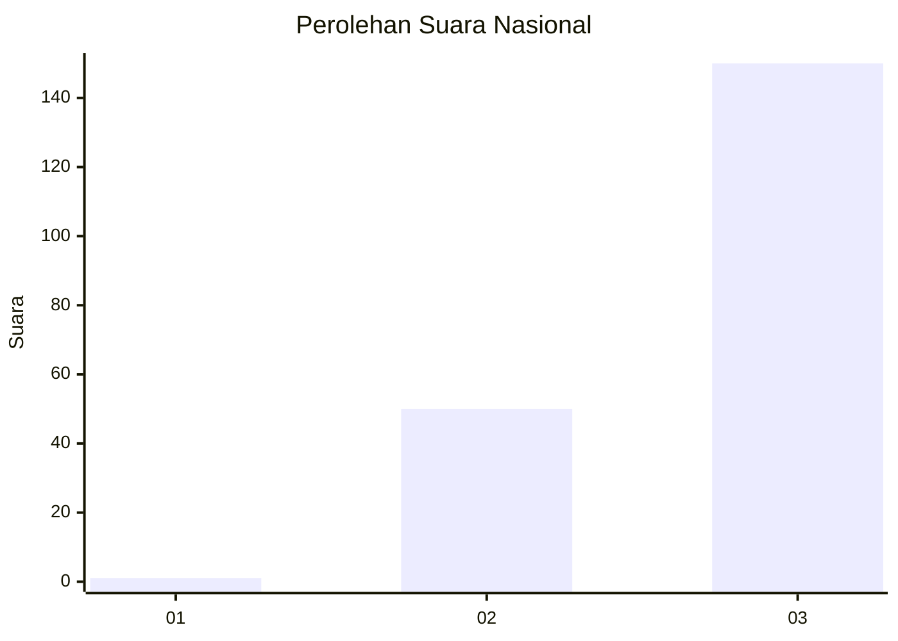
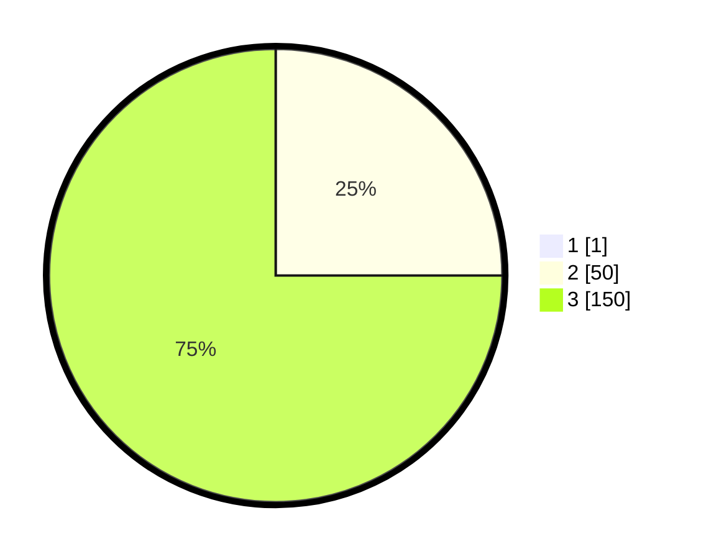

# Hasil

## Grafik

## Tabel

| No. | Nama Paslon    | Suara | Suara (raw) | Persentase |
|:--- |:-------------- | -----:| -----------:| ----------:|
| 1   | ANIES MUHAIMIN | 1     | [1][p-1]    | 0,50       |
| 2   | PRABOWO GIBRAN | 50    | [50][p-2]   | 24,88      |
| 3   | GANJAR MAHFUD  | 150   | [150][p-3]  | 74,63      |

[p-1]: https://github.com/gigit-pemilu/pemilu-2024/blob/main/pilpres/hitung-suara/sub/51-bali/sub/03-badung/sub/02-mengwi/sub/2008-baha/sub/012-tps/sub/paslon-1.txt
[p-2]: https://github.com/gigit-pemilu/pemilu-2024/blob/main/pilpres/hitung-suara/sub/51-bali/sub/03-badung/sub/02-mengwi/sub/2008-baha/sub/012-tps/sub/paslon-2.txt
[p-3]: https://github.com/gigit-pemilu/pemilu-2024/blob/main/pilpres/hitung-suara/sub/51-bali/sub/03-badung/sub/02-mengwi/sub/2008-baha/sub/012-tps/sub/paslon-3.txt

## Foto C Plano

https://sirekap-obj-formc.kpu.go.id/3078/pemilu/ppwp/51/03/02/20/08/5103022008012-20240214-233734--3f22e4a0-55fc-4487-afeb-54d68468b884.jpg

https://sirekap-obj-formc.kpu.go.id/3078/pemilu/ppwp/51/03/02/20/08/5103022008012-20240214-233755--5214ac76-8ebb-4425-9084-b0f96971b944.jpg

https://sirekap-obj-formc.kpu.go.id/3078/pemilu/ppwp/51/03/02/20/08/5103022008012-20240214-233814--a35d233d-e0d4-4fe4-8c57-40b446698135.jpg

## Metadata

| Key        | Value               |
| ---------- | ------------------- |
| Time Stamp | 2024-02-24 22:31:28 |

