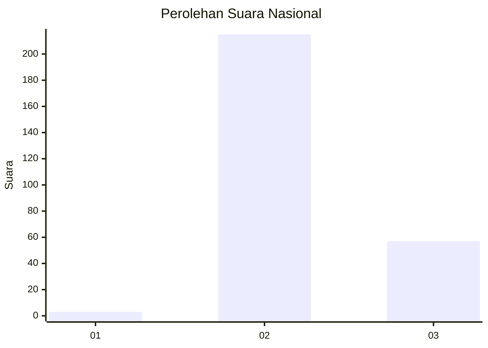

# Hasil

## Grafik

## Tabel

| No. | Nama Paslon    | Suara | Suara (raw) | Persentase |
|:--- |:-------------- | -----:| -----------:| ----------:|
| 1   | ANIES MUHAIMIN | 3     | [3][p-1]    | 1,09       |
| 2   | PRABOWO GIBRAN | 215   | [215][p-2]  | 78,18      |
| 3   | GANJAR MAHFUD  | 57    | [57][p-3]   | 20,73      |

[p-1]: https://github.com/gigit-pemilu/pemilu-2024/blob/main/pilpres/hitung-suara/sub/51-bali/sub/03-badung/sub/02-mengwi/sub/2009-mengwi/sub/005-tps/sub/paslon-1.txt
[p-2]: https://github.com/gigit-pemilu/pemilu-2024/blob/main/pilpres/hitung-suara/sub/51-bali/sub/03-badung/sub/02-mengwi/sub/2009-mengwi/sub/005-tps/sub/paslon-2.txt
[p-3]: https://github.com/gigit-pemilu/pemilu-2024/blob/main/pilpres/hitung-suara/sub/51-bali/sub/03-badung/sub/02-mengwi/sub/2009-mengwi/sub/005-tps/sub/paslon-3.txt

## Foto C Plano

https://sirekap-obj-formc.kpu.go.id/a7f3/pemilu/ppwp/51/03/02/20/09/5103022009005-20240214-222353--4b5b1516-2740-41bd-930b-77d72004b913.jpg

https://sirekap-obj-formc.kpu.go.id/a7f3/pemilu/ppwp/51/03/02/20/09/5103022009005-20240214-201536--97b50716-93f1-4ffb-9b74-3151e487ee16.jpg

https://sirekap-obj-formc.kpu.go.id/a7f3/pemilu/ppwp/51/03/02/20/09/5103022009005-20240214-201629--9633e89f-857b-43da-b168-d6fb1671dbf2.jpg

## Metadata

| Key        | Value               |
| ---------- | ------------------- |
| Time Stamp | 2024-02-16 09:00:28 |

## DATA PEMILIH TETAP

Jumlah pemilih dalam DPT: **299**.
 * L: **140**.
 * P: **159**.

## DATA PENGGUNA HAK PILIH

Jumlah pengguna hak pilih dalam DPT: **278**.
 * L: **130**.
 * P: **148**.

Jumlah pengguna hak pilih dalam DPTb: **0**.
 * L: **0**.
 * P: **0**.

Jumlah pengguna hak pilih dalam DPK: **1**.
 * L: **0**.
 * P: **1**.

Jumlah pengguna hak pilih: **279**.
 * L: **130**.
 * P: **149**.

## JUMLAH SUARA SAH DAN TIDAK SAH

JUMLAH SELURUH SUARA SAH: **275**.

JUMLAH SUARA TIDAK SAH: **4**.

JUMLAH SELURUH SUARA SAH DAN SUARA TIDAK SAH: **279**.

