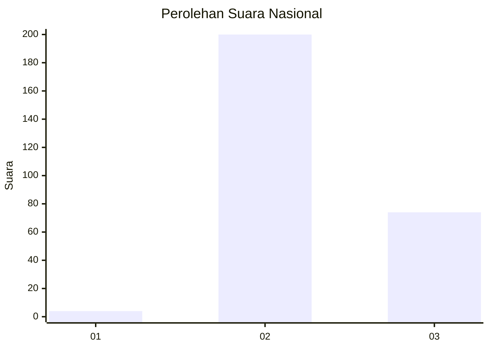
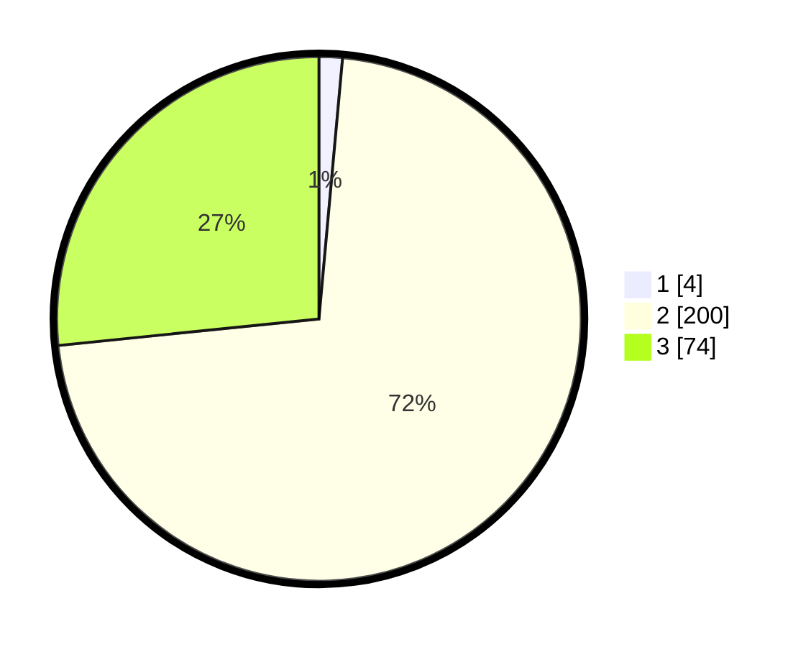

# Hasil

## Grafik

## Tabel

| No. | Nama Paslon    | Suara | Suara (raw) | Persentase |
|:--- |:-------------- | -----:| -----------:| ----------:|
| 1   | ANIES MUHAIMIN | 4     | [4][p-1]    | 1,44       |
| 2   | PRABOWO GIBRAN | 200   | [200][p-2]  | 71,94      |
| 3   | GANJAR MAHFUD  | 74    | [74][p-3]   | 26,62      |

[p-1]: https://github.com/gigit-pemilu/pemilu-2024/blob/main/pilpres/hitung-suara/sub/51-bali/sub/03-badung/sub/02-mengwi/sub/2009-mengwi/sub/006-tps/sub/paslon-1.txt
[p-2]: https://github.com/gigit-pemilu/pemilu-2024/blob/main/pilpres/hitung-suara/sub/51-bali/sub/03-badung/sub/02-mengwi/sub/2009-mengwi/sub/006-tps/sub/paslon-2.txt
[p-3]: https://github.com/gigit-pemilu/pemilu-2024/blob/main/pilpres/hitung-suara/sub/51-bali/sub/03-badung/sub/02-mengwi/sub/2009-mengwi/sub/006-tps/sub/paslon-3.txt

## Foto C Plano

https://sirekap-obj-formc.kpu.go.id/14c4/pemilu/ppwp/51/03/02/20/09/5103022009006-20240214-155832--b816b976-3294-406e-90ea-14dc44a01f04.jpg

https://sirekap-obj-formc.kpu.go.id/14c4/pemilu/ppwp/51/03/02/20/09/5103022009006-20240214-155310--44fb93a9-4d7c-4063-8bef-4747e151bedf.jpg

https://sirekap-obj-formc.kpu.go.id/14c4/pemilu/ppwp/51/03/02/20/09/5103022009006-20240214-155315--ae4333d0-5646-4c9a-b701-2ecd952b8c86.jpg

## Metadata

| Key        | Value               |
| ---------- | ------------------- |
| Time Stamp | 2024-02-14 21:46:01 |

## DATA PEMILIH TETAP

Jumlah pemilih dalam DPT: **296**.
 * L: **145**.
 * P: **151**.

## DATA PENGGUNA HAK PILIH

Jumlah pengguna hak pilih dalam DPT: **276**.
 * L: **136**.
 * P: **147**.

Jumlah pengguna hak pilih dalam DPTb: **3**.
 * L: **1**.
 * P: **2**.

Jumlah pengguna hak pilih dalam DPK: **3**.
 * L: **1**.
 * P: **2**.

Jumlah pengguna hak pilih: **282**.
 * L: **138**.
 * P: **144**.

## JUMLAH SUARA SAH DAN TIDAK SAH

JUMLAH SELURUH SUARA SAH: **278**.

JUMLAH SUARA TIDAK SAH: **4**.

JUMLAH SELURUH SUARA SAH DAN SUARA TIDAK SAH: **282**.

