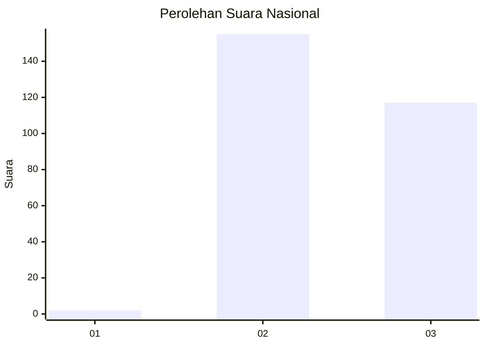
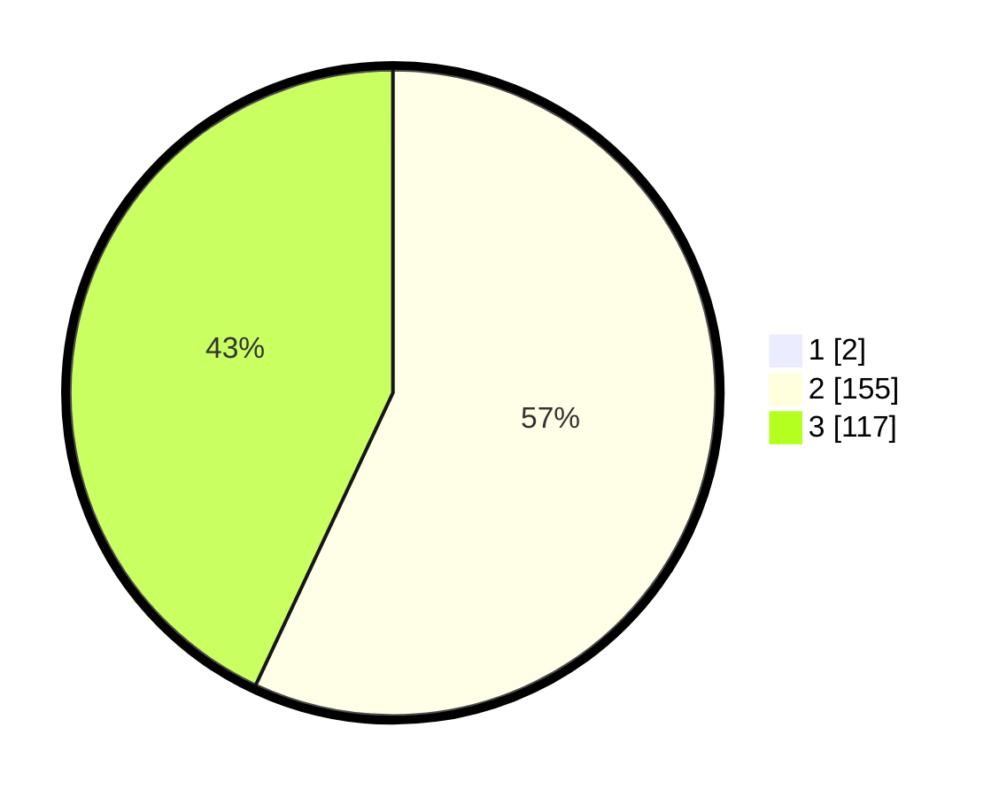

# Hasil

## Grafik

## Tabel

| No. | Nama Paslon    | Suara | Suara (raw) | Persentase |
|:--- |:-------------- | -----:| -----------:| ----------:|
| 1   | ANIES MUHAIMIN | 2     | [2][p-1]    | 0,73       |
| 2   | PRABOWO GIBRAN | 155   | [155][p-2]  | 56,57      |
| 3   | GANJAR MAHFUD  | 117   | [117][p-3]  | 42,70      |

[p-1]: https://github.com/gigit-pemilu/pemilu-2024/blob/main/pilpres/hitung-suara/sub/51-bali/sub/03-badung/sub/02-mengwi/sub/2009-mengwi/sub/007-tps/sub/paslon-1.txt
[p-2]: https://github.com/gigit-pemilu/pemilu-2024/blob/main/pilpres/hitung-suara/sub/51-bali/sub/03-badung/sub/02-mengwi/sub/2009-mengwi/sub/007-tps/sub/paslon-2.txt
[p-3]: https://github.com/gigit-pemilu/pemilu-2024/blob/main/pilpres/hitung-suara/sub/51-bali/sub/03-badung/sub/02-mengwi/sub/2009-mengwi/sub/007-tps/sub/paslon-3.txt

## Foto C Plano

https://sirekap-obj-formc.kpu.go.id/82cf/pemilu/ppwp/51/03/02/20/09/5103022009007-20240214-194345--53705bd4-c04e-40fb-99f0-4389fe4faa78.jpg

https://sirekap-obj-formc.kpu.go.id/82cf/pemilu/ppwp/51/03/02/20/09/5103022009007-20240214-194518--4a09bf84-6429-461e-ab09-96be6e779019.jpg

https://sirekap-obj-formc.kpu.go.id/82cf/pemilu/ppwp/51/03/02/20/09/5103022009007-20240214-194648--1d788189-f3fc-4366-99fb-f3266a9f03e2.jpg

## Metadata

| Key        | Value               |
| ---------- | ------------------- |
| Time Stamp | 2024-02-14 21:46:01 |

## DATA PEMILIH TETAP

Jumlah pemilih dalam DPT: **295**.
 * L: **142**.
 * P: **153**.

## DATA PENGGUNA HAK PILIH

Jumlah pengguna hak pilih dalam DPT: **279**.
 * L: **135**.
 * P: **144**.

Jumlah pengguna hak pilih dalam DPTb: **0**.
 * L: **0**.
 * P: **0**.

Jumlah pengguna hak pilih dalam DPK: **1**.
 * L: **0**.
 * P: **1**.

Jumlah pengguna hak pilih: **280**.
 * L: **135**.
 * P: **145**.

## JUMLAH SUARA SAH DAN TIDAK SAH

JUMLAH SELURUH SUARA SAH: **274**.

JUMLAH SUARA TIDAK SAH: **6**.

JUMLAH SELURUH SUARA SAH DAN SUARA TIDAK SAH: **280**.

