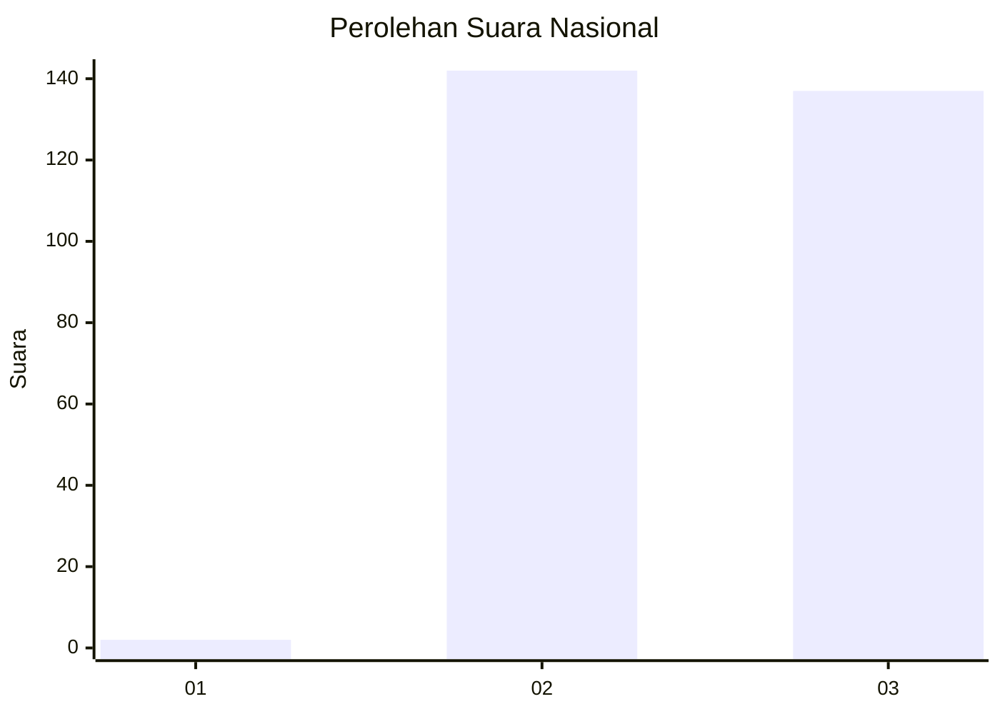
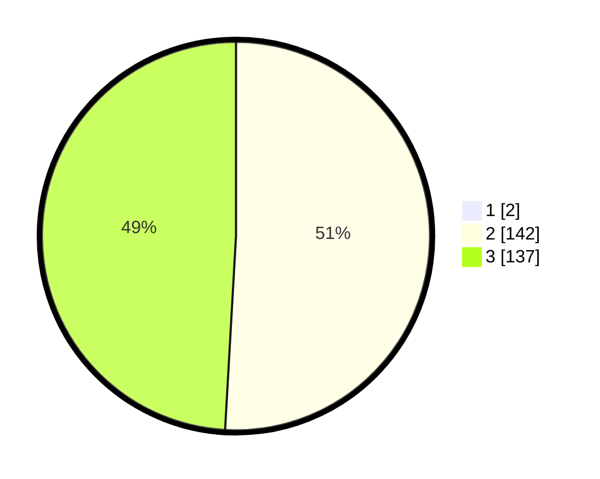

# Hasil

## Grafik

## Tabel

| No. | Nama Paslon    | Suara | Suara (raw) | Persentase |
|:--- |:-------------- | -----:| -----------:| ----------:|
| 1   | ANIES MUHAIMIN | 2     | [2][p-1]    | 0,71       |
| 2   | PRABOWO GIBRAN | 142   | [142][p-2]  | 50,53      |
| 3   | GANJAR MAHFUD  | 137   | [137][p-3]  | 48,75      |

[p-1]: https://github.com/gigit-pemilu/pemilu-2024/blob/main/pilpres/hitung-suara/sub/51-bali/sub/03-badung/sub/02-mengwi/sub/2009-mengwi/sub/008-tps/sub/paslon-1.txt
[p-2]: https://github.com/gigit-pemilu/pemilu-2024/blob/main/pilpres/hitung-suara/sub/51-bali/sub/03-badung/sub/02-mengwi/sub/2009-mengwi/sub/008-tps/sub/paslon-2.txt
[p-3]: https://github.com/gigit-pemilu/pemilu-2024/blob/main/pilpres/hitung-suara/sub/51-bali/sub/03-badung/sub/02-mengwi/sub/2009-mengwi/sub/008-tps/sub/paslon-3.txt

## Foto C Plano

https://sirekap-obj-formc.kpu.go.id/321d/pemilu/ppwp/51/03/02/20/09/5103022009008-20240214-221430--1b9655f3-b0b0-476f-ad95-4f04ae7da5f1.jpg

https://sirekap-obj-formc.kpu.go.id/321d/pemilu/ppwp/51/03/02/20/09/5103022009008-20240214-221601--7e4c2b3d-081c-4685-aa23-e3a5a56dd433.jpg

https://sirekap-obj-formc.kpu.go.id/321d/pemilu/ppwp/51/03/02/20/09/5103022009008-20240214-221714--d621ddf2-373b-45bf-bf40-a64ab967d6e0.jpg

## Metadata

| Key        | Value               |
| ---------- | ------------------- |
| Time Stamp | 2024-02-16 06:00:27 |

## DATA PEMILIH TETAP

Jumlah pemilih dalam DPT: **283**.
 * L: **151**.
 * P: **132**.

## DATA PENGGUNA HAK PILIH

Jumlah pengguna hak pilih dalam DPT: **279**.
 * L: **150**.
 * P: **129**.

Jumlah pengguna hak pilih dalam DPTb: **4**.
 * L: **1**.
 * P: **3**.

Jumlah pengguna hak pilih dalam DPK: **0**.
 * L: **0**.
 * P: **0**.

Jumlah pengguna hak pilih: **283**.
 * L: **151**.
 * P: **132**.

## JUMLAH SUARA SAH DAN TIDAK SAH

JUMLAH SELURUH SUARA SAH: **281**.

JUMLAH SUARA TIDAK SAH: **2**.

JUMLAH SELURUH SUARA SAH DAN SUARA TIDAK SAH: **283**.

