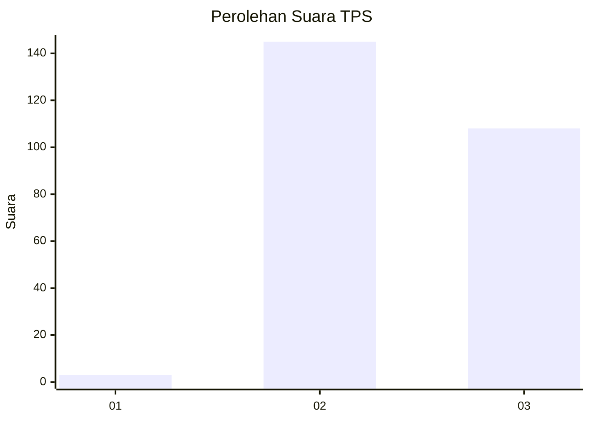
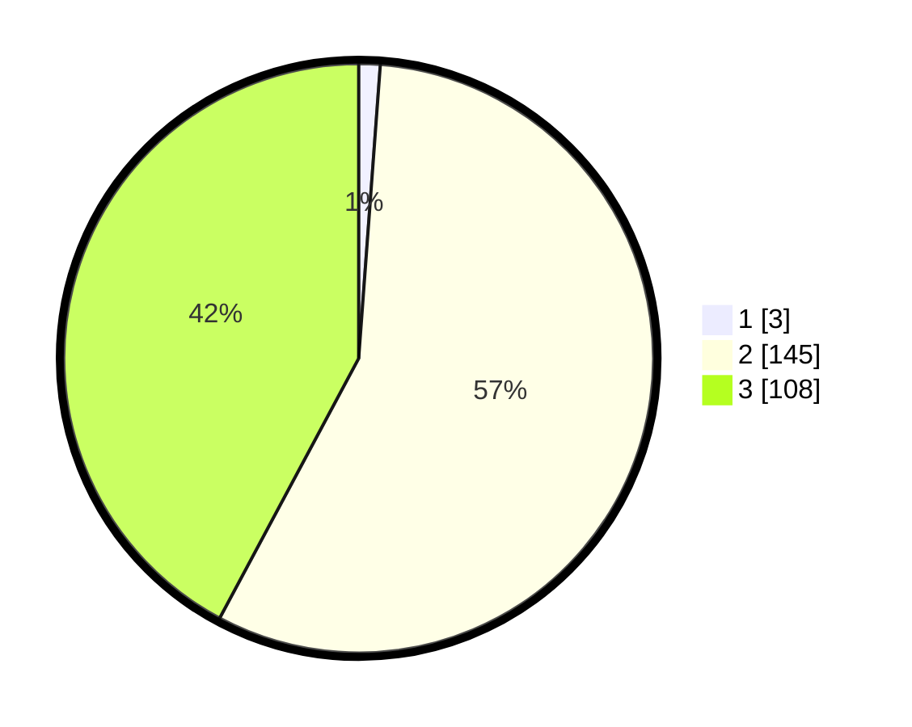

# Hasil

## Grafik

## Tabel

| No. | Nama Paslon    | Suara | Suara (raw) | Persentase |
|:--- |:-------------- | -----:| -----------:| ----------:|
| 1   | ANIES MUHAIMIN | 3     | [3][p-1]    | 1,17       |
| 2   | PRABOWO GIBRAN | 145   | [145][p-2]  | 56,64      |
| 3   | GANJAR MAHFUD  | 108   | [108][p-3]  | 42,19      |

[p-1]: https://github.com/gigit-pemilu/pemilu-2024-51-bali/blob/main/pilpres/hitung-suara/sub/51-bali/sub/03-badung/sub/02-mengwi/sub/2009-mengwi/sub/009-tps/sub/paslon-1.txt
[p-2]: https://github.com/gigit-pemilu/pemilu-2024-51-bali/blob/main/pilpres/hitung-suara/sub/51-bali/sub/03-badung/sub/02-mengwi/sub/2009-mengwi/sub/009-tps/sub/paslon-2.txt
[p-3]: https://github.com/gigit-pemilu/pemilu-2024-51-bali/blob/main/pilpres/hitung-suara/sub/51-bali/sub/03-badung/sub/02-mengwi/sub/2009-mengwi/sub/009-tps/sub/paslon-3.txt

## Foto C Plano

https://sirekap-obj-formc.kpu.go.id/0a91/pemilu/ppwp/51/03/02/20/09/5103022009009-20240214-220233--6bfd7a52-f851-470a-98f4-97561357877c.jpg

https://sirekap-obj-formc.kpu.go.id/0a91/pemilu/ppwp/51/03/02/20/09/5103022009009-20240214-220420--71fe00ec-b47e-4b92-99b4-b72ea15e1d49.jpg

https://sirekap-obj-formc.kpu.go.id/0a91/pemilu/ppwp/51/03/02/20/09/5103022009009-20240214-220617--b5da585d-2fef-4a7e-abbc-03e866fed46b.jpg

## Metadata

| Key        | Value               |
| ---------- | ------------------- |
| Time Stamp | 2024-02-24 22:31:28 |

