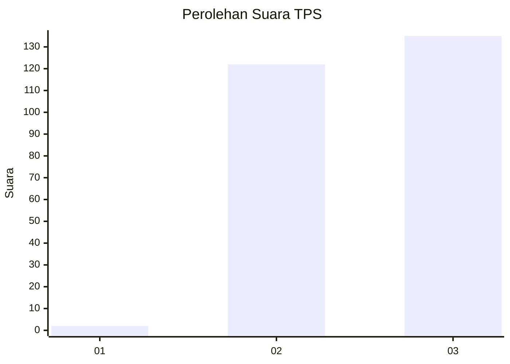
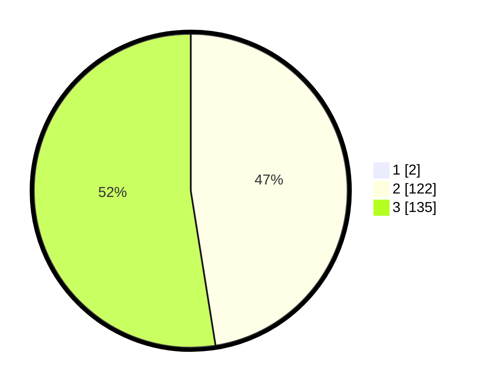

# Hasil

## Grafik

## Tabel

| No. | Nama Paslon    | Suara | Suara (raw) | Persentase |
|:--- |:-------------- | -----:| -----------:| ----------:|
| 1   | ANIES MUHAIMIN | 2     | [2][p-1]    | 0,77       |
| 2   | PRABOWO GIBRAN | 122   | [122][p-2]  | 47,10      |
| 3   | GANJAR MAHFUD  | 135   | [135][p-3]  | 52,12      |

[p-1]: https://github.com/gigit-pemilu/pemilu-2024-51-bali/blob/main/pilpres/hitung-suara/sub/51-bali/sub/03-badung/sub/02-mengwi/sub/2009-mengwi/sub/010-tps/sub/paslon-1.txt
[p-2]: https://github.com/gigit-pemilu/pemilu-2024-51-bali/blob/main/pilpres/hitung-suara/sub/51-bali/sub/03-badung/sub/02-mengwi/sub/2009-mengwi/sub/010-tps/sub/paslon-2.txt
[p-3]: https://github.com/gigit-pemilu/pemilu-2024-51-bali/blob/main/pilpres/hitung-suara/sub/51-bali/sub/03-badung/sub/02-mengwi/sub/2009-mengwi/sub/010-tps/sub/paslon-3.txt

## Foto C Plano

https://sirekap-obj-formc.kpu.go.id/85f5/pemilu/ppwp/51/03/02/20/09/5103022009010-20240214-235509--328173ac-3bc6-4c8d-9891-fe0541e131b5.jpg

https://sirekap-obj-formc.kpu.go.id/85f5/pemilu/ppwp/51/03/02/20/09/5103022009010-20240214-235646--54964ce3-0cc4-478b-b7a4-7311d3335fb2.jpg

https://sirekap-obj-formc.kpu.go.id/85f5/pemilu/ppwp/51/03/02/20/09/5103022009010-20240214-235819--15f9ee3b-1406-4439-93be-da7acf20a2f7.jpg

## Metadata

| Key        | Value               |
| ---------- | ------------------- |
| Time Stamp | 2024-02-24 22:31:28 |

