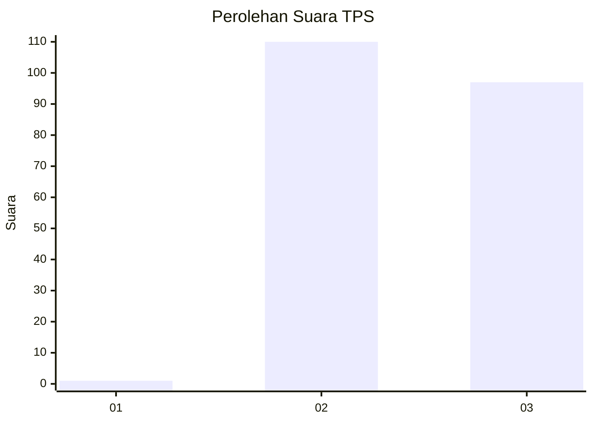
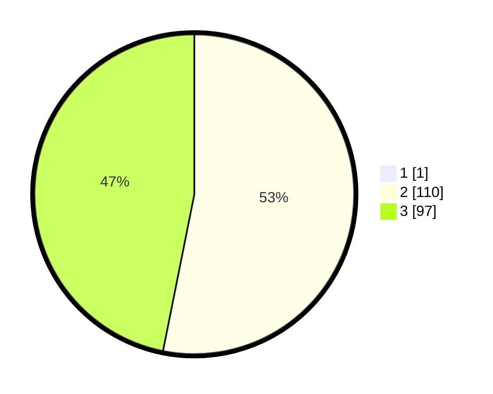

# Hasil

## Grafik

## Tabel

| No. | Nama Paslon    | Suara | Suara (raw) | Persentase |
|:--- |:-------------- | -----:| -----------:| ----------:|
| 1   | ANIES MUHAIMIN | 1     | [1][p-1]    | 0,48       |
| 2   | PRABOWO GIBRAN | 110   | [110][p-2]  | 52,88      |
| 3   | GANJAR MAHFUD  | 97    | [97][p-3]   | 46,63      |

[p-1]: https://github.com/gigit-pemilu/pemilu-2024-51-bali/blob/main/pilpres/hitung-suara/sub/51-bali/sub/03-badung/sub/02-mengwi/sub/2009-mengwi/sub/011-tps/sub/paslon-1.txt
[p-2]: https://github.com/gigit-pemilu/pemilu-2024-51-bali/blob/main/pilpres/hitung-suara/sub/51-bali/sub/03-badung/sub/02-mengwi/sub/2009-mengwi/sub/011-tps/sub/paslon-2.txt
[p-3]: https://github.com/gigit-pemilu/pemilu-2024-51-bali/blob/main/pilpres/hitung-suara/sub/51-bali/sub/03-badung/sub/02-mengwi/sub/2009-mengwi/sub/011-tps/sub/paslon-3.txt

## Foto C Plano

https://sirekap-obj-formc.kpu.go.id/227f/pemilu/ppwp/51/03/02/20/09/5103022009011-20240214-232613--f80c0fda-3ff9-4c90-9bc0-34898c921a56.jpg

https://sirekap-obj-formc.kpu.go.id/227f/pemilu/ppwp/51/03/02/20/09/5103022009011-20240214-232617--d832f078-aeec-43f9-bb34-0a9ffedb84f9.jpg

https://sirekap-obj-formc.kpu.go.id/227f/pemilu/ppwp/51/03/02/20/09/5103022009011-20240214-232621--c9cb5e11-f501-4424-a02e-0e4b87ba3722.jpg

## Metadata

| Key        | Value               |
| ---------- | ------------------- |
| Time Stamp | 2024-02-25 12:00:00 |

