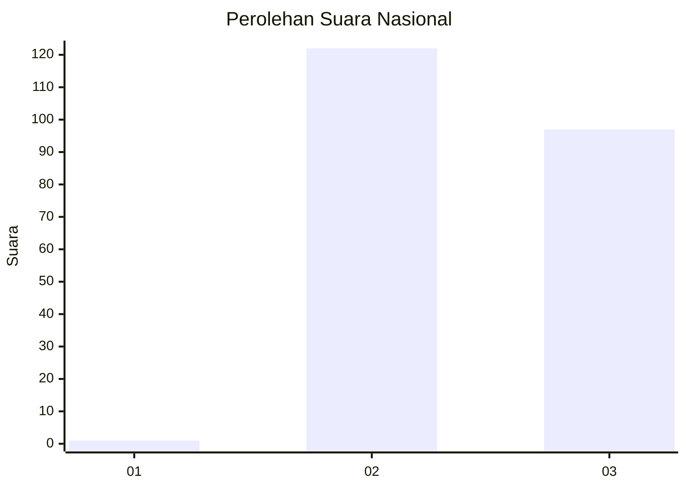
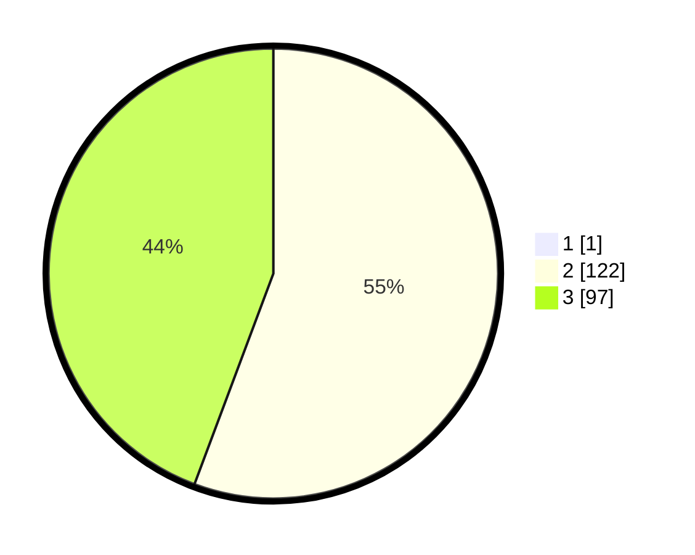

# Hasil

## Grafik

## Tabel

| No. | Nama Paslon    | Suara | Suara (raw) | Persentase |
|:--- |:-------------- | -----:| -----------:| ----------:|
| 1   | ANIES MUHAIMIN | 1     | [1][p-1]    | 0,45       |
| 2   | PRABOWO GIBRAN | 122   | [122][p-2]  | 55,45      |
| 3   | GANJAR MAHFUD  | 97    | [97][p-3]   | 44,09      |

[p-1]: https://github.com/gigit-pemilu/pemilu-2024/blob/main/pilpres/hitung-suara/sub/51-bali/sub/03-badung/sub/02-mengwi/sub/2009-mengwi/sub/012-tps/sub/paslon-1.txt
[p-2]: https://github.com/gigit-pemilu/pemilu-2024/blob/main/pilpres/hitung-suara/sub/51-bali/sub/03-badung/sub/02-mengwi/sub/2009-mengwi/sub/012-tps/sub/paslon-2.txt
[p-3]: https://github.com/gigit-pemilu/pemilu-2024/blob/main/pilpres/hitung-suara/sub/51-bali/sub/03-badung/sub/02-mengwi/sub/2009-mengwi/sub/012-tps/sub/paslon-3.txt

## Foto C Plano

https://sirekap-obj-formc.kpu.go.id/4a52/pemilu/ppwp/51/03/02/20/09/5103022009012-20240214-223241--ae640497-bc06-4312-ba26-18eaecd89d40.jpg

https://sirekap-obj-formc.kpu.go.id/4a52/pemilu/ppwp/51/03/02/20/09/5103022009012-20240214-223255--774f285f-318a-4706-ba33-eeec24f5fc03.jpg

https://sirekap-obj-formc.kpu.go.id/4a52/pemilu/ppwp/51/03/02/20/09/5103022009012-20240214-223304--b6412778-7e86-4828-a597-68d2c35bb682.jpg

## Metadata

| Key        | Value               |
| ---------- | ------------------- |
| Time Stamp | 2024-02-24 22:31:28 |

