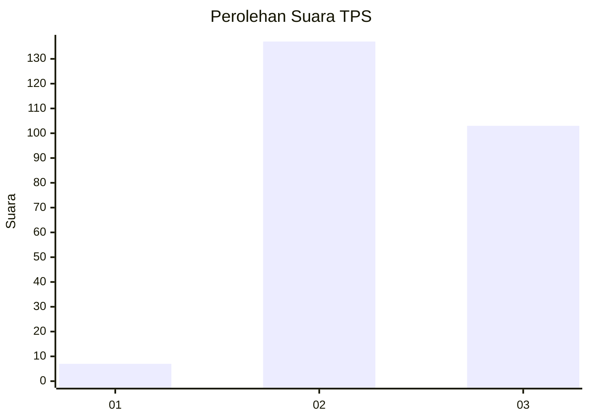
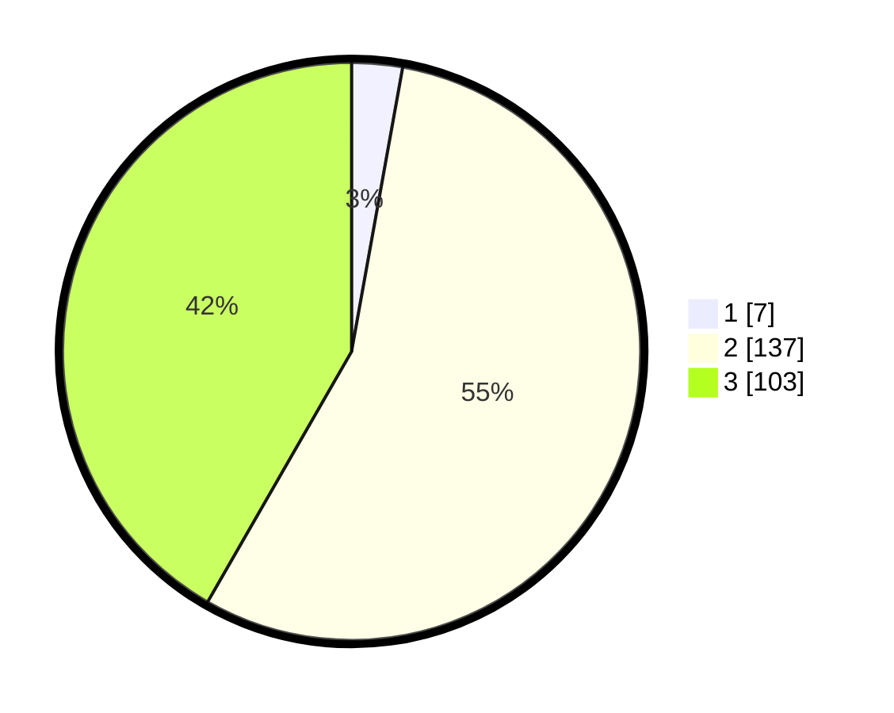

# Hasil

## Grafik

## Tabel

| No. | Nama Paslon    | Suara | Suara (raw) | Persentase |
|:--- |:-------------- | -----:| -----------:| ----------:|
| 1   | ANIES MUHAIMIN | 7     | [7][p-1]    | 2,83       |
| 2   | PRABOWO GIBRAN | 137   | [137][p-2]  | 55,47      |
| 3   | GANJAR MAHFUD  | 103   | [103][p-3]  | 41,70      |

[p-1]: https://github.com/gigit-pemilu/pemilu-2024-51-bali/blob/main/pilpres/hitung-suara/sub/51-bali/sub/03-badung/sub/02-mengwi/sub/2009-mengwi/sub/013-tps/sub/paslon-1.txt
[p-2]: https://github.com/gigit-pemilu/pemilu-2024-51-bali/blob/main/pilpres/hitung-suara/sub/51-bali/sub/03-badung/sub/02-mengwi/sub/2009-mengwi/sub/013-tps/sub/paslon-2.txt
[p-3]: https://github.com/gigit-pemilu/pemilu-2024-51-bali/blob/main/pilpres/hitung-suara/sub/51-bali/sub/03-badung/sub/02-mengwi/sub/2009-mengwi/sub/013-tps/sub/paslon-3.txt

## Foto C Plano

https://sirekap-obj-formc.kpu.go.id/dd22/pemilu/ppwp/51/03/02/20/09/5103022009013-20240214-205447--47acf763-2e4d-45dd-aa7d-26cb9fe4544b.jpg

https://sirekap-obj-formc.kpu.go.id/dd22/pemilu/ppwp/51/03/02/20/09/5103022009013-20240214-205553--cafb9863-e7f1-4b11-a88c-0ce284d0fe3f.jpg

https://sirekap-obj-formc.kpu.go.id/dd22/pemilu/ppwp/51/03/02/20/09/5103022009013-20240214-204649--c2dc32bd-36ac-4e99-8e79-baff20db6c69.jpg

## Metadata

| Key        | Value               |
| ---------- | ------------------- |
| Time Stamp | 2024-02-15 03:06:03 |

