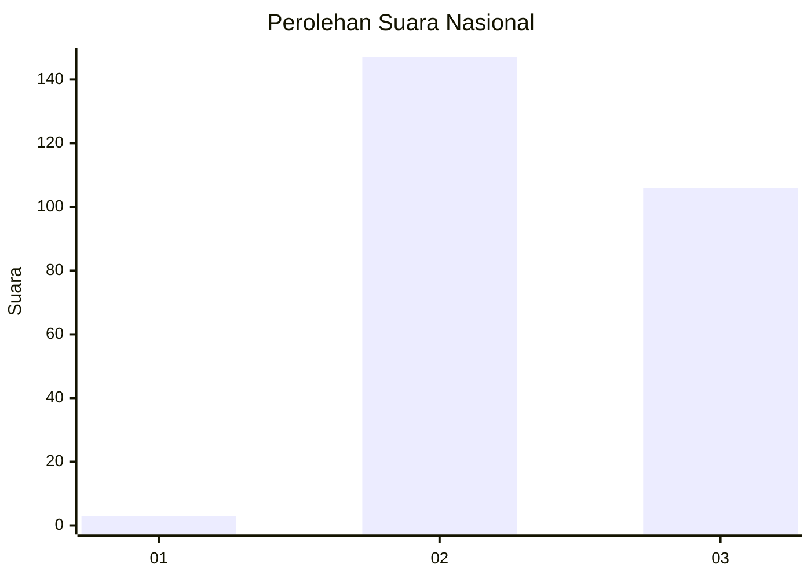
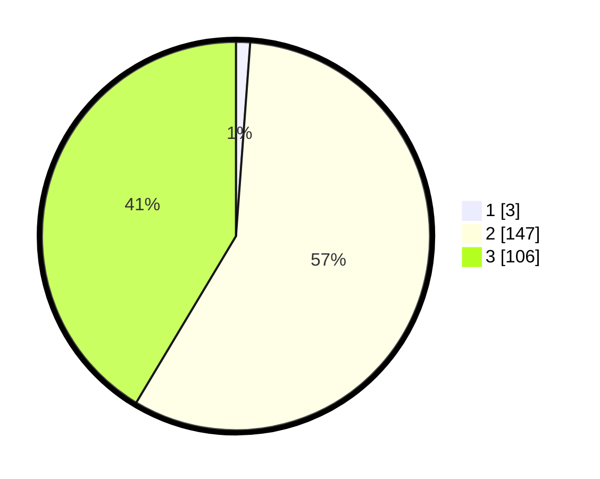

# Hasil

## Grafik

## Tabel

| No. | Nama Paslon    | Suara | Suara (raw) | Persentase |
|:--- |:-------------- | -----:| -----------:| ----------:|
| 1   | ANIES MUHAIMIN | 3     | [3][p-1]    | 1,17       |
| 2   | PRABOWO GIBRAN | 147   | [147][p-2]  | 57,42      |
| 3   | GANJAR MAHFUD  | 106   | [106][p-3]  | 41,41      |

[p-1]: https://github.com/gigit-pemilu/pemilu-2024/blob/main/pilpres/hitung-suara/sub/51-bali/sub/03-badung/sub/02-mengwi/sub/2009-mengwi/sub/016-tps/sub/paslon-1.txt
[p-2]: https://github.com/gigit-pemilu/pemilu-2024/blob/main/pilpres/hitung-suara/sub/51-bali/sub/03-badung/sub/02-mengwi/sub/2009-mengwi/sub/016-tps/sub/paslon-2.txt
[p-3]: https://github.com/gigit-pemilu/pemilu-2024/blob/main/pilpres/hitung-suara/sub/51-bali/sub/03-badung/sub/02-mengwi/sub/2009-mengwi/sub/016-tps/sub/paslon-3.txt

## Foto C Plano

https://sirekap-obj-formc.kpu.go.id/f879/pemilu/ppwp/51/03/02/20/09/5103022009016-20240216-223127--f1cc3716-b5bc-4cf7-bb64-4fb297188aed.jpg

https://sirekap-obj-formc.kpu.go.id/f879/pemilu/ppwp/51/03/02/20/09/5103022009016-20240216-223927--8e18d79f-c83d-422e-99b4-2995cf7ae67e.jpg

https://sirekap-obj-formc.kpu.go.id/f879/pemilu/ppwp/51/03/02/20/09/5103022009016-20240216-223144--3adf9457-f9ed-449c-8ac6-def4c613edfd.jpg

## Metadata

| Key        | Value               |
| ---------- | ------------------- |
| Time Stamp | 2024-02-26 17:00:04 |

## DATA PEMILIH TETAP

Jumlah pemilih dalam DPT: **284**.
 * L: **136**.
 * P: **148**.

## DATA PENGGUNA HAK PILIH

Jumlah pengguna hak pilih dalam DPT: **261**.
 * L: **123**.
 * P: **138**.

Jumlah pengguna hak pilih dalam DPTb: **2**.
 * L: **1**.
 * P: **1**.

Jumlah pengguna hak pilih dalam DPK: **0**.
 * L: **0**.
 * P: **0**.

Jumlah pengguna hak pilih: **263**.
 * L: **124**.
 * P: **139**.

## JUMLAH SUARA SAH DAN TIDAK SAH

JUMLAH SELURUH SUARA SAH: **256**.

JUMLAH SUARA TIDAK SAH: **7**.

JUMLAH SELURUH SUARA SAH DAN SUARA TIDAK SAH: **263**.

