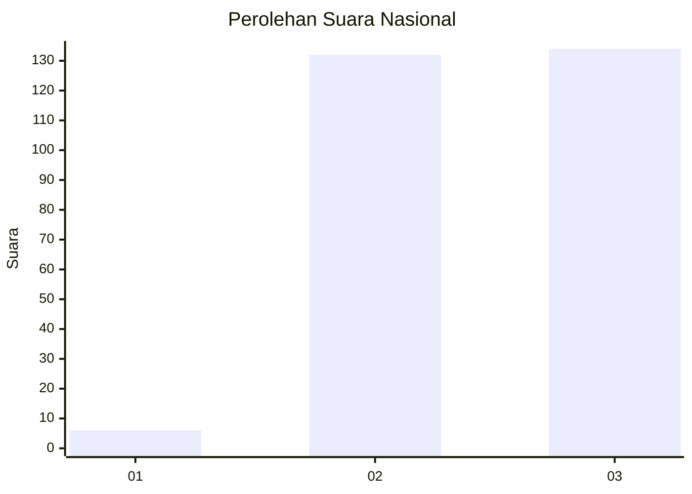
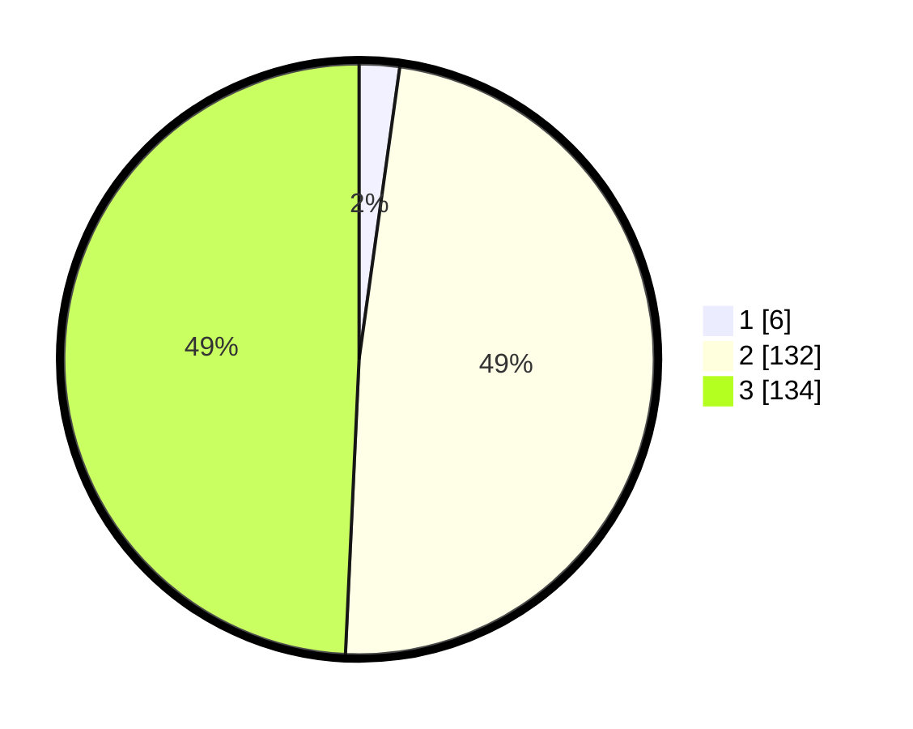

# Hasil

## Grafik

## Tabel

| No. | Nama Paslon    | Suara | Suara (raw) | Persentase |
|:--- |:-------------- | -----:| -----------:| ----------:|
| 1   | ANIES MUHAIMIN | 6     | [6][p-1]    | 2,21       |
| 2   | PRABOWO GIBRAN | 132   | [132][p-2]  | 48,53      |
| 3   | GANJAR MAHFUD  | 134   | [134][p-3]  | 49,26      |

[p-1]: https://github.com/gigit-pemilu/pemilu-2024/blob/main/pilpres/hitung-suara/sub/51-bali/sub/03-badung/sub/02-mengwi/sub/2009-mengwi/sub/021-tps/sub/paslon-1.txt
[p-2]: https://github.com/gigit-pemilu/pemilu-2024/blob/main/pilpres/hitung-suara/sub/51-bali/sub/03-badung/sub/02-mengwi/sub/2009-mengwi/sub/021-tps/sub/paslon-2.txt
[p-3]: https://github.com/gigit-pemilu/pemilu-2024/blob/main/pilpres/hitung-suara/sub/51-bali/sub/03-badung/sub/02-mengwi/sub/2009-mengwi/sub/021-tps/sub/paslon-3.txt

## Foto C Plano

https://sirekap-obj-formc.kpu.go.id/dd40/pemilu/ppwp/51/03/02/20/09/5103022009021-20240214-185851--ab596732-97f1-4568-a447-5b85a3252c1b.jpg

https://sirekap-obj-formc.kpu.go.id/dd40/pemilu/ppwp/51/03/02/20/09/5103022009021-20240214-185859--9b3384d5-4d49-4bfc-905a-d7fc2b0e5e47.jpg

https://sirekap-obj-formc.kpu.go.id/dd40/pemilu/ppwp/51/03/02/20/09/5103022009021-20240214-185907--e6b3b294-f8ba-41b0-8295-804d76c02cb5.jpg

## Metadata

| Key        | Value               |
| ---------- | ------------------- |
| Time Stamp | 2024-02-16 10:00:28 |

## DATA PEMILIH TETAP

Jumlah pemilih dalam DPT: **298**.
 * L: **147**.
 * P: **151**.

## DATA PENGGUNA HAK PILIH

Jumlah pengguna hak pilih dalam DPT: **279**.
 * L: **138**.
 * P: **141**.

Jumlah pengguna hak pilih dalam DPTb: **1**.
 * L: **0**.
 * P: **1**.

Jumlah pengguna hak pilih dalam DPK: **0**.
 * L: **0**.
 * P: **0**.

Jumlah pengguna hak pilih: **280**.
 * L: **138**.
 * P: **142**.

## JUMLAH SUARA SAH DAN TIDAK SAH

JUMLAH SELURUH SUARA SAH: **272**.

JUMLAH SUARA TIDAK SAH: **8**.

JUMLAH SELURUH SUARA SAH DAN SUARA TIDAK SAH: **280**.

