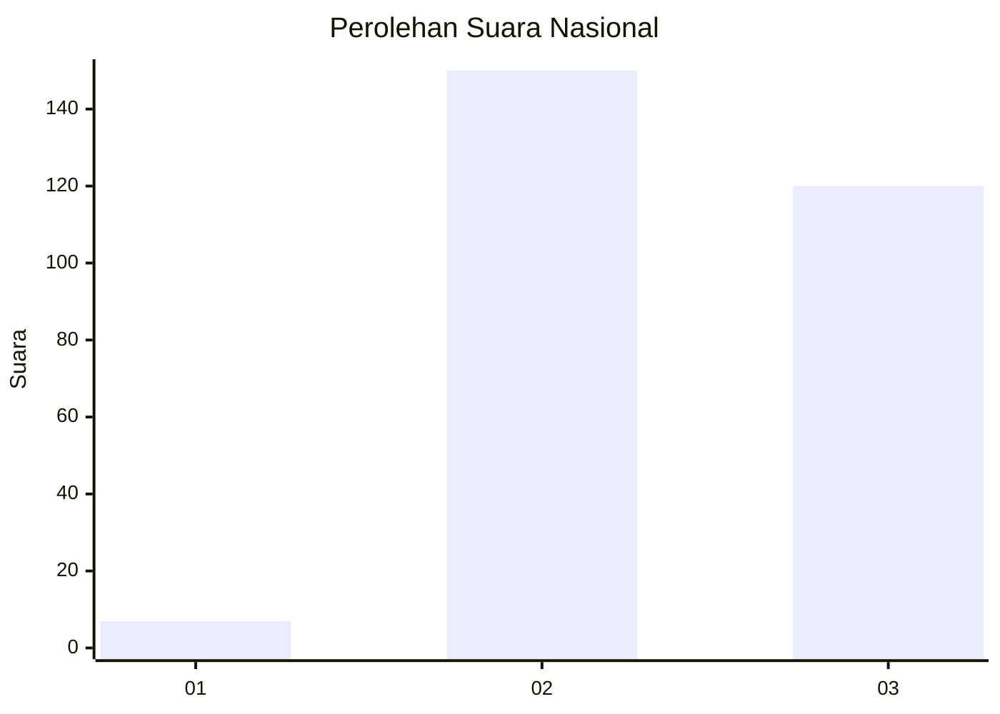
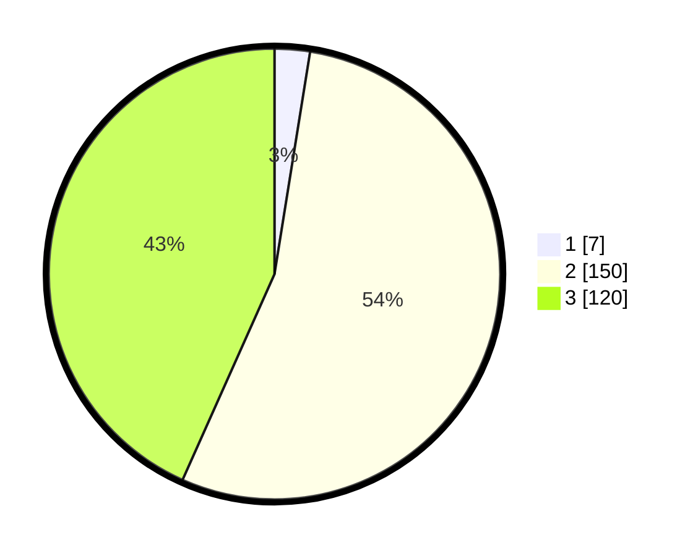

# Hasil

## Grafik

## Tabel

| No. | Nama Paslon    | Suara | Suara (raw) | Persentase |
|:--- |:-------------- | -----:| -----------:| ----------:|
| 1   | ANIES MUHAIMIN | 7     | [7][p-1]    | 2,53       |
| 2   | PRABOWO GIBRAN | 150   | [150][p-2]  | 54,15      |
| 3   | GANJAR MAHFUD  | 120   | [120][p-3]  | 43,32      |

[p-1]: https://github.com/gigit-pemilu/pemilu-2024/blob/main/pilpres/hitung-suara/sub/51-bali/sub/03-badung/sub/02-mengwi/sub/2009-mengwi/sub/022-tps/sub/paslon-1.txt
[p-2]: https://github.com/gigit-pemilu/pemilu-2024/blob/main/pilpres/hitung-suara/sub/51-bali/sub/03-badung/sub/02-mengwi/sub/2009-mengwi/sub/022-tps/sub/paslon-2.txt
[p-3]: https://github.com/gigit-pemilu/pemilu-2024/blob/main/pilpres/hitung-suara/sub/51-bali/sub/03-badung/sub/02-mengwi/sub/2009-mengwi/sub/022-tps/sub/paslon-3.txt

## Foto C Plano

https://sirekap-obj-formc.kpu.go.id/3aa8/pemilu/ppwp/51/03/02/20/09/5103022009022-20240214-204719--9e960523-47c7-4cd7-9708-4fa371c7680b.jpg

https://sirekap-obj-formc.kpu.go.id/3aa8/pemilu/ppwp/51/03/02/20/09/5103022009022-20240214-204708--e5b13805-3e3c-433e-8e0c-9014c9b7e350.jpg

https://sirekap-obj-formc.kpu.go.id/3aa8/pemilu/ppwp/51/03/02/20/09/5103022009022-20240214-204713--d12d342d-24b8-4118-abf0-880bb3ae34a0.jpg

## Metadata

| Key        | Value               |
| ---------- | ------------------- |
| Time Stamp | 2024-02-16 22:01:00 |

## DATA PEMILIH TETAP

Jumlah pemilih dalam DPT: **299**.
 * L: **150**.
 * P: **149**.

## DATA PENGGUNA HAK PILIH

Jumlah pengguna hak pilih dalam DPT: **281**.
 * L: **144**.
 * P: **137**.

Jumlah pengguna hak pilih dalam DPTb: **0**.
 * L: **0**.
 * P: **0**.

Jumlah pengguna hak pilih dalam DPK: **0**.
 * L: **0**.
 * P: **0**.

Jumlah pengguna hak pilih: **281**.
 * L: **144**.
 * P: **137**.

## JUMLAH SUARA SAH DAN TIDAK SAH

JUMLAH SELURUH SUARA SAH: **277**.

JUMLAH SUARA TIDAK SAH: **4**.

JUMLAH SELURUH SUARA SAH DAN SUARA TIDAK SAH: **281**.

