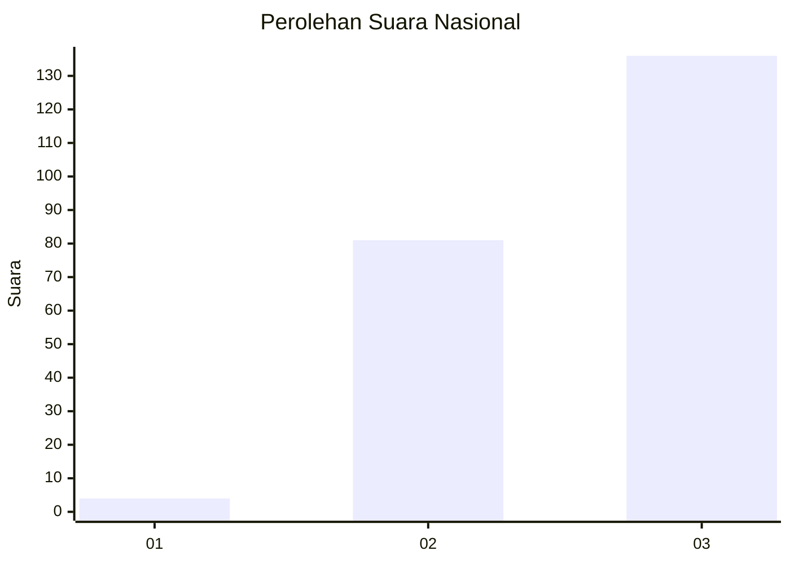
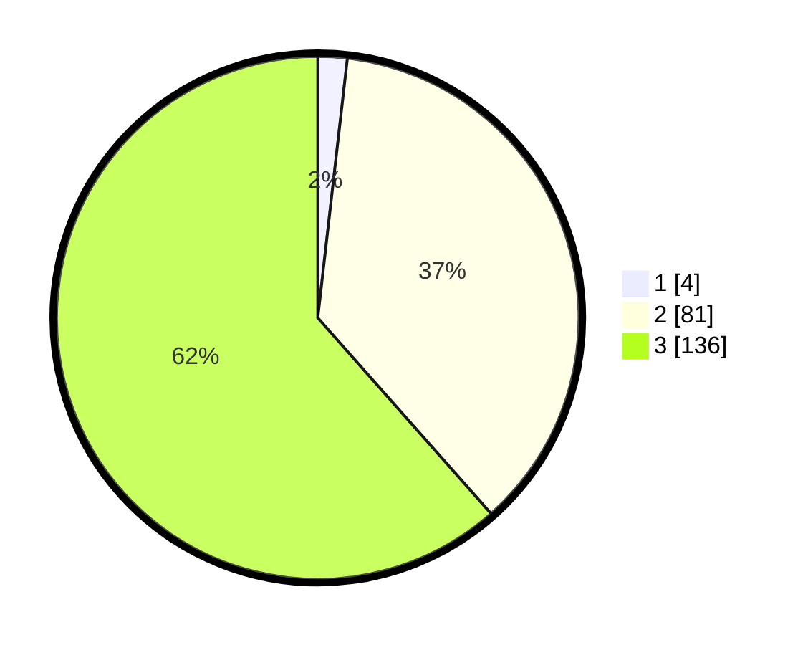

# Hasil

## Grafik

## Tabel

| No. | Nama Paslon    | Suara | Suara (raw) | Persentase |
|:--- |:-------------- | -----:| -----------:| ----------:|
| 1   | ANIES MUHAIMIN | 4     | [4][p-1]    | 1,81       |
| 2   | PRABOWO GIBRAN | 81    | [81][p-2]   | 36,65      |
| 3   | GANJAR MAHFUD  | 136   | [136][p-3]  | 61,54      |

[p-1]: https://github.com/gigit-pemilu/pemilu-2024/blob/main/pilpres/hitung-suara/sub/51-bali/sub/03-badung/sub/02-mengwi/sub/2010-kekeran/sub/001-tps/sub/paslon-1.txt
[p-2]: https://github.com/gigit-pemilu/pemilu-2024/blob/main/pilpres/hitung-suara/sub/51-bali/sub/03-badung/sub/02-mengwi/sub/2010-kekeran/sub/001-tps/sub/paslon-2.txt
[p-3]: https://github.com/gigit-pemilu/pemilu-2024/blob/main/pilpres/hitung-suara/sub/51-bali/sub/03-badung/sub/02-mengwi/sub/2010-kekeran/sub/001-tps/sub/paslon-3.txt

## Foto C Plano

https://sirekap-obj-formc.kpu.go.id/c2f5/pemilu/ppwp/51/03/02/20/10/5103022010001-20240216-202510--3779a1f1-5e76-45dc-b8b2-351fd1a9893a.jpg

https://sirekap-obj-formc.kpu.go.id/c2f5/pemilu/ppwp/51/03/02/20/10/5103022010001-20240216-213420--48287abd-2d86-4c64-ba55-a9ea316022c8.jpg

https://sirekap-obj-formc.kpu.go.id/c2f5/pemilu/ppwp/51/03/02/20/10/5103022010001-20240216-203832--6d962a88-5e3b-4129-a440-09e65233f264.jpg

## Metadata

| Key        | Value               |
| ---------- | ------------------- |
| Time Stamp | 2024-02-21 10:00:00 |

## DATA PEMILIH TETAP

Jumlah pemilih dalam DPT: **231**.
 * L: **112**.
 * P: **119**.

## DATA PENGGUNA HAK PILIH

Jumlah pengguna hak pilih dalam DPT: **222**.
 * L: **109**.
 * P: **113**.

Jumlah pengguna hak pilih dalam DPTb: **2**.
 * L: **1**.
 * P: **1**.

Jumlah pengguna hak pilih dalam DPK: **0**.
 * L: **0**.
 * P: **0**.

Jumlah pengguna hak pilih: **224**.
 * L: **110**.
 * P: **114**.

## JUMLAH SUARA SAH DAN TIDAK SAH

JUMLAH SELURUH SUARA SAH: **221**.

JUMLAH SUARA TIDAK SAH: **3**.

JUMLAH SELURUH SUARA SAH DAN SUARA TIDAK SAH: **3**.

