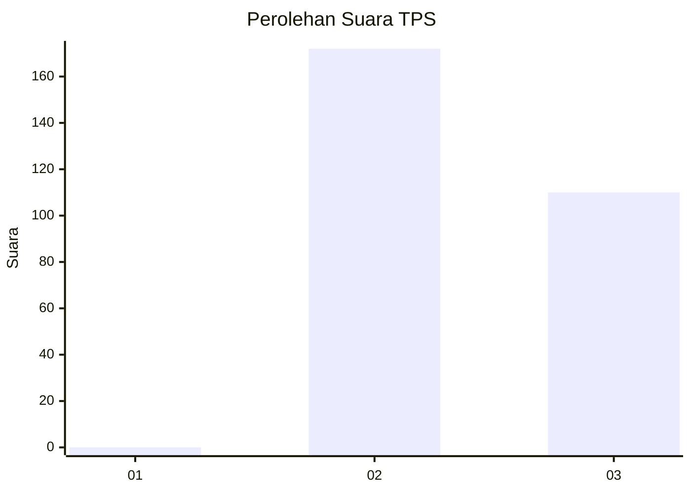
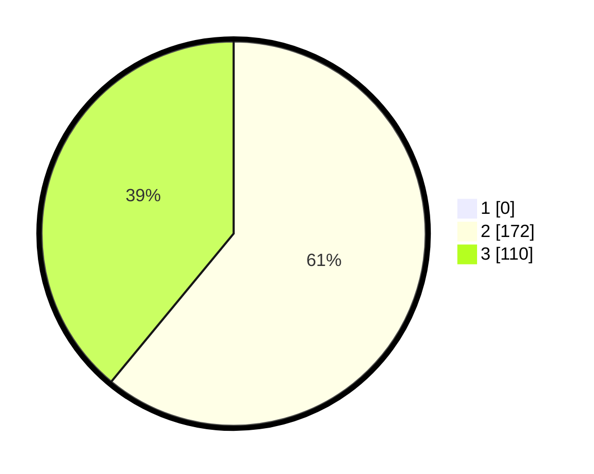

# Hasil

## Grafik

## Tabel

| No. | Nama Paslon    | Suara | Suara (raw) | Persentase |
|:--- |:-------------- | -----:| -----------:| ----------:|
| 1   | ANIES MUHAIMIN | 0     | [0][p-1]    | 0,00       |
| 2   | PRABOWO GIBRAN | 172   | [172][p-2]  | 60,99      |
| 3   | GANJAR MAHFUD  | 110   | [110][p-3]  | 39,01      |

[p-1]: https://github.com/gigit-pemilu/pemilu-2024-51-bali/blob/main/pilpres/hitung-suara/sub/51-bali/sub/03-badung/sub/02-mengwi/sub/2010-kekeran/sub/005-tps/sub/paslon-1.txt
[p-2]: https://github.com/gigit-pemilu/pemilu-2024-51-bali/blob/main/pilpres/hitung-suara/sub/51-bali/sub/03-badung/sub/02-mengwi/sub/2010-kekeran/sub/005-tps/sub/paslon-2.txt
[p-3]: https://github.com/gigit-pemilu/pemilu-2024-51-bali/blob/main/pilpres/hitung-suara/sub/51-bali/sub/03-badung/sub/02-mengwi/sub/2010-kekeran/sub/005-tps/sub/paslon-3.txt

## Foto C Plano

https://sirekap-obj-formc.kpu.go.id/5834/pemilu/ppwp/51/03/02/20/10/5103022010005-20240214-155134--cee741c9-479d-4119-9eda-f84394b8601a.jpg

https://sirekap-obj-formc.kpu.go.id/5834/pemilu/ppwp/51/03/02/20/10/5103022010005-20240217-154849--04be3727-ebc6-4573-aea3-380636e865b1.jpg

https://sirekap-obj-formc.kpu.go.id/5834/pemilu/ppwp/51/03/02/20/10/5103022010005-20240214-155213--e8865981-020d-489f-8460-69fbe1afbd79.jpg

## Metadata

| Key        | Value               |
| ---------- | ------------------- |
| Time Stamp | 2024-02-25 17:00:00 |

## DATA PEMILIH TETAP

Jumlah pemilih dalam DPT: **300**.
 * L: **149**.
 * P: **151**.

## DATA PENGGUNA HAK PILIH

Jumlah pengguna hak pilih dalam DPT: **285**.
 * L: **143**.
 * P: **142**.

Jumlah pengguna hak pilih dalam DPTb: **1**.
 * L: **1**.
 * P: **0**.

Jumlah pengguna hak pilih dalam DPK: **0**.
 * L: **0**.
 * P: **0**.

Jumlah pengguna hak pilih: **286**.
 * L: **144**.
 * P: **142**.

## JUMLAH SUARA SAH DAN TIDAK SAH

JUMLAH SELURUH SUARA SAH: **282**.

JUMLAH SUARA TIDAK SAH: **4**.

JUMLAH SELURUH SUARA SAH DAN SUARA TIDAK SAH: **286**.

