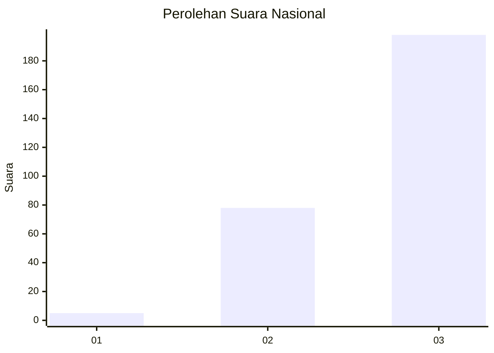
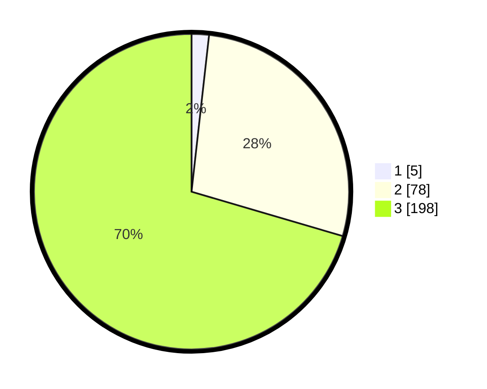

# Hasil

## Grafik

## Tabel

| No. | Nama Paslon    | Suara | Suara (raw) | Persentase |
|:--- |:-------------- | -----:| -----------:| ----------:|
| 1   | ANIES MUHAIMIN | 5     | [5][p-1]    | 1,78       |
| 2   | PRABOWO GIBRAN | 78    | [78][p-2]   | 27,76      |
| 3   | GANJAR MAHFUD  | 198   | [198][p-3]  | 70,46      |

[p-1]: https://github.com/gigit-pemilu/pemilu-2024/blob/main/pilpres/hitung-suara/sub/51-bali/sub/03-badung/sub/02-mengwi/sub/2010-kekeran/sub/006-tps/sub/paslon-1.txt
[p-2]: https://github.com/gigit-pemilu/pemilu-2024/blob/main/pilpres/hitung-suara/sub/51-bali/sub/03-badung/sub/02-mengwi/sub/2010-kekeran/sub/006-tps/sub/paslon-2.txt
[p-3]: https://github.com/gigit-pemilu/pemilu-2024/blob/main/pilpres/hitung-suara/sub/51-bali/sub/03-badung/sub/02-mengwi/sub/2010-kekeran/sub/006-tps/sub/paslon-3.txt

## Foto C Plano

https://sirekap-obj-formc.kpu.go.id/6a6a/pemilu/ppwp/51/03/02/20/10/5103022010006-20240214-205107--a144db25-0b2e-470b-a240-386bb34b25ae.jpg

https://sirekap-obj-formc.kpu.go.id/6a6a/pemilu/ppwp/51/03/02/20/10/5103022010006-20240214-191153--9a5e2c0e-ee5a-49b4-8299-b7433e0ed0a5.jpg

https://sirekap-obj-formc.kpu.go.id/6a6a/pemilu/ppwp/51/03/02/20/10/5103022010006-20240214-191156--cf07a9c4-a6ae-4eb3-85a9-309343a392ac.jpg

## Metadata

| Key        | Value               |
| ---------- | ------------------- |
| Time Stamp | 2024-02-14 21:46:01 |

## DATA PEMILIH TETAP

Jumlah pemilih dalam DPT: **299**.
 * L: **153**.
 * P: **146**.

## DATA PENGGUNA HAK PILIH

Jumlah pengguna hak pilih dalam DPT: **281**.
 * L: **146**.
 * P: **135**.

Jumlah pengguna hak pilih dalam DPTb: **2**.
 * L: **1**.
 * P: **1**.

Jumlah pengguna hak pilih dalam DPK: **1**.
 * L: **1**.
 * P: **0**.

Jumlah pengguna hak pilih: **284**.
 * L: **148**.
 * P: **136**.

## JUMLAH SUARA SAH DAN TIDAK SAH

JUMLAH SELURUH SUARA SAH: **281**.

JUMLAH SUARA TIDAK SAH: **3**.

JUMLAH SELURUH SUARA SAH DAN SUARA TIDAK SAH: **284**.

