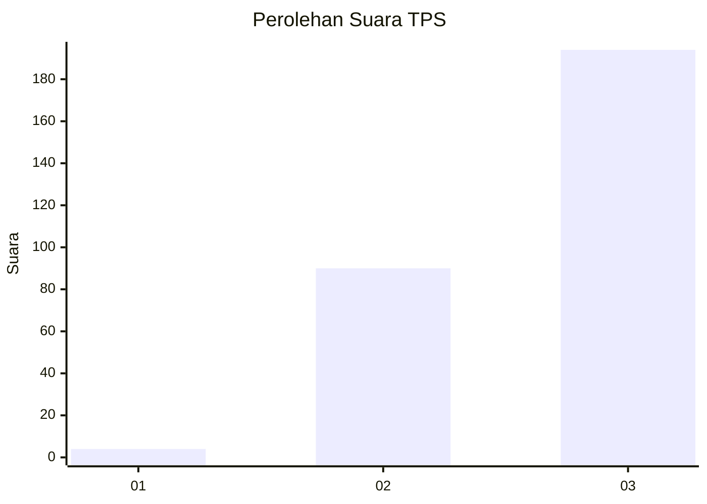
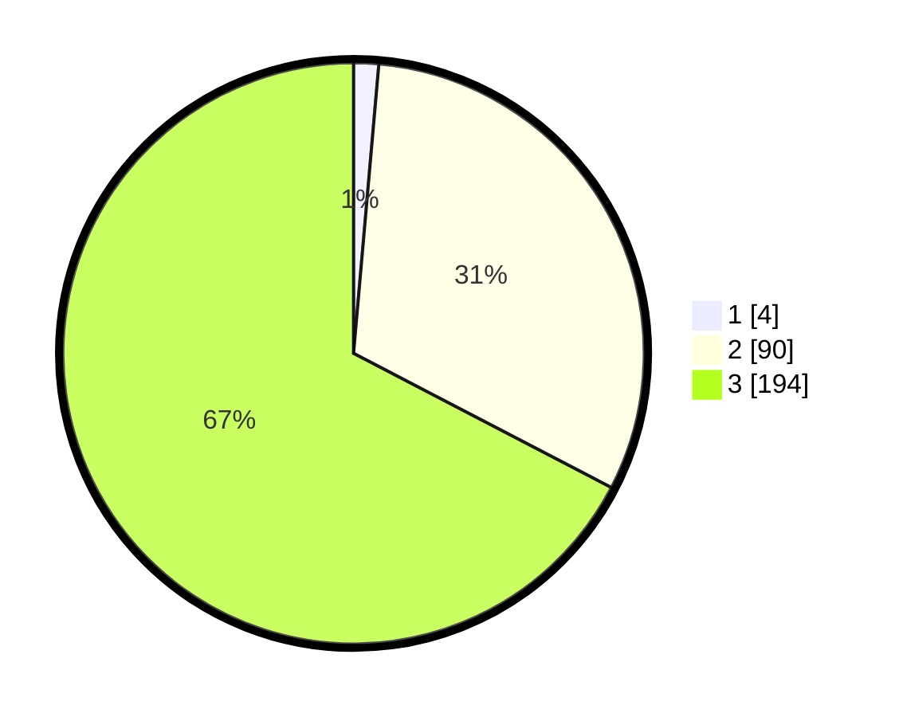

# Hasil

## Grafik

## Tabel

| No. | Nama Paslon    | Suara | Suara (raw) | Persentase |
|:--- |:-------------- | -----:| -----------:| ----------:|
| 1   | ANIES MUHAIMIN | 4     | [4][p-1]    | 1,39       |
| 2   | PRABOWO GIBRAN | 90    | [90][p-2]   | 31,25      |
| 3   | GANJAR MAHFUD  | 194   | [194][p-3]  | 67,36      |

[p-1]: https://github.com/gigit-pemilu/pemilu-2024-51-bali/blob/main/pilpres/hitung-suara/sub/51-bali/sub/03-badung/sub/02-mengwi/sub/2010-kekeran/sub/009-tps/sub/paslon-1.txt
[p-2]: https://github.com/gigit-pemilu/pemilu-2024-51-bali/blob/main/pilpres/hitung-suara/sub/51-bali/sub/03-badung/sub/02-mengwi/sub/2010-kekeran/sub/009-tps/sub/paslon-2.txt
[p-3]: https://github.com/gigit-pemilu/pemilu-2024-51-bali/blob/main/pilpres/hitung-suara/sub/51-bali/sub/03-badung/sub/02-mengwi/sub/2010-kekeran/sub/009-tps/sub/paslon-3.txt

## Foto C Plano

https://sirekap-obj-formc.kpu.go.id/1b55/pemilu/ppwp/51/03/02/20/10/5103022010009-20240214-204355--c1a5f95b-9124-4303-a2e9-10e9fe414a76.jpg

https://sirekap-obj-formc.kpu.go.id/1b55/pemilu/ppwp/51/03/02/20/10/5103022010009-20240214-204409--3ee37ca3-ba92-4c0e-8cf1-416c73558583.jpg

https://sirekap-obj-formc.kpu.go.id/1b55/pemilu/ppwp/51/03/02/20/10/5103022010009-20240214-204418--acd7dbff-0fba-40c3-9f0d-82f00b4fccd3.jpg

## Metadata

| Key        | Value               |
| ---------- | ------------------- |
| Time Stamp | 2024-02-15 00:46:45 |

## DATA PEMILIH TETAP

Jumlah pemilih dalam DPT: **291**.
 * L: **146**.
 * P: **145**.

## DATA PENGGUNA HAK PILIH

Jumlah pengguna hak pilih dalam DPT: **287**.
 * L: **143**.
 * P: **144**.

Jumlah pengguna hak pilih dalam DPTb: **3**.
 * L: **1**.
 * P: **2**.

Jumlah pengguna hak pilih dalam DPK: **1**.
 * L: **1**.
 * P: **0**.

Jumlah pengguna hak pilih: **291**.
 * L: **145**.
 * P: **146**.

## JUMLAH SUARA SAH DAN TIDAK SAH

JUMLAH SELURUH SUARA SAH: **288**.

JUMLAH SUARA TIDAK SAH: **3**.

JUMLAH SELURUH SUARA SAH DAN SUARA TIDAK SAH: **291**.

