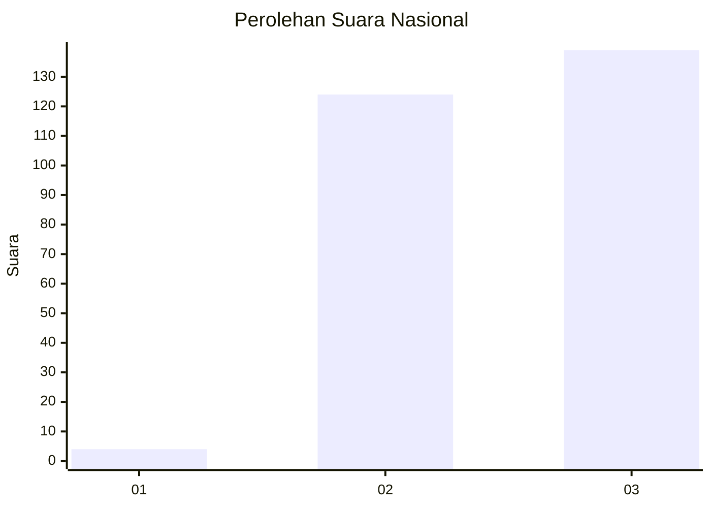
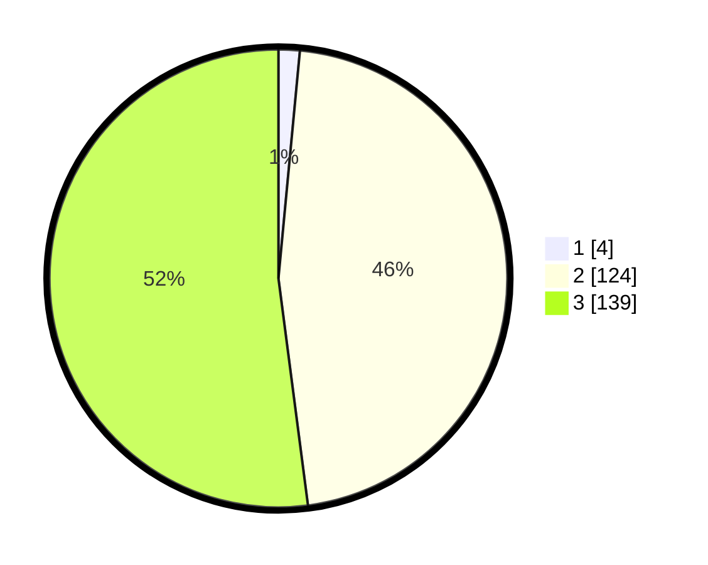

# Hasil

## Grafik

## Tabel

| No. | Nama Paslon    | Suara | Suara (raw) | Persentase |
|:--- |:-------------- | -----:| -----------:| ----------:|
| 1   | ANIES MUHAIMIN | 4     | [4][p-1]    | 1,50       |
| 2   | PRABOWO GIBRAN | 124   | [124][p-2]  | 46,44      |
| 3   | GANJAR MAHFUD  | 139   | [139][p-3]  | 52,06      |

[p-1]: https://github.com/gigit-pemilu/pemilu-2024/blob/main/pilpres/hitung-suara/sub/51-bali/sub/03-badung/sub/02-mengwi/sub/2011-sobangan/sub/001-tps/sub/paslon-1.txt
[p-2]: https://github.com/gigit-pemilu/pemilu-2024/blob/main/pilpres/hitung-suara/sub/51-bali/sub/03-badung/sub/02-mengwi/sub/2011-sobangan/sub/001-tps/sub/paslon-2.txt
[p-3]: https://github.com/gigit-pemilu/pemilu-2024/blob/main/pilpres/hitung-suara/sub/51-bali/sub/03-badung/sub/02-mengwi/sub/2011-sobangan/sub/001-tps/sub/paslon-3.txt

## Foto C Plano

https://sirekap-obj-formc.kpu.go.id/887d/pemilu/ppwp/51/03/02/20/11/5103022011001-20240214-191737--77921a3f-3800-4be6-b078-9861f1c1f1b9.jpg

https://sirekap-obj-formc.kpu.go.id/887d/pemilu/ppwp/51/03/02/20/11/5103022011001-20240214-191757--ecdff614-d056-4c17-b2b2-4729dcf24d0c.jpg

https://sirekap-obj-formc.kpu.go.id/887d/pemilu/ppwp/51/03/02/20/11/5103022011001-20240214-191809--d021d4c8-ca46-498b-a18e-316823a12a4e.jpg

## Metadata

| Key        | Value               |
| ---------- | ------------------- |
| Time Stamp | 2024-02-15 01:47:43 |

## DATA PEMILIH TETAP

Jumlah pemilih dalam DPT: **279**.
 * L: **143**.
 * P: **136**.

## DATA PENGGUNA HAK PILIH

Jumlah pengguna hak pilih dalam DPT: **269**.
 * L: **138**.
 * P: **131**.

Jumlah pengguna hak pilih dalam DPTb: **0**.
 * L: **0**.
 * P: **0**.

Jumlah pengguna hak pilih dalam DPK: **0**.
 * L: **0**.
 * P: **0**.

Jumlah pengguna hak pilih: **269**.
 * L: **138**.
 * P: **131**.

## JUMLAH SUARA SAH DAN TIDAK SAH

JUMLAH SELURUH SUARA SAH: **267**.

JUMLAH SUARA TIDAK SAH: **2**.

JUMLAH SELURUH SUARA SAH DAN SUARA TIDAK SAH: **269**.

