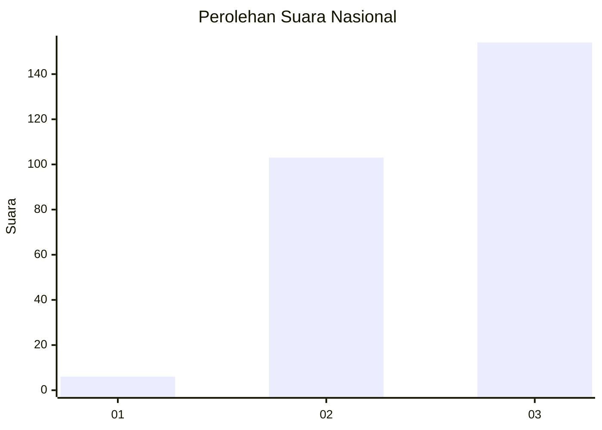
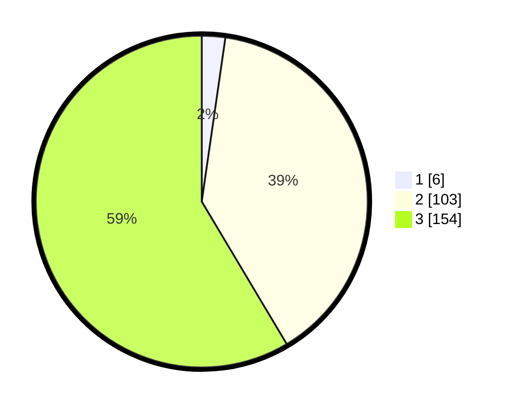

# Hasil

## Grafik

## Tabel

| No. | Nama Paslon    | Suara | Suara (raw) | Persentase |
|:--- |:-------------- | -----:| -----------:| ----------:|
| 1   | ANIES MUHAIMIN | 6     | [6][p-1]    | 2,28       |
| 2   | PRABOWO GIBRAN | 103   | [103][p-2]  | 39,16      |
| 3   | GANJAR MAHFUD  | 154   | [154][p-3]  | 58,56      |

[p-1]: https://github.com/gigit-pemilu/pemilu-2024/blob/main/pilpres/hitung-suara/sub/51-bali/sub/03-badung/sub/02-mengwi/sub/2011-sobangan/sub/004-tps/sub/paslon-1.txt
[p-2]: https://github.com/gigit-pemilu/pemilu-2024/blob/main/pilpres/hitung-suara/sub/51-bali/sub/03-badung/sub/02-mengwi/sub/2011-sobangan/sub/004-tps/sub/paslon-2.txt
[p-3]: https://github.com/gigit-pemilu/pemilu-2024/blob/main/pilpres/hitung-suara/sub/51-bali/sub/03-badung/sub/02-mengwi/sub/2011-sobangan/sub/004-tps/sub/paslon-3.txt

## Foto C Plano

https://sirekap-obj-formc.kpu.go.id/423b/pemilu/ppwp/51/03/02/20/11/5103022011004-20240216-055253--6c604463-6453-44a2-b7f0-5de725f27e3c.jpg

https://sirekap-obj-formc.kpu.go.id/423b/pemilu/ppwp/51/03/02/20/11/5103022011004-20240216-055255--642bf79a-a419-4fee-b8d6-f66a15801a32.jpg

https://sirekap-obj-formc.kpu.go.id/423b/pemilu/ppwp/51/03/02/20/11/5103022011004-20240216-055254--00d24f55-4d1c-4cec-afe8-b7552e412ab5.jpg

## Metadata

| Key        | Value               |
| ---------- | ------------------- |
| Time Stamp | 2024-02-21 12:00:00 |

## DATA PEMILIH TETAP

Jumlah pemilih dalam DPT: **274**.
 * L: **136**.
 * P: **138**.

## DATA PENGGUNA HAK PILIH

Jumlah pengguna hak pilih dalam DPT: **262**.
 * L: **132**.
 * P: **130**.

Jumlah pengguna hak pilih dalam DPTb: **0**.
 * L: **0**.
 * P: **0**.

Jumlah pengguna hak pilih dalam DPK: **5**.
 * L: **2**.
 * P: **3**.

Jumlah pengguna hak pilih: **267**.
 * L: **134**.
 * P: **133**.

## JUMLAH SUARA SAH DAN TIDAK SAH

JUMLAH SELURUH SUARA SAH: **263**.

JUMLAH SUARA TIDAK SAH: **4**.

JUMLAH SELURUH SUARA SAH DAN SUARA TIDAK SAH: **267**.

