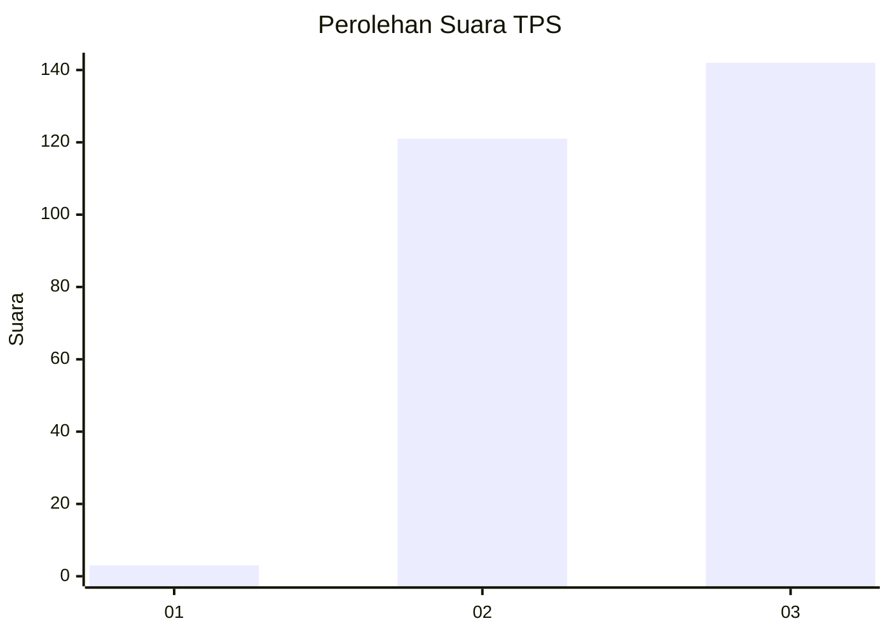
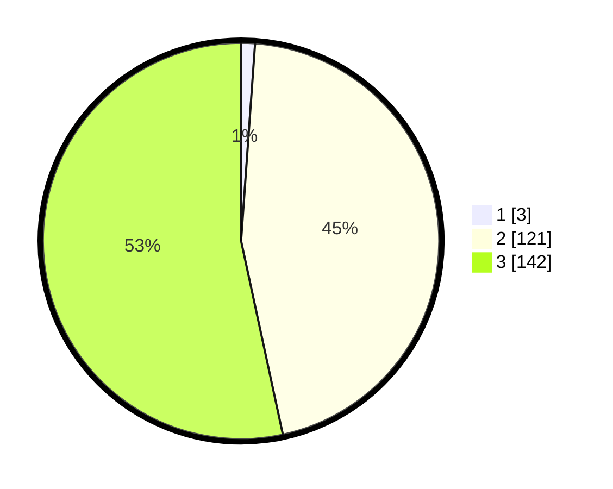

# Hasil

## Grafik

## Tabel

| No. | Nama Paslon    | Suara | Suara (raw) | Persentase |
|:--- |:-------------- | -----:| -----------:| ----------:|
| 1   | ANIES MUHAIMIN | 3     | [3][p-1]    | 1,13       |
| 2   | PRABOWO GIBRAN | 121   | [121][p-2]  | 45,49      |
| 3   | GANJAR MAHFUD  | 142   | [142][p-3]  | 53,38      |

[p-1]: https://github.com/gigit-pemilu/pemilu-2024-51-bali/blob/main/pilpres/hitung-suara/sub/51-bali/sub/03-badung/sub/02-mengwi/sub/2011-sobangan/sub/005-tps/sub/paslon-1.txt
[p-2]: https://github.com/gigit-pemilu/pemilu-2024-51-bali/blob/main/pilpres/hitung-suara/sub/51-bali/sub/03-badung/sub/02-mengwi/sub/2011-sobangan/sub/005-tps/sub/paslon-2.txt
[p-3]: https://github.com/gigit-pemilu/pemilu-2024-51-bali/blob/main/pilpres/hitung-suara/sub/51-bali/sub/03-badung/sub/02-mengwi/sub/2011-sobangan/sub/005-tps/sub/paslon-3.txt

## Foto C Plano

https://sirekap-obj-formc.kpu.go.id/f32a/pemilu/ppwp/51/03/02/20/11/5103022011005-20240217-112429--47e4ea52-91d4-44c2-9063-d58ec1d31883.jpg

https://sirekap-obj-formc.kpu.go.id/f32a/pemilu/ppwp/51/03/02/20/11/5103022011005-20240214-141447--9b0f3f5a-764b-41ce-8881-2ffda002d91f.jpg

https://sirekap-obj-formc.kpu.go.id/f32a/pemilu/ppwp/51/03/02/20/11/5103022011005-20240217-112429--213ec820-100e-42a9-9d24-b4becf88784f.jpg

## Metadata

| Key        | Value               |
| ---------- | ------------------- |
| Time Stamp | 2024-02-21 22:00:00 |

## DATA PEMILIH TETAP

Jumlah pemilih dalam DPT: **283**.
 * L: **138**.
 * P: **145**.

## DATA PENGGUNA HAK PILIH

Jumlah pengguna hak pilih dalam DPT: **269**.
 * L: **131**.
 * P: **138**.

Jumlah pengguna hak pilih dalam DPTb: **0**.
 * L: **0**.
 * P: **0**.

Jumlah pengguna hak pilih dalam DPK: **0**.
 * L: **0**.
 * P: **0**.

Jumlah pengguna hak pilih: **269**.
 * L: **131**.
 * P: **138**.

## JUMLAH SUARA SAH DAN TIDAK SAH

JUMLAH SELURUH SUARA SAH: **266**.

JUMLAH SUARA TIDAK SAH: **3**.

JUMLAH SELURUH SUARA SAH DAN SUARA TIDAK SAH: **269**.

