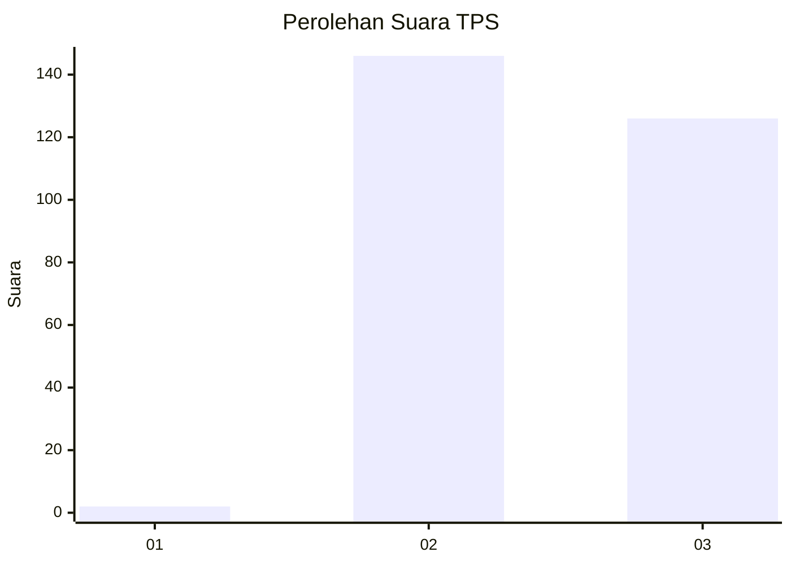
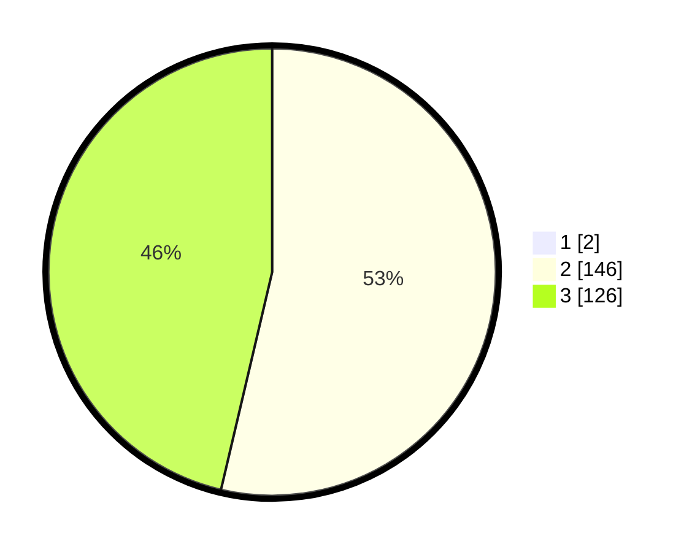

# Hasil

## Grafik

## Tabel

| No. | Nama Paslon    | Suara | Suara (raw) | Persentase |
|:--- |:-------------- | -----:| -----------:| ----------:|
| 1   | ANIES MUHAIMIN | 2     | [2][p-1]    | 0,73       |
| 2   | PRABOWO GIBRAN | 146   | [146][p-2]  | 53,28      |
| 3   | GANJAR MAHFUD  | 126   | [126][p-3]  | 45,99      |

[p-1]: https://github.com/gigit-pemilu/pemilu-2024-51-bali/blob/main/pilpres/hitung-suara/sub/51-bali/sub/03-badung/sub/02-mengwi/sub/2011-sobangan/sub/009-tps/sub/paslon-1.txt
[p-2]: https://github.com/gigit-pemilu/pemilu-2024-51-bali/blob/main/pilpres/hitung-suara/sub/51-bali/sub/03-badung/sub/02-mengwi/sub/2011-sobangan/sub/009-tps/sub/paslon-2.txt
[p-3]: https://github.com/gigit-pemilu/pemilu-2024-51-bali/blob/main/pilpres/hitung-suara/sub/51-bali/sub/03-badung/sub/02-mengwi/sub/2011-sobangan/sub/009-tps/sub/paslon-3.txt

## Foto C Plano

https://sirekap-obj-formc.kpu.go.id/db55/pemilu/ppwp/51/03/02/20/11/5103022011009-20240214-193338--028f25d7-94b9-406f-a6ad-bfdb34e24392.jpg

https://sirekap-obj-formc.kpu.go.id/db55/pemilu/ppwp/51/03/02/20/11/5103022011009-20240214-193426--f995b391-1fb7-4e96-921c-e96875fd2bb8.jpg

https://sirekap-obj-formc.kpu.go.id/db55/pemilu/ppwp/51/03/02/20/11/5103022011009-20240214-193443--e6fdcbf5-eb63-4b0a-bb81-f4c079a61d32.jpg

## Metadata

| Key        | Value               |
| ---------- | ------------------- |
| Time Stamp | 2024-02-21 10:00:00 |

## DATA PEMILIH TETAP

Jumlah pemilih dalam DPT: **292**.
 * L: **138**.
 * P: **154**.

## DATA PENGGUNA HAK PILIH

Jumlah pengguna hak pilih dalam DPT: **276**.
 * L: **134**.
 * P: **142**.

Jumlah pengguna hak pilih dalam DPTb: **1**.
 * L: **0**.
 * P: **1**.

Jumlah pengguna hak pilih dalam DPK: **4**.
 * L: **1**.
 * P: **3**.

Jumlah pengguna hak pilih: **281**.
 * L: **135**.
 * P: **146**.

## JUMLAH SUARA SAH DAN TIDAK SAH

JUMLAH SELURUH SUARA SAH: **274**.

JUMLAH SUARA TIDAK SAH: **7**.

JUMLAH SELURUH SUARA SAH DAN SUARA TIDAK SAH: **281**.

