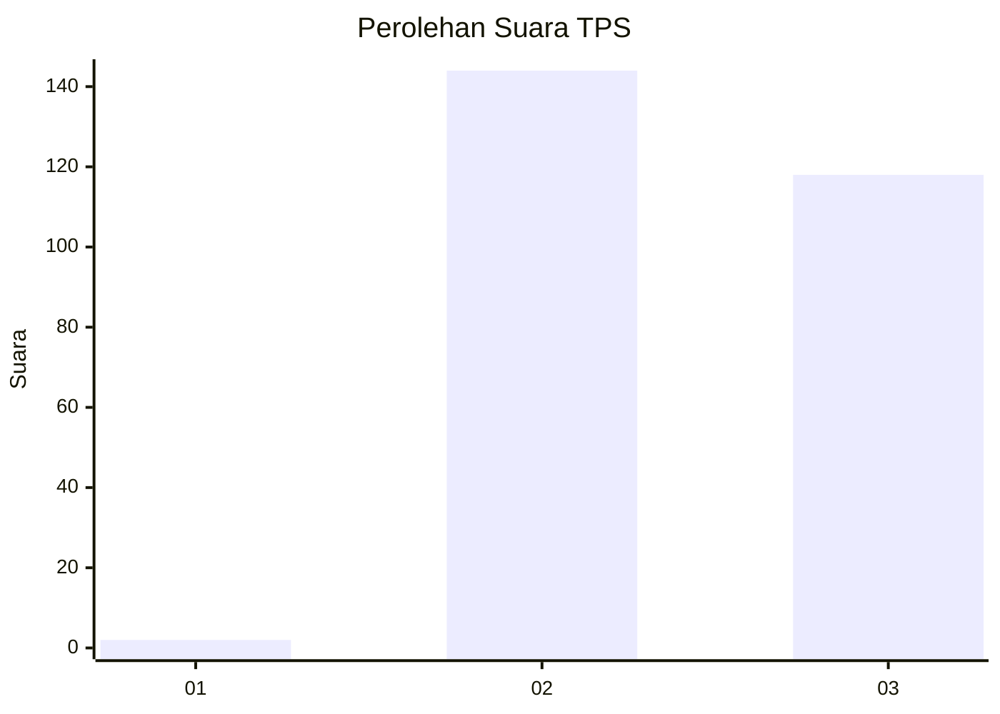
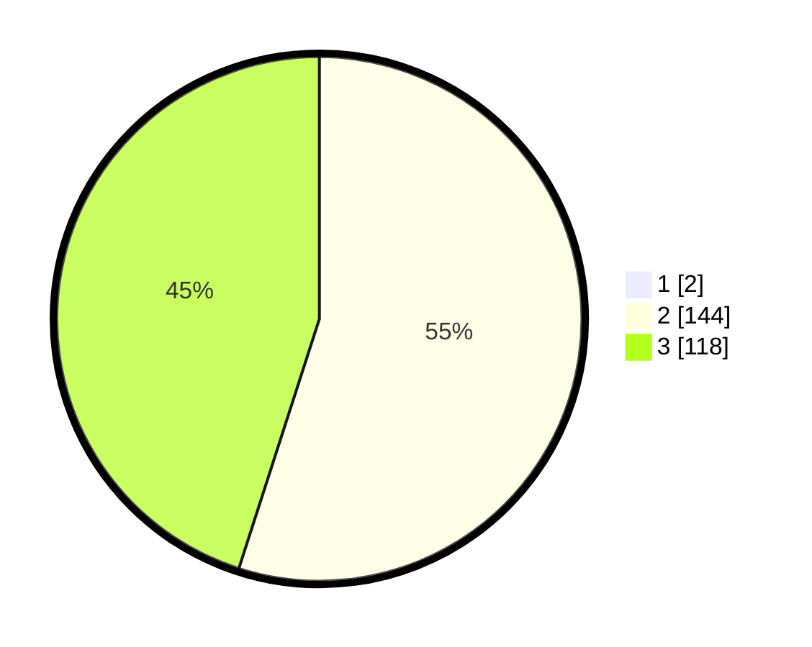

# Hasil

## Grafik

## Tabel

| No. | Nama Paslon    | Suara | Suara (raw) | Persentase |
|:--- |:-------------- | -----:| -----------:| ----------:|
| 1   | ANIES MUHAIMIN | 2     | [2][p-1]    | 0,76       |
| 2   | PRABOWO GIBRAN | 144   | [144][p-2]  | 54,55      |
| 3   | GANJAR MAHFUD  | 118   | [118][p-3]  | 44,70      |

[p-1]: https://github.com/gigit-pemilu/pemilu-2024-51-bali/blob/main/pilpres/hitung-suara/sub/51-bali/sub/03-badung/sub/02-mengwi/sub/2011-sobangan/sub/010-tps/sub/paslon-1.txt
[p-2]: https://github.com/gigit-pemilu/pemilu-2024-51-bali/blob/main/pilpres/hitung-suara/sub/51-bali/sub/03-badung/sub/02-mengwi/sub/2011-sobangan/sub/010-tps/sub/paslon-2.txt
[p-3]: https://github.com/gigit-pemilu/pemilu-2024-51-bali/blob/main/pilpres/hitung-suara/sub/51-bali/sub/03-badung/sub/02-mengwi/sub/2011-sobangan/sub/010-tps/sub/paslon-3.txt

## Foto C Plano

https://sirekap-obj-formc.kpu.go.id/17b4/pemilu/ppwp/51/03/02/20/11/5103022011010-20240214-155014--c3fc28ae-f541-4d89-ab0f-8455e087ada7.jpg

https://sirekap-obj-formc.kpu.go.id/17b4/pemilu/ppwp/51/03/02/20/11/5103022011010-20240214-155109--3f046f61-403e-4e54-bf23-638148b4bb43.jpg

https://sirekap-obj-formc.kpu.go.id/17b4/pemilu/ppwp/51/03/02/20/11/5103022011010-20240214-155138--d8a60aaf-157e-4932-bc8f-a56dc141e5a1.jpg

## Metadata

| Key        | Value               |
| ---------- | ------------------- |
| Time Stamp | 2024-02-14 21:46:01 |

## DATA PEMILIH TETAP

Jumlah pemilih dalam DPT: **287**.
 * L: **142**.
 * P: **145**.

## DATA PENGGUNA HAK PILIH

Jumlah pengguna hak pilih dalam DPT: **274**.
 * L: **137**.
 * P: **137**.

Jumlah pengguna hak pilih dalam DPTb: **2**.
 * L: **1**.
 * P: **1**.

Jumlah pengguna hak pilih dalam DPK: **7**.
 * L: **1**.
 * P: **0**.

Jumlah pengguna hak pilih: **277**.
 * L: **139**.
 * P: **138**.

## JUMLAH SUARA SAH DAN TIDAK SAH

JUMLAH SELURUH SUARA SAH: **264**.

JUMLAH SUARA TIDAK SAH: **13**.

JUMLAH SELURUH SUARA SAH DAN SUARA TIDAK SAH: **277**.

