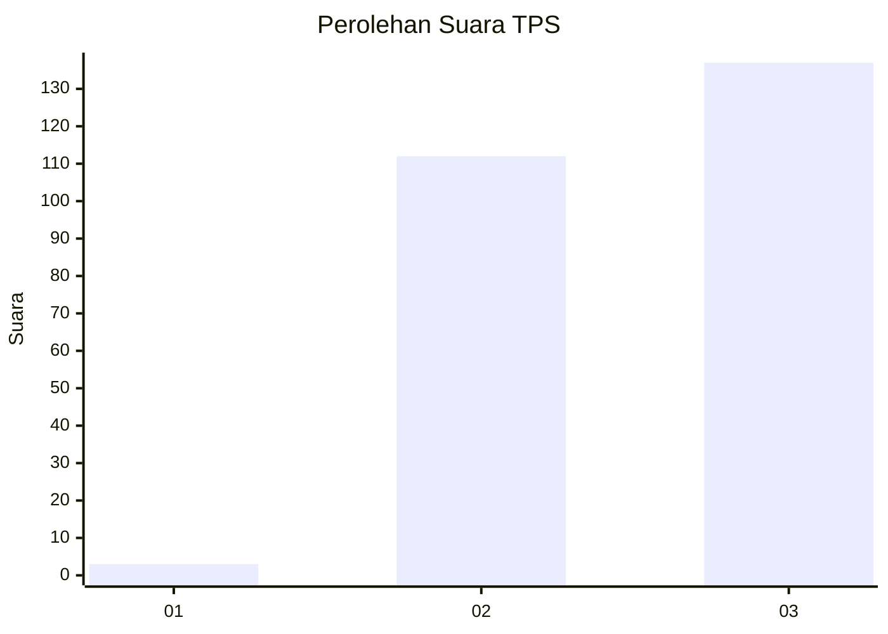
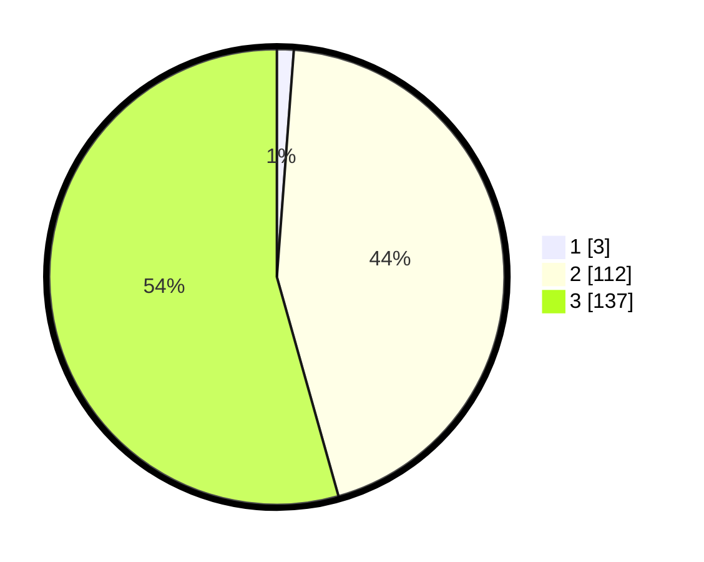

# Hasil

## Grafik

## Tabel

| No. | Nama Paslon    | Suara | Suara (raw) | Persentase |
|:--- |:-------------- | -----:| -----------:| ----------:|
| 1   | ANIES MUHAIMIN | 3     | [3][p-1]    | 1,19       |
| 2   | PRABOWO GIBRAN | 112   | [112][p-2]  | 44,44      |
| 3   | GANJAR MAHFUD  | 137   | [137][p-3]  | 54,37      |

[p-1]: https://github.com/gigit-pemilu/pemilu-2024-51-bali/blob/main/pilpres/hitung-suara/sub/51-bali/sub/03-badung/sub/02-mengwi/sub/2012-gulingan/sub/008-tps/sub/paslon-1.txt
[p-2]: https://github.com/gigit-pemilu/pemilu-2024-51-bali/blob/main/pilpres/hitung-suara/sub/51-bali/sub/03-badung/sub/02-mengwi/sub/2012-gulingan/sub/008-tps/sub/paslon-2.txt
[p-3]: https://github.com/gigit-pemilu/pemilu-2024-51-bali/blob/main/pilpres/hitung-suara/sub/51-bali/sub/03-badung/sub/02-mengwi/sub/2012-gulingan/sub/008-tps/sub/paslon-3.txt

## Foto C Plano

https://sirekap-obj-formc.kpu.go.id/7b5e/pemilu/ppwp/51/03/02/20/12/5103022012008-20240214-211819--2cb26431-47e8-46b3-b480-c5bbaf88e9a7.jpg

https://sirekap-obj-formc.kpu.go.id/7b5e/pemilu/ppwp/51/03/02/20/12/5103022012008-20240214-211839--a8eeb278-31fd-44ab-a183-4170884ef5ed.jpg

https://sirekap-obj-formc.kpu.go.id/7b5e/pemilu/ppwp/51/03/02/20/12/5103022012008-20240214-211846--21a4c5a7-63df-49c3-b4de-500566ff7484.jpg

## Metadata

| Key        | Value               |
| ---------- | ------------------- |
| Time Stamp | 2024-02-15 18:30:25 |

## DATA PEMILIH TETAP

Jumlah pemilih dalam DPT: **291**.
 * L: **142**.
 * P: **149**.

## DATA PENGGUNA HAK PILIH

Jumlah pengguna hak pilih dalam DPT: **257**.
 * L: **122**.
 * P: **135**.

Jumlah pengguna hak pilih dalam DPTb: **1**.
 * L: **1**.
 * P: **0**.

Jumlah pengguna hak pilih dalam DPK: **1**.
 * L: **0**.
 * P: **1**.

Jumlah pengguna hak pilih: **259**.
 * L: **123**.
 * P: **136**.

## JUMLAH SUARA SAH DAN TIDAK SAH

JUMLAH SELURUH SUARA SAH: **252**.

JUMLAH SUARA TIDAK SAH: **7**.

JUMLAH SELURUH SUARA SAH DAN SUARA TIDAK SAH: **259**.

