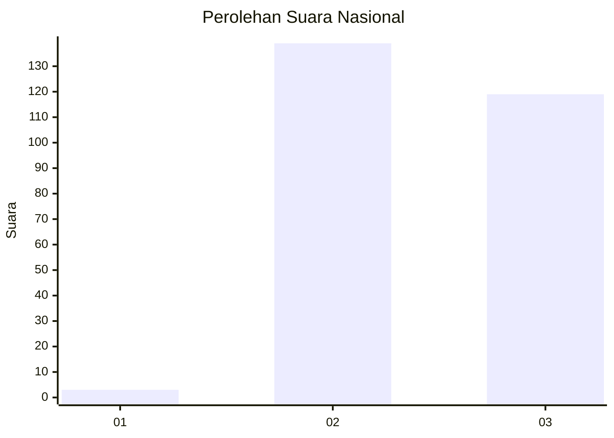
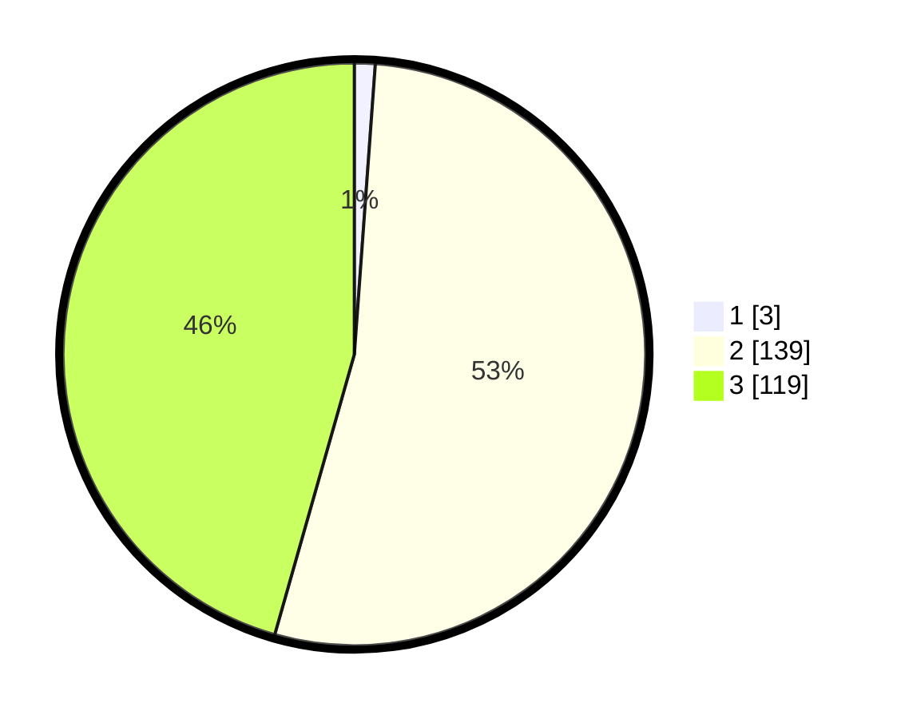

# Hasil

## Grafik

## Tabel

| No. | Nama Paslon    | Suara | Suara (raw) | Persentase |
|:--- |:-------------- | -----:| -----------:| ----------:|
| 1   | ANIES MUHAIMIN | 3     | [3][p-1]    | 1,15       |
| 2   | PRABOWO GIBRAN | 139   | [139][p-2]  | 53,26      |
| 3   | GANJAR MAHFUD  | 119   | [119][p-3]  | 45,59      |

[p-1]: https://github.com/gigit-pemilu/pemilu-2024/blob/main/pilpres/hitung-suara/sub/51-bali/sub/03-badung/sub/02-mengwi/sub/2012-gulingan/sub/010-tps/sub/paslon-1.txt
[p-2]: https://github.com/gigit-pemilu/pemilu-2024/blob/main/pilpres/hitung-suara/sub/51-bali/sub/03-badung/sub/02-mengwi/sub/2012-gulingan/sub/010-tps/sub/paslon-2.txt
[p-3]: https://github.com/gigit-pemilu/pemilu-2024/blob/main/pilpres/hitung-suara/sub/51-bali/sub/03-badung/sub/02-mengwi/sub/2012-gulingan/sub/010-tps/sub/paslon-3.txt

## Foto C Plano

https://sirekap-obj-formc.kpu.go.id/3d6a/pemilu/ppwp/51/03/02/20/12/5103022012010-20240216-132411--61532132-6b3f-45e6-87a0-d9af67bcf432.jpg

https://sirekap-obj-formc.kpu.go.id/3d6a/pemilu/ppwp/51/03/02/20/12/5103022012010-20240216-132413--cb5e0759-c158-4362-a72c-adb0a7c6a735.jpg

https://sirekap-obj-formc.kpu.go.id/3d6a/pemilu/ppwp/51/03/02/20/12/5103022012010-20240216-132412--cc71b3bd-d14e-44bc-9ed8-f93142d92d29.jpg

## Metadata

| Key        | Value               |
| ---------- | ------------------- |
| Time Stamp | 2024-02-21 12:00:00 |

## DATA PEMILIH TETAP

Jumlah pemilih dalam DPT: **285**.
 * L: **137**.
 * P: **148**.

## DATA PENGGUNA HAK PILIH

Jumlah pengguna hak pilih dalam DPT: **264**.
 * L: **127**.
 * P: **137**.

Jumlah pengguna hak pilih dalam DPTb: **1**.
 * L: **0**.
 * P: **1**.

Jumlah pengguna hak pilih dalam DPK: **2**.
 * L: **1**.
 * P: **1**.

Jumlah pengguna hak pilih: **267**.
 * L: **128**.
 * P: **139**.

## JUMLAH SUARA SAH DAN TIDAK SAH

JUMLAH SELURUH SUARA SAH: **261**.

JUMLAH SUARA TIDAK SAH: **6**.

JUMLAH SELURUH SUARA SAH DAN SUARA TIDAK SAH: **267**.

