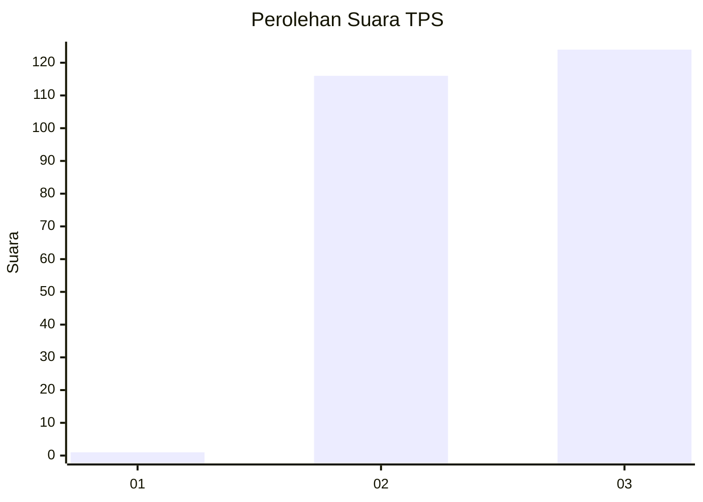
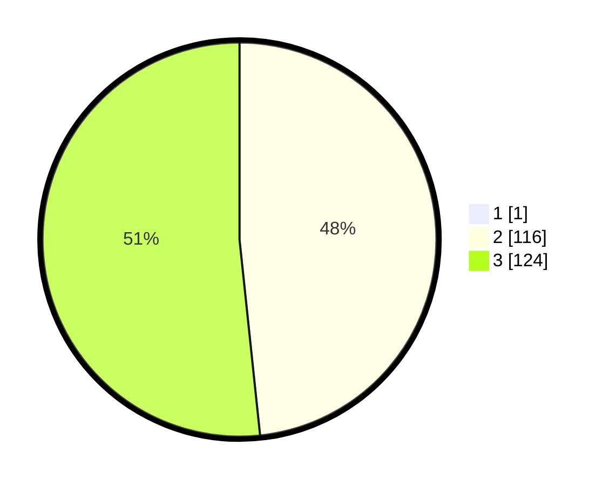

# Hasil

## Grafik

## Tabel

| No. | Nama Paslon    | Suara | Suara (raw) | Persentase |
|:--- |:-------------- | -----:| -----------:| ----------:|
| 1   | ANIES MUHAIMIN | 1     | [1][p-1]    | 0,41       |
| 2   | PRABOWO GIBRAN | 116   | [116][p-2]  | 48,13      |
| 3   | GANJAR MAHFUD  | 124   | [124][p-3]  | 51,45      |

[p-1]: https://github.com/gigit-pemilu/pemilu-2024-51-bali/blob/main/pilpres/hitung-suara/sub/51-bali/sub/03-badung/sub/02-mengwi/sub/2012-gulingan/sub/012-tps/sub/paslon-1.txt
[p-2]: https://github.com/gigit-pemilu/pemilu-2024-51-bali/blob/main/pilpres/hitung-suara/sub/51-bali/sub/03-badung/sub/02-mengwi/sub/2012-gulingan/sub/012-tps/sub/paslon-2.txt
[p-3]: https://github.com/gigit-pemilu/pemilu-2024-51-bali/blob/main/pilpres/hitung-suara/sub/51-bali/sub/03-badung/sub/02-mengwi/sub/2012-gulingan/sub/012-tps/sub/paslon-3.txt

## Foto C Plano

https://sirekap-obj-formc.kpu.go.id/97b4/pemilu/ppwp/51/03/02/20/12/5103022012012-20240214-193830--d3434b9b-d8c6-4e29-90c7-cea59f9adaf8.jpg

https://sirekap-obj-formc.kpu.go.id/97b4/pemilu/ppwp/51/03/02/20/12/5103022012012-20240214-231637--1866f721-092d-4bd0-bbff-227a7e0a4bce.jpg

https://sirekap-obj-formc.kpu.go.id/97b4/pemilu/ppwp/51/03/02/20/12/5103022012012-20240214-231932--58ffcc7c-fcc3-4e79-92b7-f952333d534a.jpg

## Metadata

| Key        | Value               |
| ---------- | ------------------- |
| Time Stamp | 2024-02-22 11:00:00 |

## DATA PEMILIH TETAP

Jumlah pemilih dalam DPT: **245**.
 * L: **115**.
 * P: **130**.

## DATA PENGGUNA HAK PILIH

Jumlah pengguna hak pilih dalam DPT: **239**.
 * L: **110**.
 * P: **129**.

Jumlah pengguna hak pilih dalam DPTb: **1**.
 * L: **1**.
 * P: **0**.

Jumlah pengguna hak pilih dalam DPK: **3**.
 * L: **3**.
 * P: **0**.

Jumlah pengguna hak pilih: **243**.
 * L: **114**.
 * P: **129**.

## JUMLAH SUARA SAH DAN TIDAK SAH

JUMLAH SELURUH SUARA SAH: **243**.

JUMLAH SUARA TIDAK SAH: **2**.

JUMLAH SELURUH SUARA SAH DAN SUARA TIDAK SAH: **241**.

