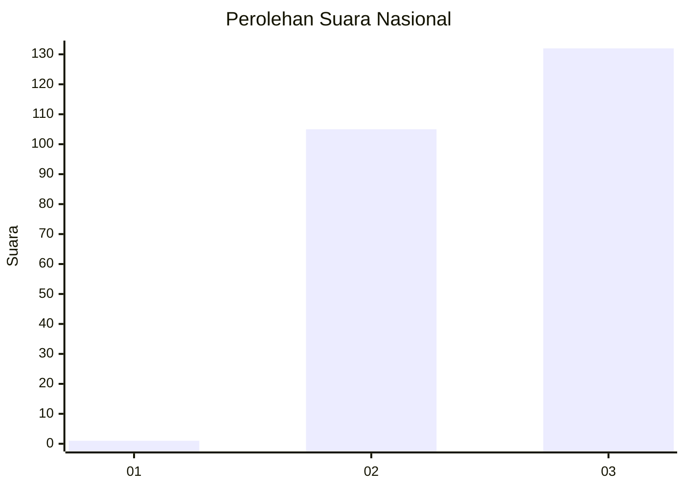
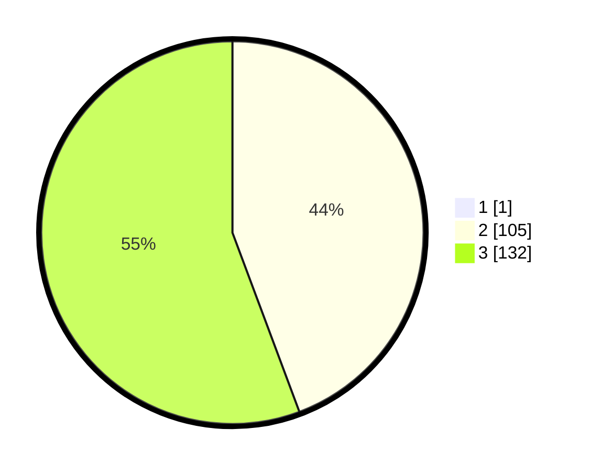

# Hasil

## Grafik

## Tabel

| No. | Nama Paslon    | Suara | Suara (raw) | Persentase |
|:--- |:-------------- | -----:| -----------:| ----------:|
| 1   | ANIES MUHAIMIN | 1     | [1][p-1]    | 0,42       |
| 2   | PRABOWO GIBRAN | 105   | [105][p-2]  | 44,12      |
| 3   | GANJAR MAHFUD  | 132   | [132][p-3]  | 55,46      |

[p-1]: https://github.com/gigit-pemilu/pemilu-2024/blob/main/pilpres/hitung-suara/sub/51-bali/sub/03-badung/sub/02-mengwi/sub/2012-gulingan/sub/013-tps/sub/paslon-1.txt
[p-2]: https://github.com/gigit-pemilu/pemilu-2024/blob/main/pilpres/hitung-suara/sub/51-bali/sub/03-badung/sub/02-mengwi/sub/2012-gulingan/sub/013-tps/sub/paslon-2.txt
[p-3]: https://github.com/gigit-pemilu/pemilu-2024/blob/main/pilpres/hitung-suara/sub/51-bali/sub/03-badung/sub/02-mengwi/sub/2012-gulingan/sub/013-tps/sub/paslon-3.txt

## Foto C Plano

https://sirekap-obj-formc.kpu.go.id/f169/pemilu/ppwp/51/03/02/20/12/5103022012013-20240214-232909--e8154905-8458-4e7f-8363-bd899fca4373.jpg

https://sirekap-obj-formc.kpu.go.id/f169/pemilu/ppwp/51/03/02/20/12/5103022012013-20240215-014543--265dcc86-a188-45b3-b265-3569d2eddf21.jpg

https://sirekap-obj-formc.kpu.go.id/f169/pemilu/ppwp/51/03/02/20/12/5103022012013-20240215-014622--43840431-92eb-4d11-9dbf-b3b11937527d.jpg

## Metadata

| Key        | Value               |
| ---------- | ------------------- |
| Time Stamp | 2024-02-19 06:16:00 |

