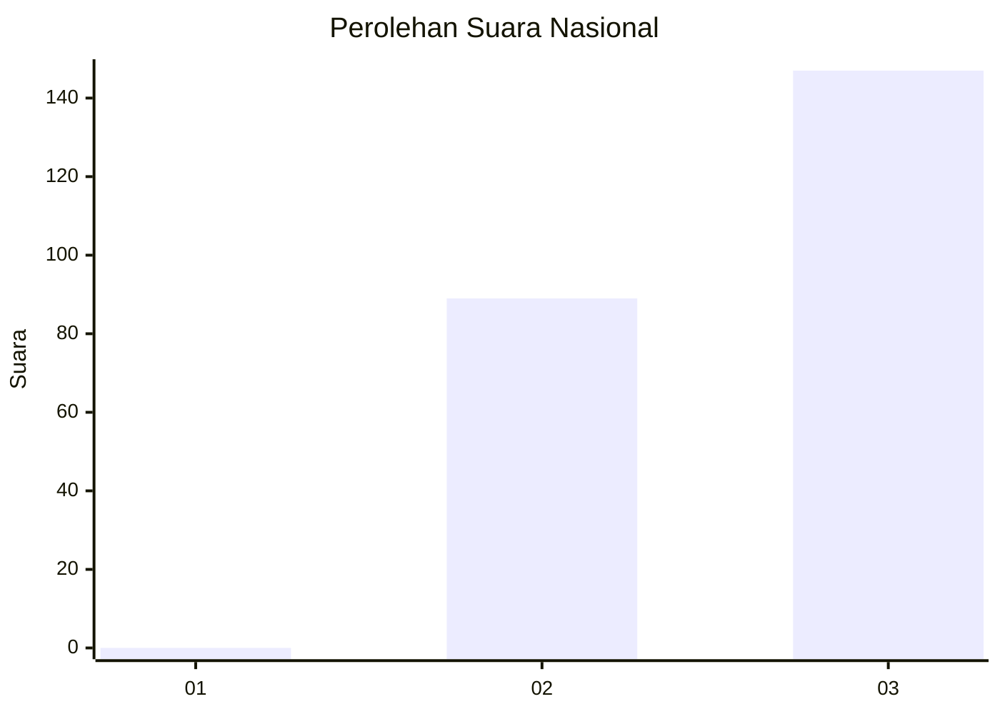
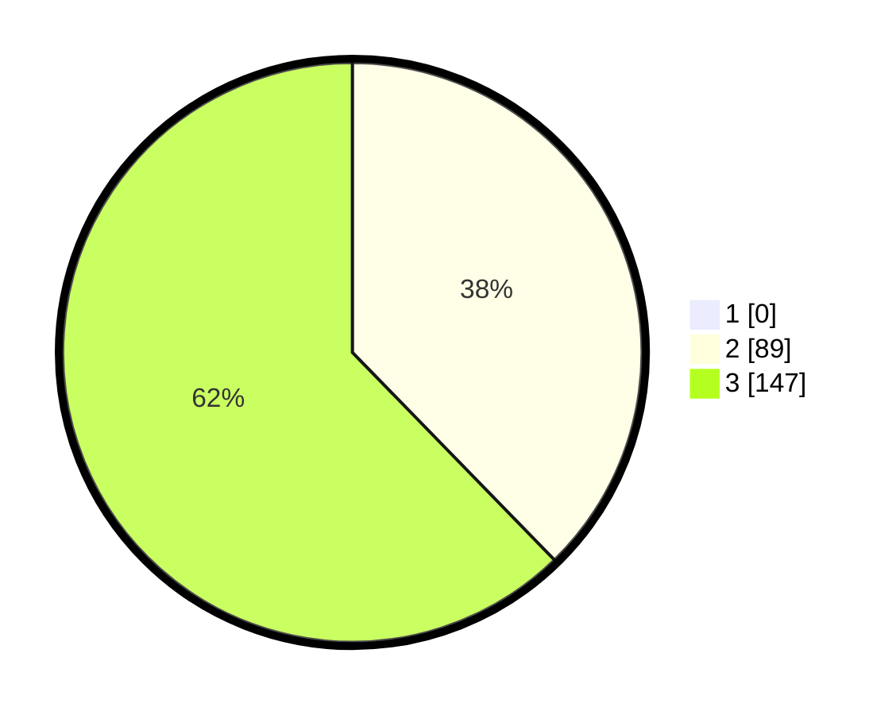

# Hasil

## Grafik

## Tabel

| No. | Nama Paslon    | Suara | Suara (raw) | Persentase |
|:--- |:-------------- | -----:| -----------:| ----------:|
| 1   | ANIES MUHAIMIN | 0     | [0][p-1]    | 0,00       |
| 2   | PRABOWO GIBRAN | 89    | [89][p-2]   | 37,71      |
| 3   | GANJAR MAHFUD  | 147   | [147][p-3]  | 62,29      |

[p-1]: https://github.com/gigit-pemilu/pemilu-2024/blob/main/pilpres/hitung-suara/sub/51-bali/sub/03-badung/sub/02-mengwi/sub/2012-gulingan/sub/014-tps/sub/paslon-1.txt
[p-2]: https://github.com/gigit-pemilu/pemilu-2024/blob/main/pilpres/hitung-suara/sub/51-bali/sub/03-badung/sub/02-mengwi/sub/2012-gulingan/sub/014-tps/sub/paslon-2.txt
[p-3]: https://github.com/gigit-pemilu/pemilu-2024/blob/main/pilpres/hitung-suara/sub/51-bali/sub/03-badung/sub/02-mengwi/sub/2012-gulingan/sub/014-tps/sub/paslon-3.txt

## Foto C Plano

https://sirekap-obj-formc.kpu.go.id/1899/pemilu/ppwp/51/03/02/20/12/5103022012014-20240215-012155--7aa5dfc1-7bd1-4a84-9eae-4af891f12362.jpg

https://sirekap-obj-formc.kpu.go.id/1899/pemilu/ppwp/51/03/02/20/12/5103022012014-20240215-012203--7fb58215-2756-48cf-b3d8-ac32d987b83e.jpg

https://sirekap-obj-formc.kpu.go.id/1899/pemilu/ppwp/51/03/02/20/12/5103022012014-20240215-012215--1083ff95-21e9-4d42-b30f-ba896282f0d4.jpg

## Metadata

| Key        | Value               |
| ---------- | ------------------- |
| Time Stamp | 2024-02-24 22:31:28 |

