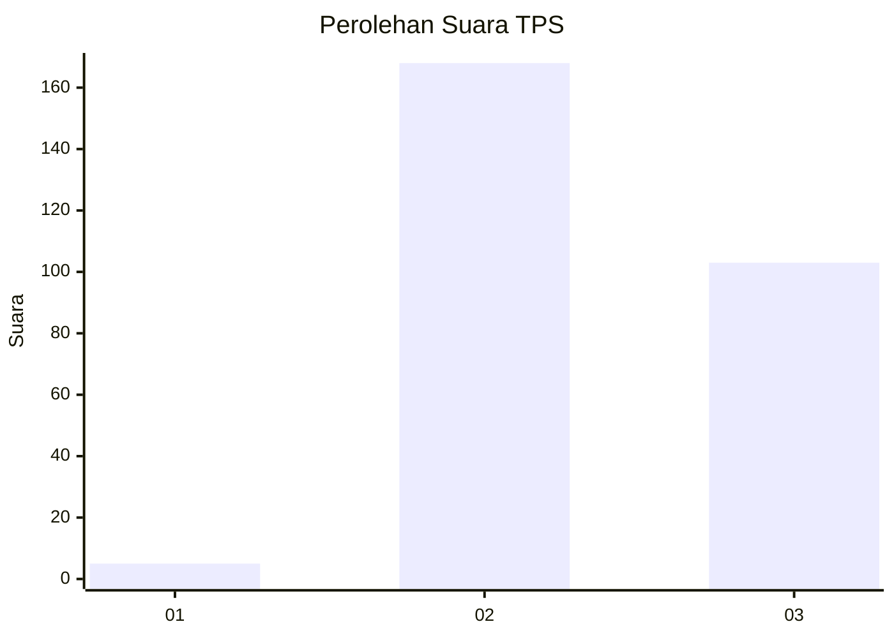
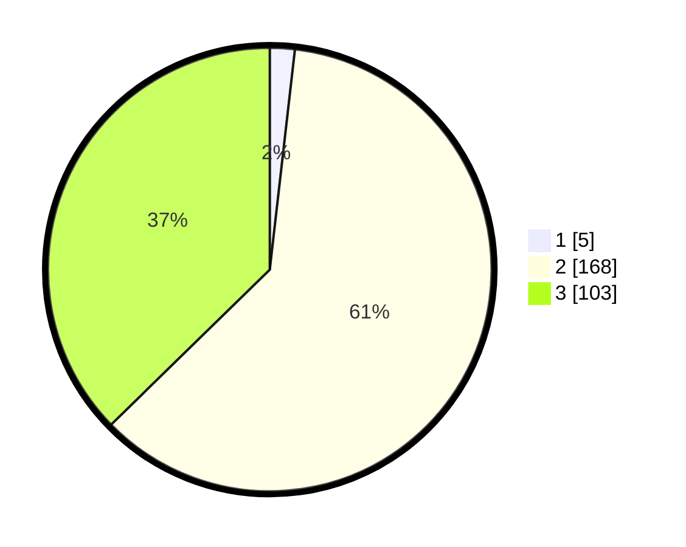

# Hasil

## Grafik

## Tabel

| No. | Nama Paslon    | Suara | Suara (raw) | Persentase |
|:--- |:-------------- | -----:| -----------:| ----------:|
| 1   | ANIES MUHAIMIN | 5     | [5][p-1]    | 1,81       |
| 2   | PRABOWO GIBRAN | 168   | [168][p-2]  | 60,87      |
| 3   | GANJAR MAHFUD  | 103   | [103][p-3]  | 37,32      |

[p-1]: https://github.com/gigit-pemilu/pemilu-2024-51-bali/blob/main/pilpres/hitung-suara/sub/51-bali/sub/03-badung/sub/02-mengwi/sub/2012-gulingan/sub/016-tps/sub/paslon-1.txt
[p-2]: https://github.com/gigit-pemilu/pemilu-2024-51-bali/blob/main/pilpres/hitung-suara/sub/51-bali/sub/03-badung/sub/02-mengwi/sub/2012-gulingan/sub/016-tps/sub/paslon-2.txt
[p-3]: https://github.com/gigit-pemilu/pemilu-2024-51-bali/blob/main/pilpres/hitung-suara/sub/51-bali/sub/03-badung/sub/02-mengwi/sub/2012-gulingan/sub/016-tps/sub/paslon-3.txt

## Foto C Plano

https://sirekap-obj-formc.kpu.go.id/ab31/pemilu/ppwp/51/03/02/20/12/5103022012016-20240216-202300--5850cc14-da64-42b2-a715-0cbc5eb8da59.jpg

https://sirekap-obj-formc.kpu.go.id/ab31/pemilu/ppwp/51/03/02/20/12/5103022012016-20240214-233828--a6f55b55-8182-4443-acc4-bd8191334c4b.jpg

https://sirekap-obj-formc.kpu.go.id/ab31/pemilu/ppwp/51/03/02/20/12/5103022012016-20240214-233927--9a71eebd-d8ab-40b3-8e2b-ac0f0f9fb7be.jpg

## Metadata

| Key        | Value               |
| ---------- | ------------------- |
| Time Stamp | 2024-02-21 00:00:00 |

## DATA PEMILIH TETAP

Jumlah pemilih dalam DPT: **294**.
 * L: **155**.
 * P: **139**.

## DATA PENGGUNA HAK PILIH

Jumlah pengguna hak pilih dalam DPT: **294**.
 * L: **148**.
 * P: **136**.

Jumlah pengguna hak pilih dalam DPTb: **2**.
 * L: **2**.
 * P: **0**.

Jumlah pengguna hak pilih dalam DPK: **1**.
 * L: **0**.
 * P: **1**.

Jumlah pengguna hak pilih: **287**.
 * L: **150**.
 * P: **137**.

## JUMLAH SUARA SAH DAN TIDAK SAH

JUMLAH SELURUH SUARA SAH: **276**.

JUMLAH SUARA TIDAK SAH: **11**.

JUMLAH SELURUH SUARA SAH DAN SUARA TIDAK SAH: **287**.

