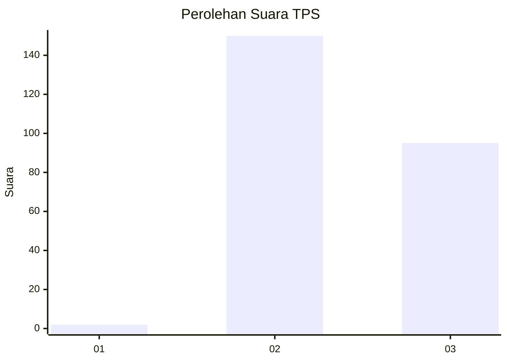
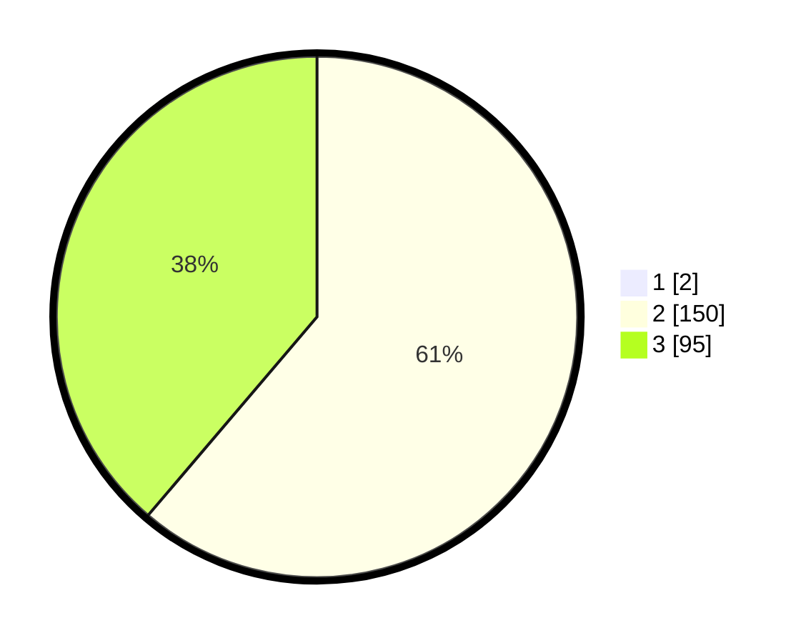

# Hasil

## Grafik

## Tabel

| No. | Nama Paslon    | Suara | Suara (raw) | Persentase |
|:--- |:-------------- | -----:| -----------:| ----------:|
| 1   | ANIES MUHAIMIN | 2     | [2][p-1]    | 0,81       |
| 2   | PRABOWO GIBRAN | 150   | [150][p-2]  | 60,73      |
| 3   | GANJAR MAHFUD  | 95    | [95][p-3]   | 38,46      |

[p-1]: https://github.com/gigit-pemilu/pemilu-2024-51-bali/blob/main/pilpres/hitung-suara/sub/51-bali/sub/03-badung/sub/02-mengwi/sub/2012-gulingan/sub/018-tps/sub/paslon-1.txt
[p-2]: https://github.com/gigit-pemilu/pemilu-2024-51-bali/blob/main/pilpres/hitung-suara/sub/51-bali/sub/03-badung/sub/02-mengwi/sub/2012-gulingan/sub/018-tps/sub/paslon-2.txt
[p-3]: https://github.com/gigit-pemilu/pemilu-2024-51-bali/blob/main/pilpres/hitung-suara/sub/51-bali/sub/03-badung/sub/02-mengwi/sub/2012-gulingan/sub/018-tps/sub/paslon-3.txt

## Foto C Plano

https://sirekap-obj-formc.kpu.go.id/216b/pemilu/ppwp/51/03/02/20/12/5103022012018-20240214-214257--2e03f418-7293-41c4-b1d0-29e5840e4eb0.jpg

https://sirekap-obj-formc.kpu.go.id/216b/pemilu/ppwp/51/03/02/20/12/5103022012018-20240214-214345--4768577f-e26c-4f02-826d-bf64eecc361e.jpg

https://sirekap-obj-formc.kpu.go.id/216b/pemilu/ppwp/51/03/02/20/12/5103022012018-20240214-214430--60c1b80e-9830-41e1-92f7-2d89848ac5de.jpg

## Metadata

| Key        | Value               |
| ---------- | ------------------- |
| Time Stamp | 2024-02-24 22:31:28 |

