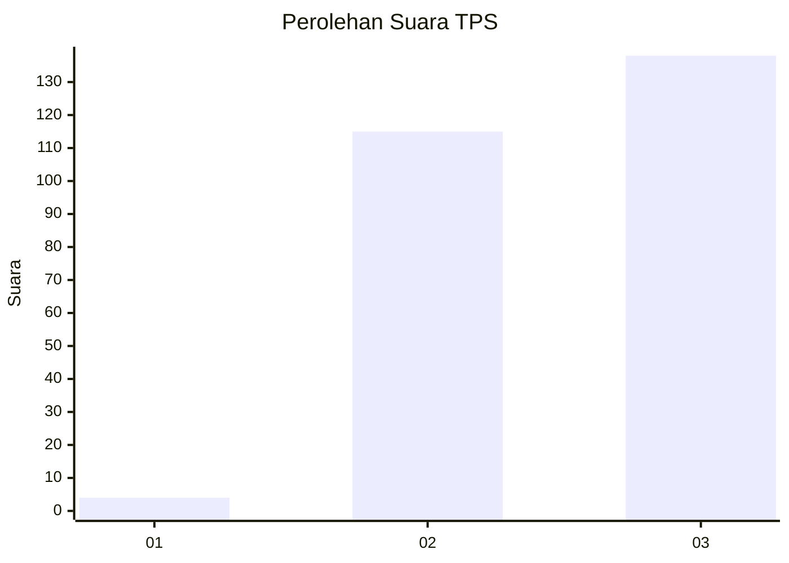
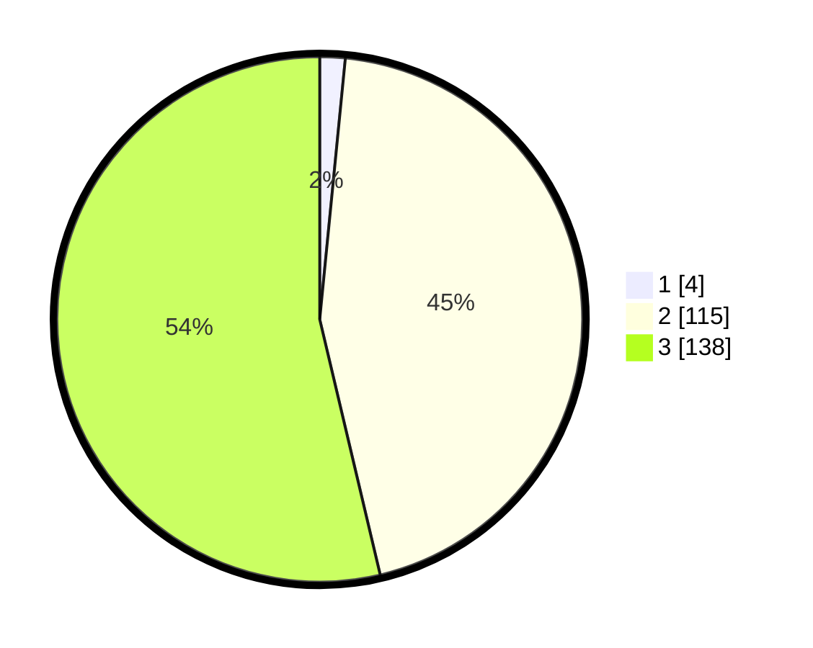

# Hasil

## Grafik

## Tabel

| No. | Nama Paslon    | Suara | Suara (raw) | Persentase |
|:--- |:-------------- | -----:| -----------:| ----------:|
| 1   | ANIES MUHAIMIN | 4     | [4][p-1]    | 1,56       |
| 2   | PRABOWO GIBRAN | 115   | [115][p-2]  | 44,75      |
| 3   | GANJAR MAHFUD  | 138   | [138][p-3]  | 53,70      |

[p-1]: https://github.com/gigit-pemilu/pemilu-2024-51-bali/blob/main/pilpres/hitung-suara/sub/51-bali/sub/03-badung/sub/02-mengwi/sub/2012-gulingan/sub/023-tps/sub/paslon-1.txt
[p-2]: https://github.com/gigit-pemilu/pemilu-2024-51-bali/blob/main/pilpres/hitung-suara/sub/51-bali/sub/03-badung/sub/02-mengwi/sub/2012-gulingan/sub/023-tps/sub/paslon-2.txt
[p-3]: https://github.com/gigit-pemilu/pemilu-2024-51-bali/blob/main/pilpres/hitung-suara/sub/51-bali/sub/03-badung/sub/02-mengwi/sub/2012-gulingan/sub/023-tps/sub/paslon-3.txt

## Foto C Plano

https://sirekap-obj-formc.kpu.go.id/0585/pemilu/ppwp/51/03/02/20/12/5103022012023-20240223-180255--b07d712b-57ca-4126-9e09-5a07dcb09e78.jpg

https://sirekap-obj-formc.kpu.go.id/0585/pemilu/ppwp/51/03/02/20/12/5103022012023-20240223-180325--c5ee8757-312e-433a-920f-8d67ef0d3ea4.jpg

https://sirekap-obj-formc.kpu.go.id/0585/pemilu/ppwp/51/03/02/20/12/5103022012023-20240223-180403--fa9ec296-9c11-401e-8fa0-cf772b2bd462.jpg

## Metadata

| Key        | Value               |
| ---------- | ------------------- |
| Time Stamp | 2024-02-24 22:31:28 |

