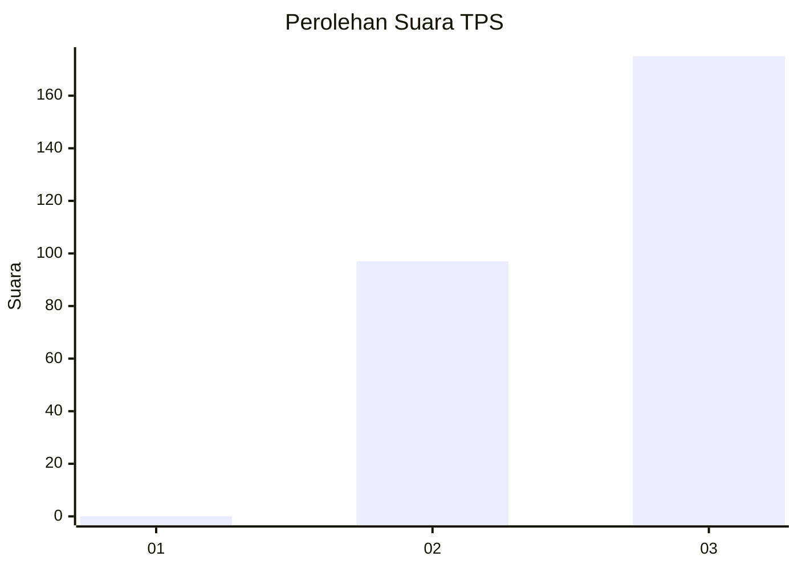
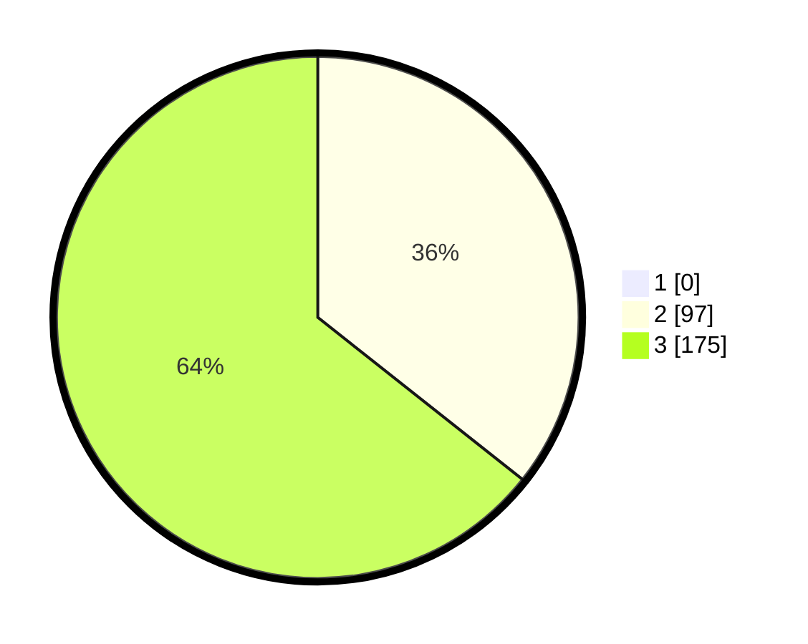

# Hasil

## Grafik

## Tabel

| No. | Nama Paslon    | Suara | Suara (raw) | Persentase |
|:--- |:-------------- | -----:| -----------:| ----------:|
| 1   | ANIES MUHAIMIN | 0     | [0][p-1]    | 0,00       |
| 2   | PRABOWO GIBRAN | 97    | [97][p-2]   | 35,66      |
| 3   | GANJAR MAHFUD  | 175   | [175][p-3]  | 64,34      |

[p-1]: https://github.com/gigit-pemilu/pemilu-2024-51-bali/blob/main/pilpres/hitung-suara/sub/51-bali/sub/03-badung/sub/02-mengwi/sub/2012-gulingan/sub/025-tps/sub/paslon-1.txt
[p-2]: https://github.com/gigit-pemilu/pemilu-2024-51-bali/blob/main/pilpres/hitung-suara/sub/51-bali/sub/03-badung/sub/02-mengwi/sub/2012-gulingan/sub/025-tps/sub/paslon-2.txt
[p-3]: https://github.com/gigit-pemilu/pemilu-2024-51-bali/blob/main/pilpres/hitung-suara/sub/51-bali/sub/03-badung/sub/02-mengwi/sub/2012-gulingan/sub/025-tps/sub/paslon-3.txt

## Foto C Plano

https://sirekap-obj-formc.kpu.go.id/8eec/pemilu/ppwp/51/03/02/20/12/5103022012025-20240216-212542--e219a10c-9e17-44a5-b077-28edb0612512.jpg

https://sirekap-obj-formc.kpu.go.id/8eec/pemilu/ppwp/51/03/02/20/12/5103022012025-20240214-221503--5f8a5579-4333-4a9e-b806-50b407a025b1.jpg

https://sirekap-obj-formc.kpu.go.id/8eec/pemilu/ppwp/51/03/02/20/12/5103022012025-20240214-221513--d360f069-8818-4566-b2df-a59cef9d8876.jpg

## Metadata

| Key        | Value               |
| ---------- | ------------------- |
| Time Stamp | 2024-02-16 22:01:00 |

## DATA PEMILIH TETAP

Jumlah pemilih dalam DPT: **231**.
 * L: **138**.
 * P: **143**.

## DATA PENGGUNA HAK PILIH

Jumlah pengguna hak pilih dalam DPT: **279**.
 * L: **136**.
 * P: **143**.

Jumlah pengguna hak pilih dalam DPTb: **0**.
 * L: **0**.
 * P: **0**.

Jumlah pengguna hak pilih dalam DPK: **1**.
 * L: **0**.
 * P: **1**.

Jumlah pengguna hak pilih: **280**.
 * L: **136**.
 * P: **144**.

## JUMLAH SUARA SAH DAN TIDAK SAH

JUMLAH SELURUH SUARA SAH: **272**.

JUMLAH SUARA TIDAK SAH: **8**.

JUMLAH SELURUH SUARA SAH DAN SUARA TIDAK SAH: **280**.

