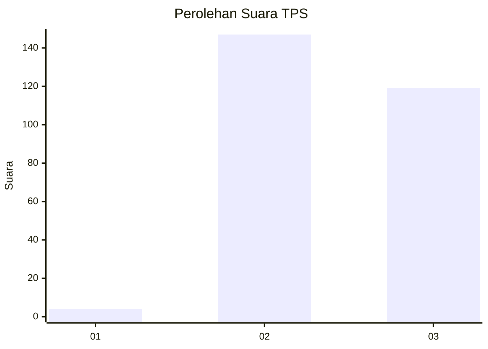
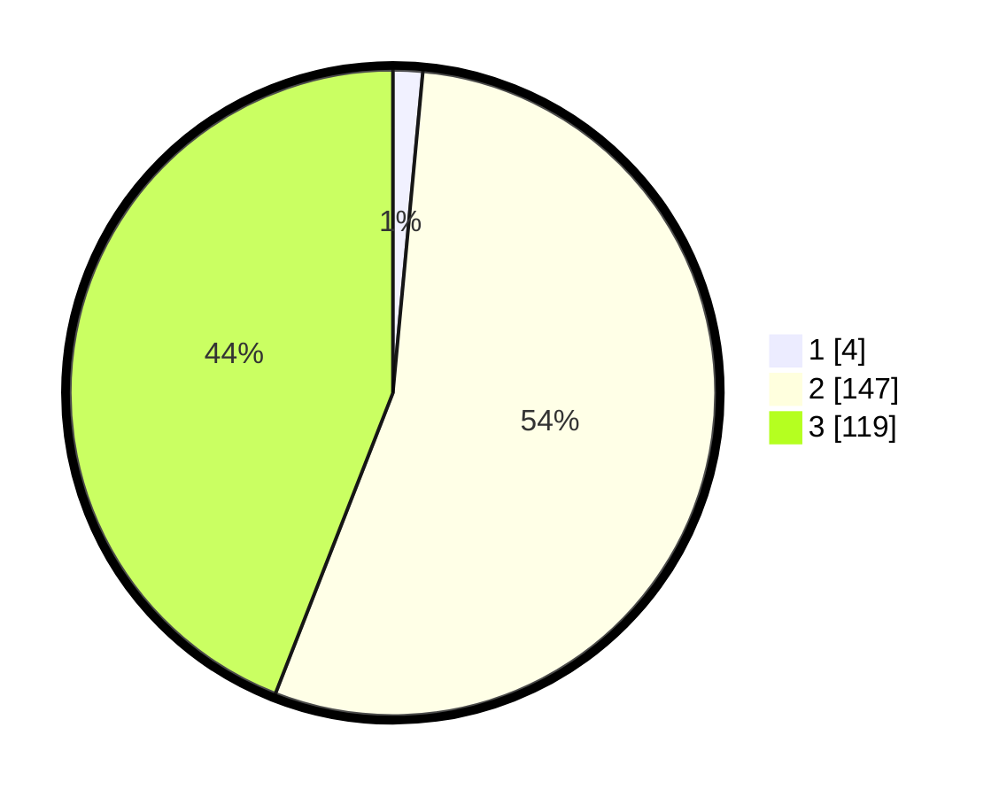

# Hasil

## Grafik

## Tabel

| No. | Nama Paslon    | Suara | Suara (raw) | Persentase |
|:--- |:-------------- | -----:| -----------:| ----------:|
| 1   | ANIES MUHAIMIN | 4     | [4][p-1]    | 1,48       |
| 2   | PRABOWO GIBRAN | 147   | [147][p-2]  | 54,44      |
| 3   | GANJAR MAHFUD  | 119   | [119][p-3]  | 44,07      |

[p-1]: https://github.com/gigit-pemilu/pemilu-2024-51-bali/blob/main/pilpres/hitung-suara/sub/51-bali/sub/03-badung/sub/02-mengwi/sub/2013-werdi-bhuwana/sub/004-tps/sub/paslon-1.txt
[p-2]: https://github.com/gigit-pemilu/pemilu-2024-51-bali/blob/main/pilpres/hitung-suara/sub/51-bali/sub/03-badung/sub/02-mengwi/sub/2013-werdi-bhuwana/sub/004-tps/sub/paslon-2.txt
[p-3]: https://github.com/gigit-pemilu/pemilu-2024-51-bali/blob/main/pilpres/hitung-suara/sub/51-bali/sub/03-badung/sub/02-mengwi/sub/2013-werdi-bhuwana/sub/004-tps/sub/paslon-3.txt

## Foto C Plano

https://sirekap-obj-formc.kpu.go.id/bc04/pemilu/ppwp/51/03/02/20/13/5103022013004-20240214-201900--511cfd87-55c2-40ea-af82-9175b70ed1cf.jpg

https://sirekap-obj-formc.kpu.go.id/bc04/pemilu/ppwp/51/03/02/20/13/5103022013004-20240214-201908--0b78f6f6-808b-4d12-ba89-a49844bf23f8.jpg

https://sirekap-obj-formc.kpu.go.id/bc04/pemilu/ppwp/51/03/02/20/13/5103022013004-20240214-201914--a2462cca-4827-446e-b176-afbaa693ae9f.jpg

## Metadata

| Key        | Value               |
| ---------- | ------------------- |
| Time Stamp | 2024-02-21 02:00:00 |

## DATA PEMILIH TETAP

Jumlah pemilih dalam DPT: **277**.
 * L: **139**.
 * P: **138**.

## DATA PENGGUNA HAK PILIH

Jumlah pengguna hak pilih dalam DPT: **268**.
 * L: **132**.
 * P: **136**.

Jumlah pengguna hak pilih dalam DPTb: **1**.
 * L: **0**.
 * P: **1**.

Jumlah pengguna hak pilih dalam DPK: **1**.
 * L: **0**.
 * P: **1**.

Jumlah pengguna hak pilih: **270**.
 * L: **132**.
 * P: **138**.

## JUMLAH SUARA SAH DAN TIDAK SAH

JUMLAH SELURUH SUARA SAH: **270**.

JUMLAH SUARA TIDAK SAH: **0**.

JUMLAH SELURUH SUARA SAH DAN SUARA TIDAK SAH: **270**.

