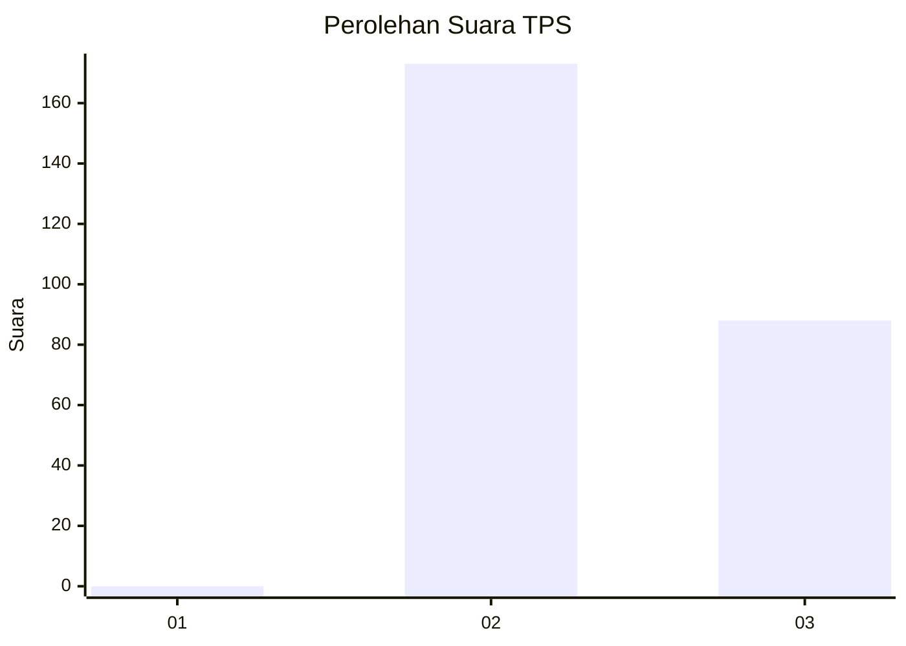
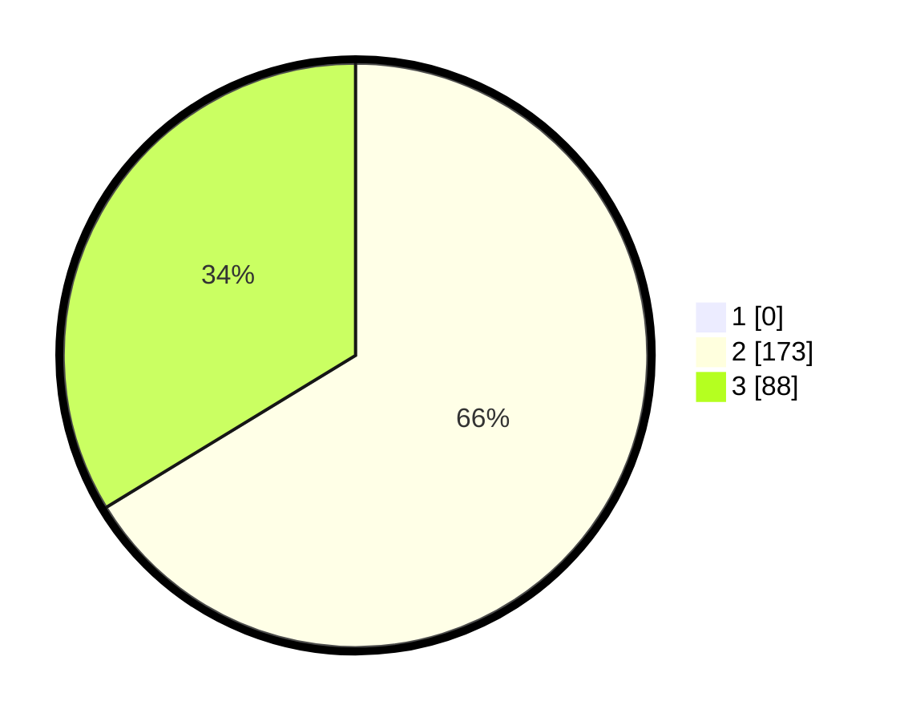

# Hasil

## Grafik

## Tabel

| No. | Nama Paslon    | Suara | Suara (raw) | Persentase |
|:--- |:-------------- | -----:| -----------:| ----------:|
| 1   | ANIES MUHAIMIN | 0     | [0][p-1]    | 0,00       |
| 2   | PRABOWO GIBRAN | 173   | [173][p-2]  | 66,28      |
| 3   | GANJAR MAHFUD  | 88    | [88][p-3]   | 33,72      |

[p-1]: https://github.com/gigit-pemilu/pemilu-2024-51-bali/blob/main/pilpres/hitung-suara/sub/51-bali/sub/03-badung/sub/02-mengwi/sub/2013-werdi-bhuwana/sub/005-tps/sub/paslon-1.txt
[p-2]: https://github.com/gigit-pemilu/pemilu-2024-51-bali/blob/main/pilpres/hitung-suara/sub/51-bali/sub/03-badung/sub/02-mengwi/sub/2013-werdi-bhuwana/sub/005-tps/sub/paslon-2.txt
[p-3]: https://github.com/gigit-pemilu/pemilu-2024-51-bali/blob/main/pilpres/hitung-suara/sub/51-bali/sub/03-badung/sub/02-mengwi/sub/2013-werdi-bhuwana/sub/005-tps/sub/paslon-3.txt

## Foto C Plano

https://sirekap-obj-formc.kpu.go.id/35d9/pemilu/ppwp/51/03/02/20/13/5103022013005-20240214-193040--a999a287-ea93-4881-bf21-89e0cd871c59.jpg

https://sirekap-obj-formc.kpu.go.id/35d9/pemilu/ppwp/51/03/02/20/13/5103022013005-20240214-193205--47eaaef7-f27e-44cb-95df-882e7204ee75.jpg

https://sirekap-obj-formc.kpu.go.id/35d9/pemilu/ppwp/51/03/02/20/13/5103022013005-20240214-193333--79c214e9-22fd-48c5-b2b7-cf32fb09d3c9.jpg

## Metadata

| Key        | Value               |
| ---------- | ------------------- |
| Time Stamp | 2024-02-21 10:00:00 |

## DATA PEMILIH TETAP

Jumlah pemilih dalam DPT: **278**.
 * L: **139**.
 * P: **139**.

## DATA PENGGUNA HAK PILIH

Jumlah pengguna hak pilih dalam DPT: **260**.
 * L: **131**.
 * P: **129**.

Jumlah pengguna hak pilih dalam DPTb: **0**.
 * L: **0**.
 * P: **0**.

Jumlah pengguna hak pilih dalam DPK: **4**.
 * L: **0**.
 * P: **4**.

Jumlah pengguna hak pilih: **264**.
 * L: **131**.
 * P: **133**.

## JUMLAH SUARA SAH DAN TIDAK SAH

JUMLAH SELURUH SUARA SAH: **261**.

JUMLAH SUARA TIDAK SAH: **3**.

JUMLAH SELURUH SUARA SAH DAN SUARA TIDAK SAH: **264**.

