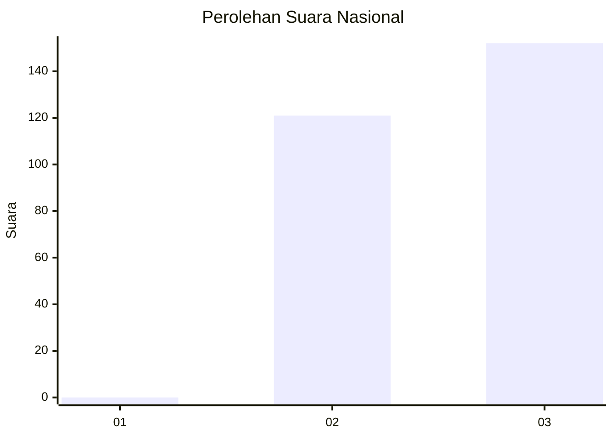
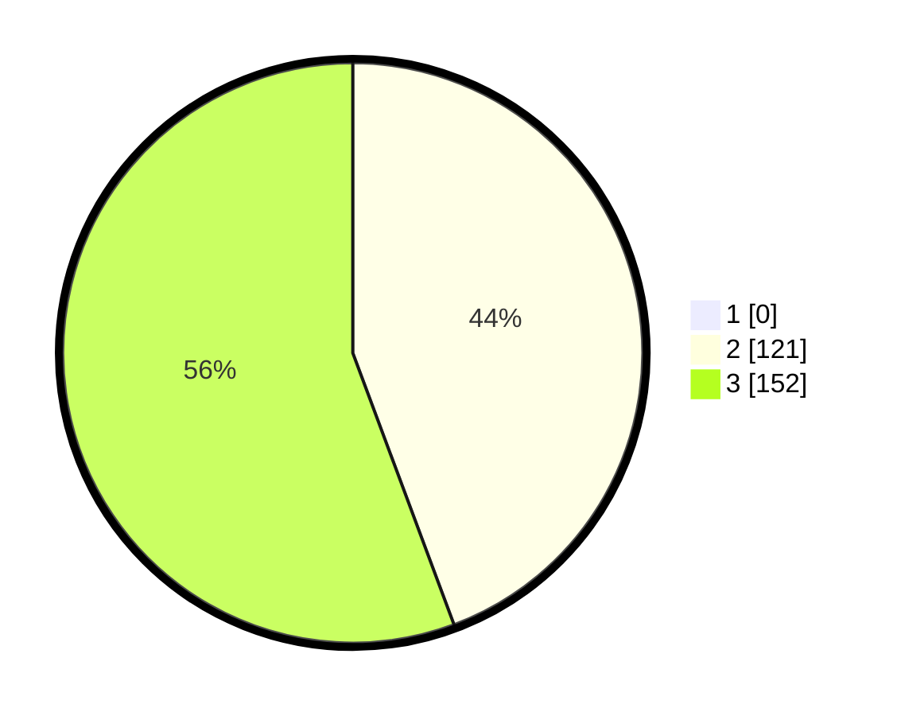

# Hasil

## Grafik

## Tabel

| No. | Nama Paslon    | Suara | Suara (raw) | Persentase |
|:--- |:-------------- | -----:| -----------:| ----------:|
| 1   | ANIES MUHAIMIN | 0     | [0][p-1]    | 0,00       |
| 2   | PRABOWO GIBRAN | 121   | [121][p-2]  | 44,32      |
| 3   | GANJAR MAHFUD  | 152   | [152][p-3]  | 55,68      |

[p-1]: https://github.com/gigit-pemilu/pemilu-2024/blob/main/pilpres/hitung-suara/sub/51-bali/sub/03-badung/sub/02-mengwi/sub/2013-werdi-bhuwana/sub/006-tps/sub/paslon-1.txt
[p-2]: https://github.com/gigit-pemilu/pemilu-2024/blob/main/pilpres/hitung-suara/sub/51-bali/sub/03-badung/sub/02-mengwi/sub/2013-werdi-bhuwana/sub/006-tps/sub/paslon-2.txt
[p-3]: https://github.com/gigit-pemilu/pemilu-2024/blob/main/pilpres/hitung-suara/sub/51-bali/sub/03-badung/sub/02-mengwi/sub/2013-werdi-bhuwana/sub/006-tps/sub/paslon-3.txt

## Foto C Plano

https://sirekap-obj-formc.kpu.go.id/5896/pemilu/ppwp/51/03/02/20/13/5103022013006-20240214-185605--7aebe6e5-3102-4bc6-8360-06e0a60d7ca5.jpg

https://sirekap-obj-formc.kpu.go.id/5896/pemilu/ppwp/51/03/02/20/13/5103022013006-20240214-185628--7947c84f-25d4-4dae-b0d2-83f5f25e23d8.jpg

https://sirekap-obj-formc.kpu.go.id/5896/pemilu/ppwp/51/03/02/20/13/5103022013006-20240214-185717--443640f3-1668-41dc-b9d6-eaafdee82dad.jpg

## Metadata

| Key        | Value               |
| ---------- | ------------------- |
| Time Stamp | 2024-02-24 22:31:28 |

## DATA PEMILIH TETAP

Jumlah pemilih dalam DPT: **294**.
 * L: **144**.
 * P: **150**.

## DATA PENGGUNA HAK PILIH

Jumlah pengguna hak pilih dalam DPT: **280**.
 * L: **138**.
 * P: **142**.

Jumlah pengguna hak pilih dalam DPTb: **0**.
 * L: **0**.
 * P: **0**.

Jumlah pengguna hak pilih dalam DPK: **2**.
 * L: **2**.
 * P: **0**.

Jumlah pengguna hak pilih: **282**.
 * L: **140**.
 * P: **142**.

## JUMLAH SUARA SAH DAN TIDAK SAH

JUMLAH SELURUH SUARA SAH: **273**.

JUMLAH SUARA TIDAK SAH: **9**.

JUMLAH SELURUH SUARA SAH DAN SUARA TIDAK SAH: **282**.

