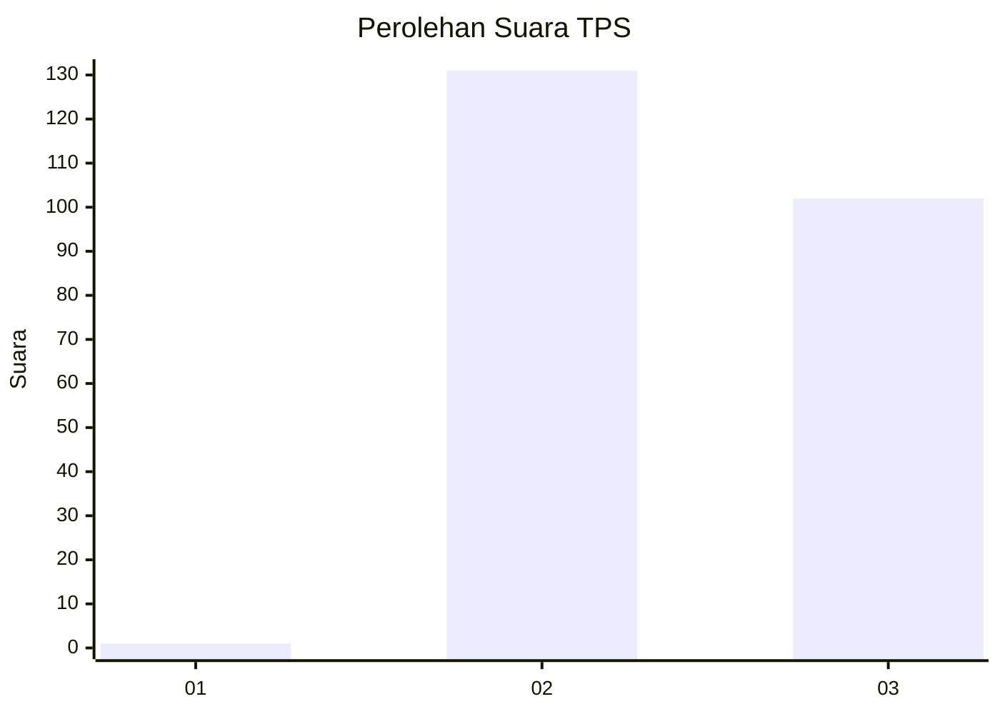
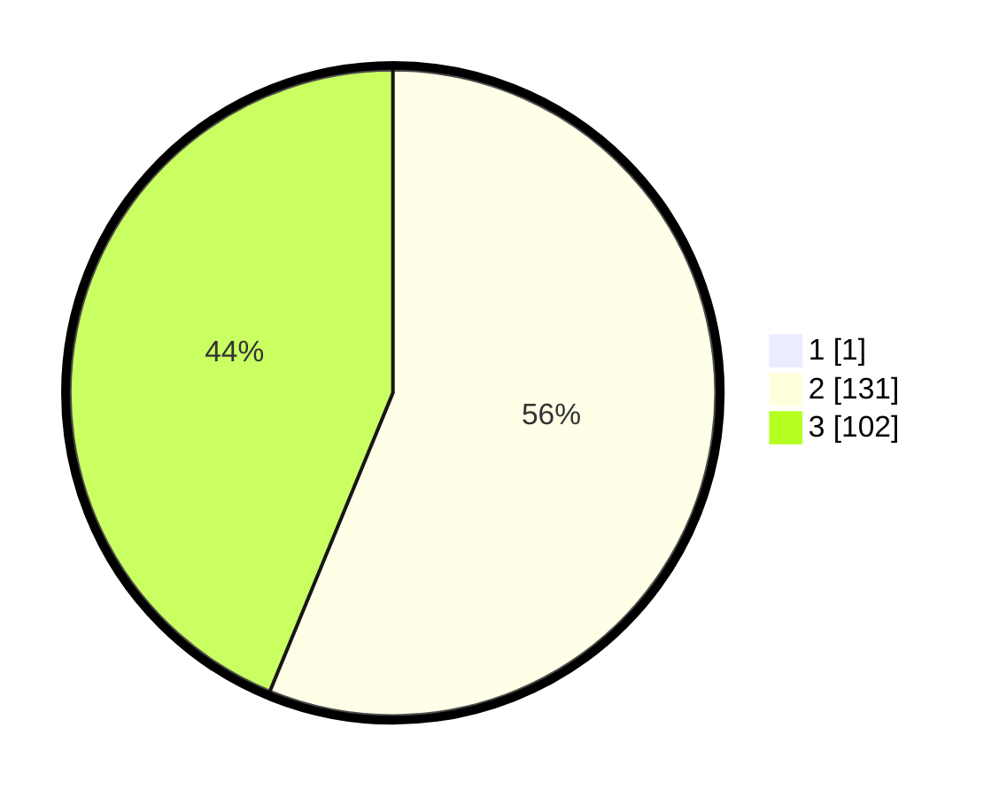

# Hasil

## Grafik

## Tabel

| No. | Nama Paslon    | Suara | Suara (raw) | Persentase |
|:--- |:-------------- | -----:| -----------:| ----------:|
| 1   | ANIES MUHAIMIN | 1     | [1][p-1]    | 0,43       |
| 2   | PRABOWO GIBRAN | 131   | [131][p-2]  | 55,98      |
| 3   | GANJAR MAHFUD  | 102   | [102][p-3]  | 43,59      |

[p-1]: https://github.com/gigit-pemilu/pemilu-2024-51-bali/blob/main/pilpres/hitung-suara/sub/51-bali/sub/03-badung/sub/02-mengwi/sub/2013-werdi-bhuwana/sub/010-tps/sub/paslon-1.txt
[p-2]: https://github.com/gigit-pemilu/pemilu-2024-51-bali/blob/main/pilpres/hitung-suara/sub/51-bali/sub/03-badung/sub/02-mengwi/sub/2013-werdi-bhuwana/sub/010-tps/sub/paslon-2.txt
[p-3]: https://github.com/gigit-pemilu/pemilu-2024-51-bali/blob/main/pilpres/hitung-suara/sub/51-bali/sub/03-badung/sub/02-mengwi/sub/2013-werdi-bhuwana/sub/010-tps/sub/paslon-3.txt

## Foto C Plano

https://sirekap-obj-formc.kpu.go.id/9ef1/pemilu/ppwp/51/03/02/20/13/5103022013010-20240216-111150--b2103a22-d745-4a21-a16b-bfea2aabecca.jpg

https://sirekap-obj-formc.kpu.go.id/9ef1/pemilu/ppwp/51/03/02/20/13/5103022013010-20240214-225820--6446654e-ac7c-4716-ab1d-c108704b106f.jpg

https://sirekap-obj-formc.kpu.go.id/9ef1/pemilu/ppwp/51/03/02/20/13/5103022013010-20240214-225846--0652e025-8a41-4d52-bf94-18509b232693.jpg

## Metadata

| Key        | Value               |
| ---------- | ------------------- |
| Time Stamp | 2024-02-21 10:00:00 |

