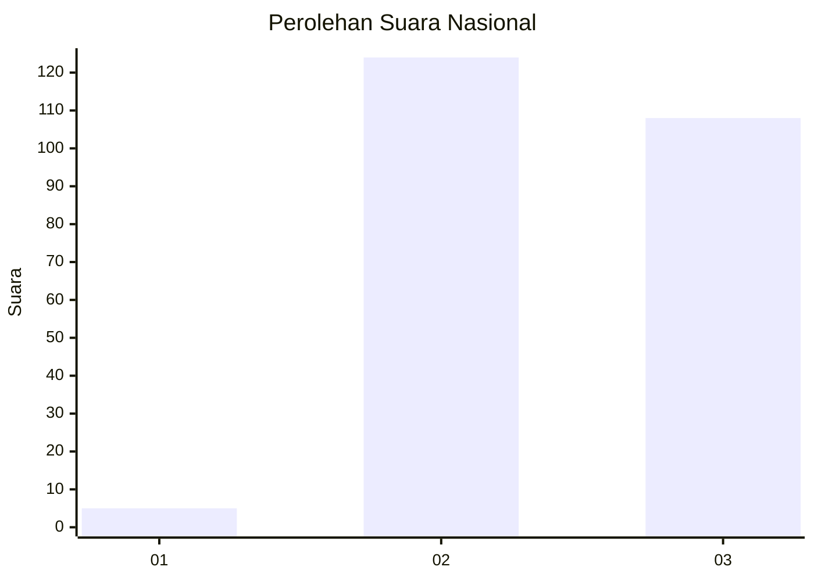
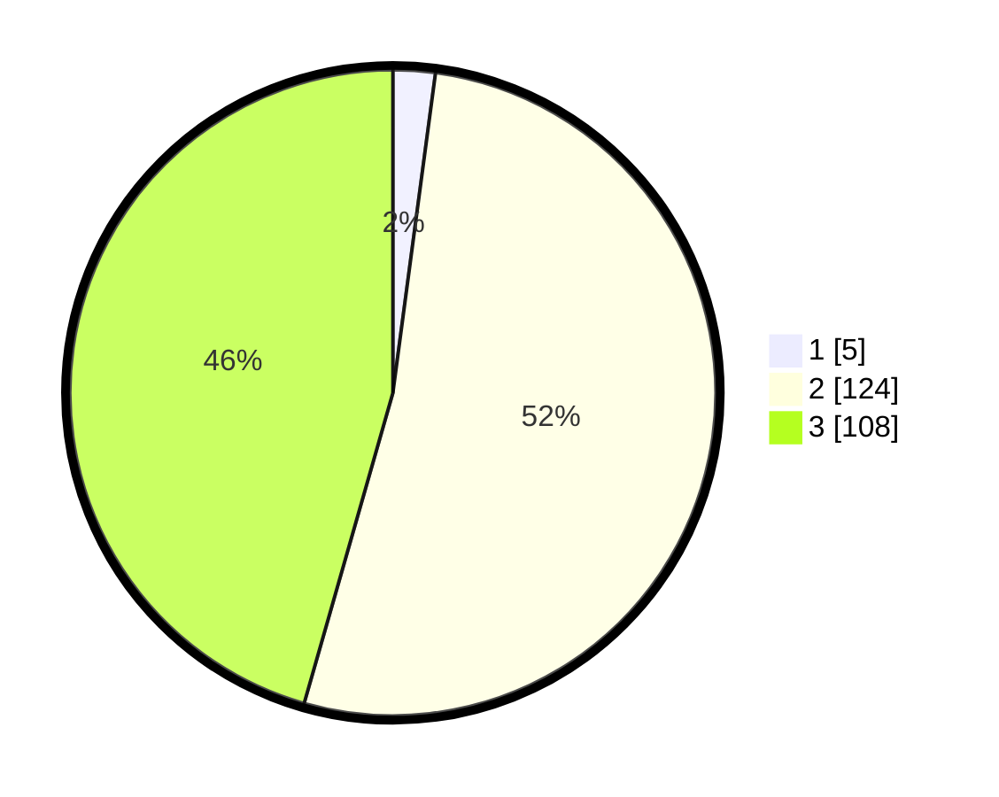

# Hasil

## Grafik

## Tabel

| No. | Nama Paslon    | Suara | Suara (raw) | Persentase |
|:--- |:-------------- | -----:| -----------:| ----------:|
| 1   | ANIES MUHAIMIN | 5     | [5][p-1]    | 2,11       |
| 2   | PRABOWO GIBRAN | 124   | [124][p-2]  | 52,32      |
| 3   | GANJAR MAHFUD  | 108   | [108][p-3]  | 45,57      |

[p-1]: https://github.com/gigit-pemilu/pemilu-2024/blob/main/pilpres/hitung-suara/sub/51-bali/sub/03-badung/sub/02-mengwi/sub/2013-werdi-bhuwana/sub/011-tps/sub/paslon-1.txt
[p-2]: https://github.com/gigit-pemilu/pemilu-2024/blob/main/pilpres/hitung-suara/sub/51-bali/sub/03-badung/sub/02-mengwi/sub/2013-werdi-bhuwana/sub/011-tps/sub/paslon-2.txt
[p-3]: https://github.com/gigit-pemilu/pemilu-2024/blob/main/pilpres/hitung-suara/sub/51-bali/sub/03-badung/sub/02-mengwi/sub/2013-werdi-bhuwana/sub/011-tps/sub/paslon-3.txt

## Foto C Plano

https://sirekap-obj-formc.kpu.go.id/a253/pemilu/ppwp/51/03/02/20/13/5103022013011-20240216-193806--2eca38eb-4210-4372-a46e-22f7bdcdfc08.jpg

https://sirekap-obj-formc.kpu.go.id/a253/pemilu/ppwp/51/03/02/20/13/5103022013011-20240214-193831--97369a2c-1458-44a8-9349-79a0b160d545.jpg

## Metadata

| Key        | Value               |
| ---------- | ------------------- |
| Time Stamp | 2024-02-21 04:00:00 |

