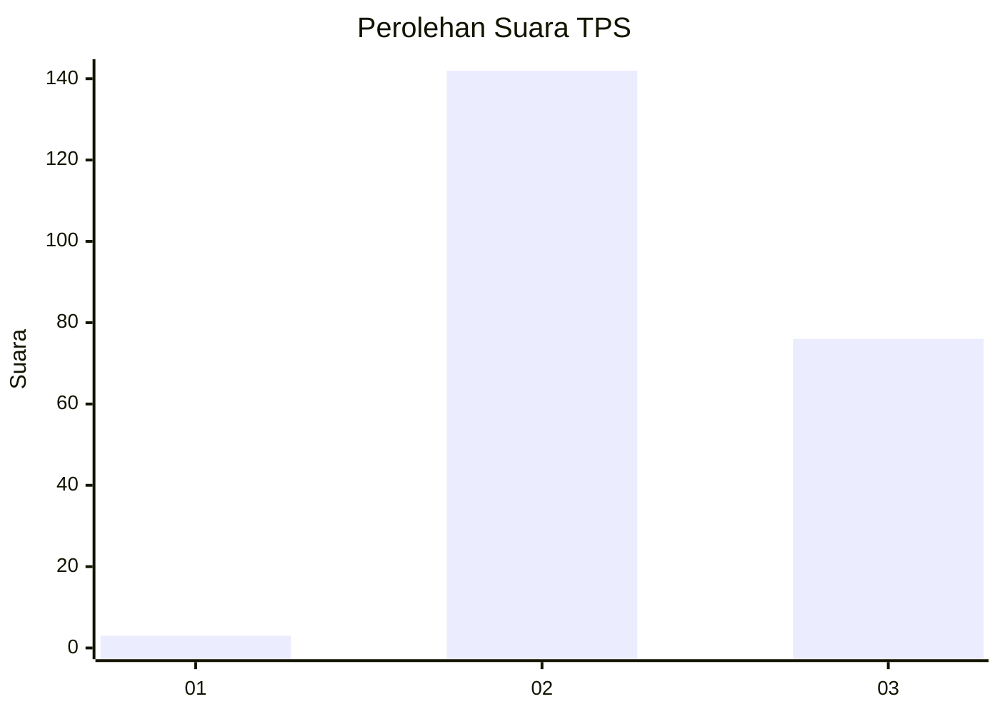
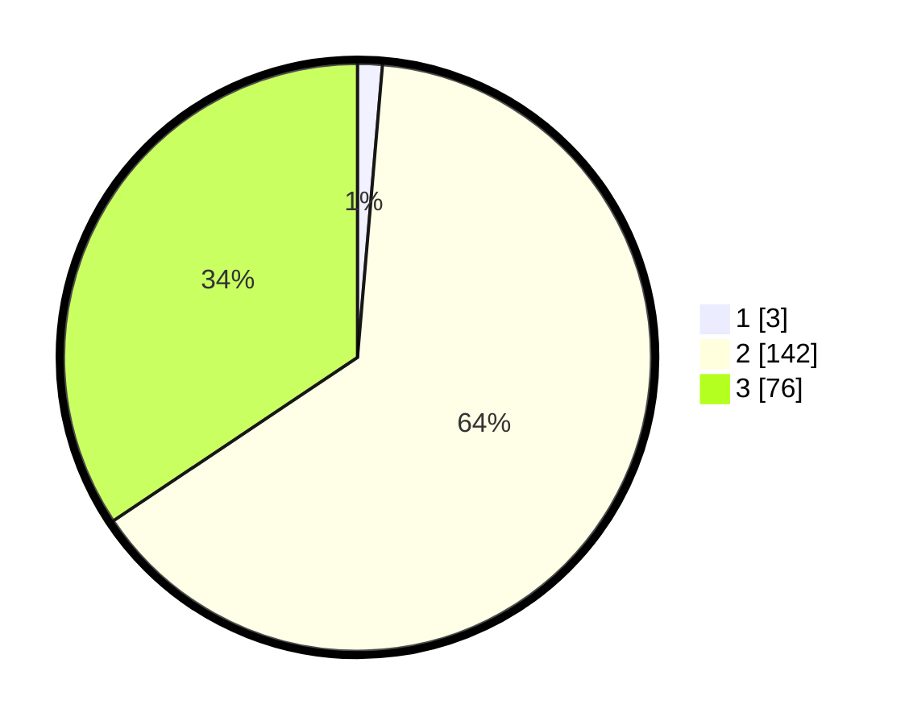

# Hasil

## Grafik

## Tabel

| No. | Nama Paslon    | Suara | Suara (raw) | Persentase |
|:--- |:-------------- | -----:| -----------:| ----------:|
| 1   | ANIES MUHAIMIN | 3     | [3][p-1]    | 1,36       |
| 2   | PRABOWO GIBRAN | 142   | [142][p-2]  | 64,25      |
| 3   | GANJAR MAHFUD  | 76    | [76][p-3]   | 34,39      |

[p-1]: https://github.com/gigit-pemilu/pemilu-2024-51-bali/blob/main/pilpres/hitung-suara/sub/51-bali/sub/03-badung/sub/02-mengwi/sub/2017-cemagi/sub/005-tps/sub/paslon-1.txt
[p-2]: https://github.com/gigit-pemilu/pemilu-2024-51-bali/blob/main/pilpres/hitung-suara/sub/51-bali/sub/03-badung/sub/02-mengwi/sub/2017-cemagi/sub/005-tps/sub/paslon-2.txt
[p-3]: https://github.com/gigit-pemilu/pemilu-2024-51-bali/blob/main/pilpres/hitung-suara/sub/51-bali/sub/03-badung/sub/02-mengwi/sub/2017-cemagi/sub/005-tps/sub/paslon-3.txt

## Foto C Plano

https://sirekap-obj-formc.kpu.go.id/470b/pemilu/ppwp/51/03/02/20/17/5103022017005-20240214-230443--47b74d8d-97a8-409b-92f6-c0a339ef4311.jpg

https://sirekap-obj-formc.kpu.go.id/470b/pemilu/ppwp/51/03/02/20/17/5103022017005-20240214-230514--63456202-2fad-4f97-a7cb-8ef95a51cf22.jpg

https://sirekap-obj-formc.kpu.go.id/470b/pemilu/ppwp/51/03/02/20/17/5103022017005-20240214-230525--b5b21f54-49f8-42fb-bd4f-38ebcca74390.jpg

## Metadata

| Key        | Value               |
| ---------- | ------------------- |
| Time Stamp | 2024-02-15 05:00:24 |

## DATA PEMILIH TETAP

Jumlah pemilih dalam DPT: **244**.
 * L: **122**.
 * P: **122**.

## DATA PENGGUNA HAK PILIH

Jumlah pengguna hak pilih dalam DPT: **228**.
 * L: **113**.
 * P: **115**.

Jumlah pengguna hak pilih dalam DPTb: **2**.
 * L: **1**.
 * P: **1**.

Jumlah pengguna hak pilih dalam DPK: **1**.
 * L: **0**.
 * P: **1**.

Jumlah pengguna hak pilih: **231**.
 * L: **114**.
 * P: **117**.

## JUMLAH SUARA SAH DAN TIDAK SAH

JUMLAH SELURUH SUARA SAH: **221**.

JUMLAH SUARA TIDAK SAH: **10**.

JUMLAH SELURUH SUARA SAH DAN SUARA TIDAK SAH: **231**.

