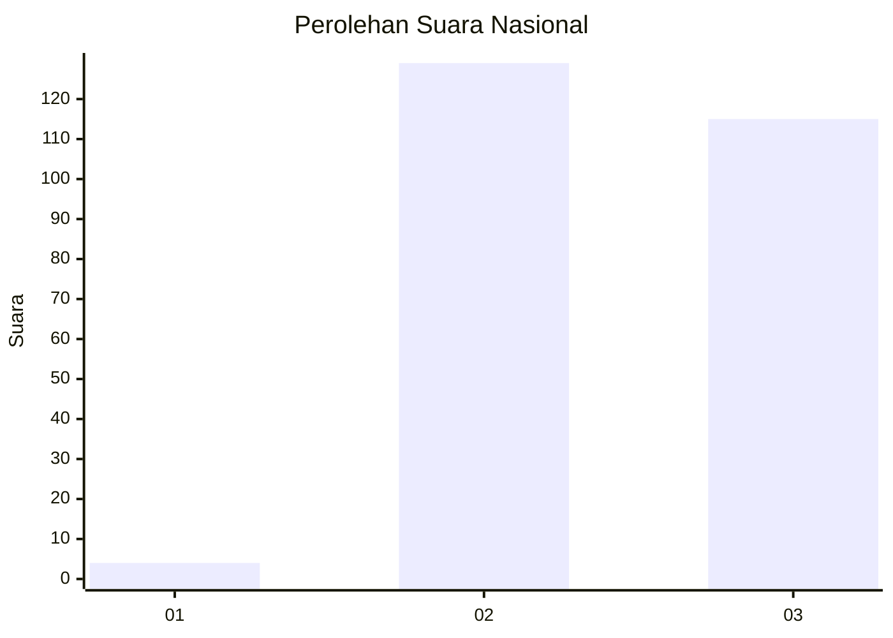
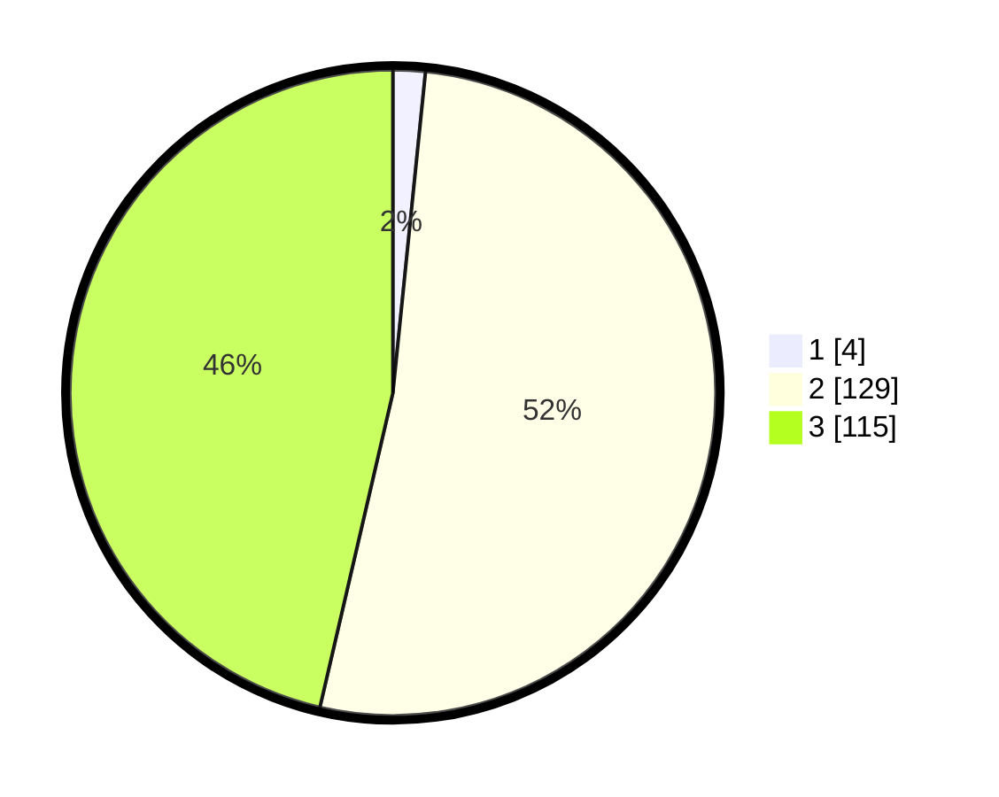

# Hasil

## Grafik

## Tabel

| No. | Nama Paslon    | Suara | Suara (raw) | Persentase |
|:--- |:-------------- | -----:| -----------:| ----------:|
| 1   | ANIES MUHAIMIN | 4     | [4][p-1]    | 1,61       |
| 2   | PRABOWO GIBRAN | 129   | [129][p-2]  | 52,02      |
| 3   | GANJAR MAHFUD  | 115   | [115][p-3]  | 46,37      |

[p-1]: https://github.com/gigit-pemilu/pemilu-2024/blob/main/pilpres/hitung-suara/sub/51-bali/sub/03-badung/sub/02-mengwi/sub/2017-cemagi/sub/006-tps/sub/paslon-1.txt
[p-2]: https://github.com/gigit-pemilu/pemilu-2024/blob/main/pilpres/hitung-suara/sub/51-bali/sub/03-badung/sub/02-mengwi/sub/2017-cemagi/sub/006-tps/sub/paslon-2.txt
[p-3]: https://github.com/gigit-pemilu/pemilu-2024/blob/main/pilpres/hitung-suara/sub/51-bali/sub/03-badung/sub/02-mengwi/sub/2017-cemagi/sub/006-tps/sub/paslon-3.txt

## Foto C Plano

https://sirekap-obj-formc.kpu.go.id/d89d/pemilu/ppwp/51/03/02/20/17/5103022017006-20240214-214442--675ee1e7-d6c2-4745-a7b1-c7a3a2e0b087.jpg

https://sirekap-obj-formc.kpu.go.id/d89d/pemilu/ppwp/51/03/02/20/17/5103022017006-20240214-214315--f61d9092-b65e-46fa-a278-fb9cb1c91a55.jpg

https://sirekap-obj-formc.kpu.go.id/d89d/pemilu/ppwp/51/03/02/20/17/5103022017006-20240214-214407--0c723e85-2889-49cd-bcc7-82f66379bba6.jpg

## Metadata

| Key        | Value               |
| ---------- | ------------------- |
| Time Stamp | 2024-02-21 12:00:00 |

