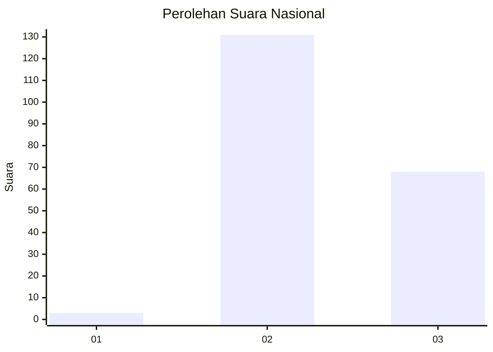
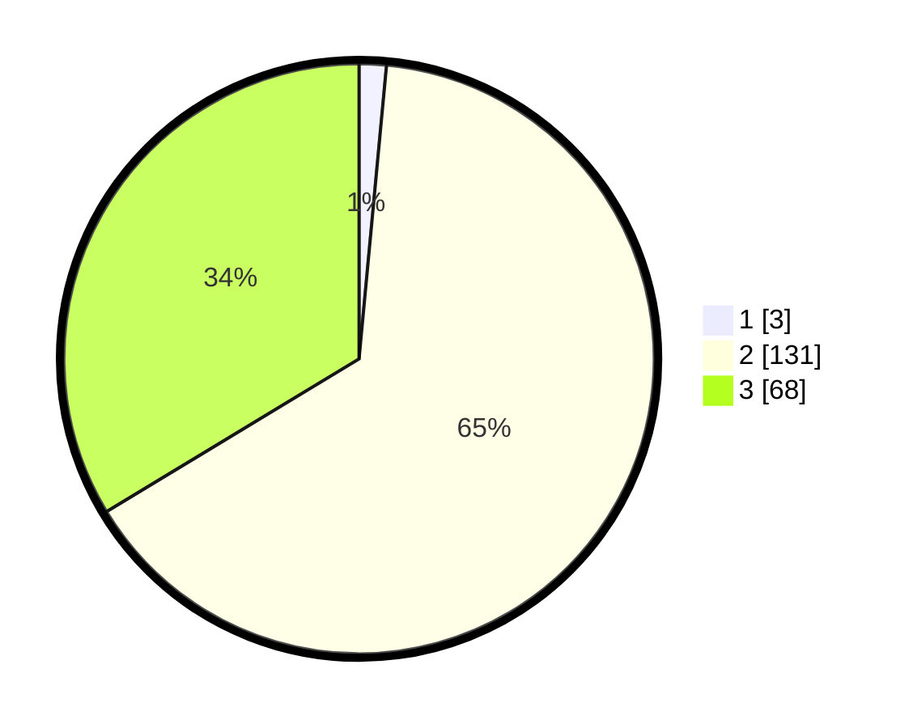

# Hasil

## Grafik

## Tabel

| No. | Nama Paslon    | Suara | Suara (raw) | Persentase |
|:--- |:-------------- | -----:| -----------:| ----------:|
| 1   | ANIES MUHAIMIN | 3     | [3][p-1]    | 1,49       |
| 2   | PRABOWO GIBRAN | 131   | [131][p-2]  | 64,85      |
| 3   | GANJAR MAHFUD  | 68    | [68][p-3]   | 33,66      |

[p-1]: https://github.com/gigit-pemilu/pemilu-2024/blob/main/pilpres/hitung-suara/sub/51-bali/sub/03-badung/sub/02-mengwi/sub/2017-cemagi/sub/008-tps/sub/paslon-1.txt
[p-2]: https://github.com/gigit-pemilu/pemilu-2024/blob/main/pilpres/hitung-suara/sub/51-bali/sub/03-badung/sub/02-mengwi/sub/2017-cemagi/sub/008-tps/sub/paslon-2.txt
[p-3]: https://github.com/gigit-pemilu/pemilu-2024/blob/main/pilpres/hitung-suara/sub/51-bali/sub/03-badung/sub/02-mengwi/sub/2017-cemagi/sub/008-tps/sub/paslon-3.txt

## Foto C Plano

https://sirekap-obj-formc.kpu.go.id/6f15/pemilu/ppwp/51/03/02/20/17/5103022017008-20240214-195500--c1a3560a-574d-473f-9f45-417c3a59afa1.jpg

https://sirekap-obj-formc.kpu.go.id/6f15/pemilu/ppwp/51/03/02/20/17/5103022017008-20240214-214844--0162c2b3-5e32-4bee-9068-4e0cb0e8c992.jpg

https://sirekap-obj-formc.kpu.go.id/6f15/pemilu/ppwp/51/03/02/20/17/5103022017008-20240214-195719--9b70385c-25e5-414e-a1b8-6608cebaccc5.jpg

## Metadata

| Key        | Value               |
| ---------- | ------------------- |
| Time Stamp | 2024-02-15 18:30:25 |

## DATA PEMILIH TETAP

Jumlah pemilih dalam DPT: **231**.
 * L: **119**.
 * P: **112**.

## DATA PENGGUNA HAK PILIH

Jumlah pengguna hak pilih dalam DPT: **207**.
 * L: **108**.
 * P: **99**.

Jumlah pengguna hak pilih dalam DPTb: **0**.
 * L: **0**.
 * P: **0**.

Jumlah pengguna hak pilih dalam DPK: **1**.
 * L: **1**.
 * P: **0**.

Jumlah pengguna hak pilih: **208**.
 * L: **109**.
 * P: **99**.

## JUMLAH SUARA SAH DAN TIDAK SAH

JUMLAH SELURUH SUARA SAH: **202**.

JUMLAH SUARA TIDAK SAH: **6**.

JUMLAH SELURUH SUARA SAH DAN SUARA TIDAK SAH: **208**.

