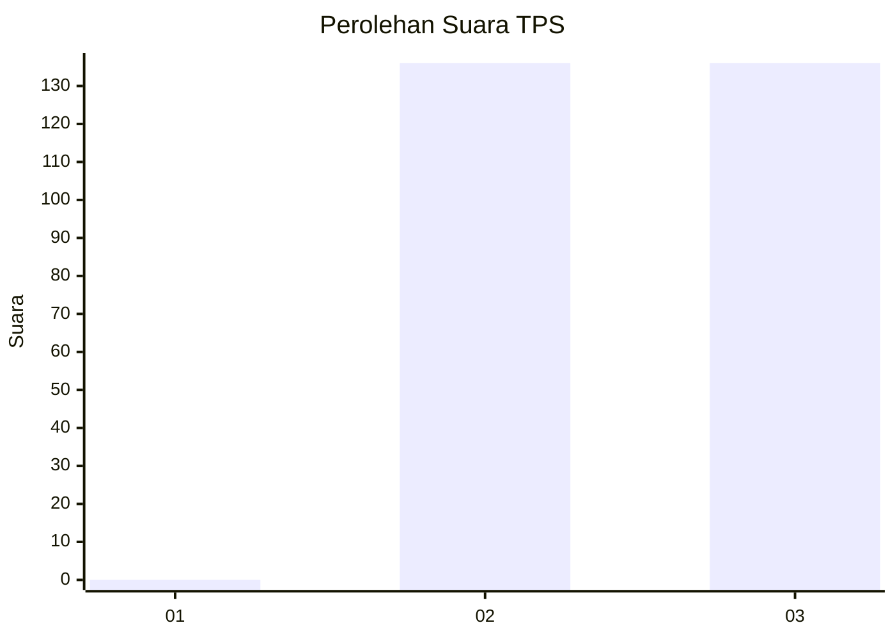
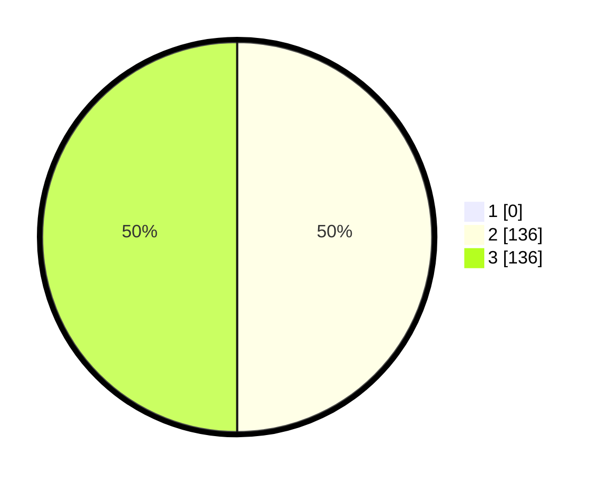

# Hasil

## Grafik

## Tabel

| No. | Nama Paslon    | Suara | Suara (raw) | Persentase |
|:--- |:-------------- | -----:| -----------:| ----------:|
| 1   | ANIES MUHAIMIN | 0     | [0][p-1]    | 0,00       |
| 2   | PRABOWO GIBRAN | 136   | [136][p-2]  | 50,00      |
| 3   | GANJAR MAHFUD  | 136   | [136][p-3]  | 50,00      |

[p-1]: https://github.com/gigit-pemilu/pemilu-2024-51-bali/blob/main/pilpres/hitung-suara/sub/51-bali/sub/03-badung/sub/02-mengwi/sub/2017-cemagi/sub/012-tps/sub/paslon-1.txt
[p-2]: https://github.com/gigit-pemilu/pemilu-2024-51-bali/blob/main/pilpres/hitung-suara/sub/51-bali/sub/03-badung/sub/02-mengwi/sub/2017-cemagi/sub/012-tps/sub/paslon-2.txt
[p-3]: https://github.com/gigit-pemilu/pemilu-2024-51-bali/blob/main/pilpres/hitung-suara/sub/51-bali/sub/03-badung/sub/02-mengwi/sub/2017-cemagi/sub/012-tps/sub/paslon-3.txt

## Foto C Plano

https://sirekap-obj-formc.kpu.go.id/183d/pemilu/ppwp/51/03/02/20/17/5103022017012-20240214-211026--9dfb6956-918e-4b09-93f0-36558f01d615.jpg

https://sirekap-obj-formc.kpu.go.id/183d/pemilu/ppwp/51/03/02/20/17/5103022017012-20240214-233439--df879247-36ed-4075-8eb8-024296755574.jpg

https://sirekap-obj-formc.kpu.go.id/183d/pemilu/ppwp/51/03/02/20/17/5103022017012-20240214-233554--94d3885c-48f9-4164-b8d4-0a57f6c73e8c.jpg

## Metadata

| Key        | Value               |
| ---------- | ------------------- |
| Time Stamp | 2024-02-25 09:00:00 |

